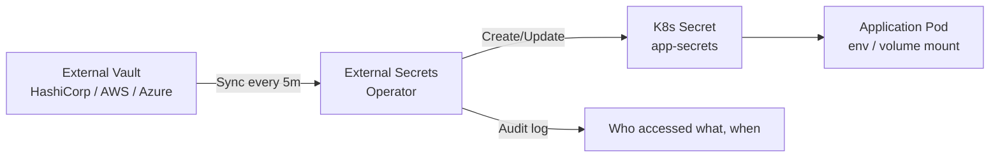

> 💡 **Quick Answer:** Install External Secrets Operator (ESO), create a `SecretStore` pointing to your vault/cloud provider, then define `ExternalSecret` resources that sync secrets into Kubernetes `Secret` objects. Secrets auto-refresh on the configured interval.

## The Problem

Kubernetes Secrets are base64-encoded (not encrypted at rest by default), stored in etcd, and hard to rotate. Organizations need secrets in a central vault (HashiCorp Vault, AWS Secrets Manager, etc.) with audit trails, automatic rotation, and access policies — then sync them to Kubernetes.

## The Solution

### Install External Secrets Operator

```bash
helm install external-secrets external-secrets/external-secrets \
  --namespace external-secrets \
  --create-namespace
```

### HashiCorp Vault

```yaml
apiVersion: external-secrets.io/v1beta1
kind: SecretStore
metadata:
  name: vault-store
  namespace: production
spec:
  provider:
    vault:
      server: "https://vault.example.com"
      path: "secret"
      version: "v2"
      auth:
        kubernetes:
          mountPath: "kubernetes"
          role: "production-app"
          serviceAccountRef:
            name: vault-auth
---
apiVersion: external-secrets.io/v1beta1
kind: ExternalSecret
metadata:
  name: app-secrets
  namespace: production
spec:
  refreshInterval: 5m
  secretStoreRef:
    name: vault-store
    kind: SecretStore
  target:
    name: app-secrets
    creationPolicy: Owner
  data:
    - secretKey: database-url
      remoteRef:
        key: production/database
        property: url
    - secretKey: api-key
      remoteRef:
        key: production/api
        property: key
```

### AWS Secrets Manager

```yaml
apiVersion: external-secrets.io/v1beta1
kind: ClusterSecretStore
metadata:
  name: aws-store
spec:
  provider:
    aws:
      service: SecretsManager
      region: eu-west-1
      auth:
        jwt:
          serviceAccountRef:
            name: eso-sa
            namespace: external-secrets
---
apiVersion: external-secrets.io/v1beta1
kind: ExternalSecret
metadata:
  name: rds-credentials
  namespace: production
spec:
  refreshInterval: 10m
  secretStoreRef:
    name: aws-store
    kind: ClusterSecretStore
  target:
    name: rds-credentials
  dataFrom:
    - extract:
        key: production/rds-main
```



## Common Issues

**ExternalSecret status shows "SecretSyncedError"**

Check the SecretStore connection: `kubectl describe secretstore vault-store -n production`. Common causes: wrong vault address, expired authentication token, missing Vault policy.

**Secrets not updating after rotation in vault**

Check `refreshInterval`. ESO only syncs on this interval. For immediate sync: `kubectl annotate externalsecret app-secrets force-sync=$(date +%s) --overwrite`.

## Best Practices

- **Use `ClusterSecretStore`** for shared vault connections — avoids duplicating auth config per namespace
- **Set `refreshInterval: 5m`** for sensitive secrets — balance between freshness and API load
- **`creationPolicy: Owner`** — ESO owns the Secret lifecycle; deleted ExternalSecret deletes the Secret
- **IRSA/Workload Identity** for cloud providers — no static credentials for ESO itself
- **Audit vault access logs** — ESO requests are traceable

## Key Takeaways

- External Secrets Operator syncs secrets from external vaults into Kubernetes Secrets
- `SecretStore` defines the connection; `ExternalSecret` defines what to sync
- Supports Vault, AWS, Azure, GCP, and 20+ other providers
- `refreshInterval` controls sync frequency — secrets auto-rotate
- Use workload identity (IRSA, GCP WI) for ESO authentication — no static credentials
