> 💡 **Quick Answer:** Harden your cluster with 5 layers: (1) Pod Security Standards (`Restricted` profile), (2) RBAC least-privilege with audit, (3) NetworkPolicies default-deny, (4) etcd encryption at rest, (5) API server audit logging. Use `kube-bench` to validate against CIS benchmarks.

## The Problem

Your Kubernetes cluster is running in production but you haven't validated its security posture. Default configurations are permissive — pods run as root, RBAC is over-provisioned, network traffic flows unrestricted between namespaces, and secrets sit unencrypted in etcd. One compromised pod could escalate to cluster-admin.

## The Solution

### Layer 1: Pod Security Standards (PSS)

Pod Security Standards replace deprecated PodSecurityPolicies. Enforce at the namespace level.

```yaml
# Enforce Restricted profile — strictest baseline
apiVersion: v1
kind: Namespace
metadata:
  name: production
  labels:
    pod-security.kubernetes.io/enforce: restricted
    pod-security.kubernetes.io/enforce-version: latest
    pod-security.kubernetes.io/audit: restricted
    pod-security.kubernetes.io/warn: restricted
```

**What `restricted` enforces:**
- No privileged containers
- No hostNetwork, hostPID, hostIPC
- Must run as non-root (runAsNonRoot: true)
- Read-only root filesystem encouraged
- No privilege escalation (allowPrivilegeEscalation: false)
- Seccomp profile required

```yaml
# Pod that passes Restricted profile
apiVersion: v1
kind: Pod
metadata:
  name: secure-app
  namespace: production
spec:
  securityContext:
    runAsNonRoot: true
    runAsUser: 1000
    runAsGroup: 1000
    fsGroup: 1000
    seccompProfile:
      type: RuntimeDefault
  containers:
    - name: app
      image: myapp:1.0@sha256:abc123...  # Pin by digest
      securityContext:
        allowPrivilegeEscalation: false
        readOnlyRootFilesystem: true
        capabilities:
          drop: ["ALL"]
      resources:
        limits:
          cpu: "500m"
          memory: "256Mi"
        requests:
          cpu: "100m"
          memory: "128Mi"
      volumeMounts:
        - name: tmp
          mountPath: /tmp
  volumes:
    - name: tmp
      emptyDir:
        sizeLimit: 100Mi
```

### Layer 2: RBAC Least-Privilege

```yaml
# Audit: find over-provisioned ClusterRoleBindings
---
# Bad: wildcard permissions
apiVersion: rbac.authorization.k8s.io/v1
kind: ClusterRole
metadata:
  name: too-permissive
rules:
  - apiGroups: ["*"]    # ❌ All API groups
    resources: ["*"]     # ❌ All resources
    verbs: ["*"]         # ❌ All verbs

---
# Good: scoped permissions
apiVersion: rbac.authorization.k8s.io/v1
kind: Role
metadata:
  name: app-deployer
  namespace: production
rules:
  - apiGroups: ["apps"]
    resources: ["deployments"]
    verbs: ["get", "list", "watch", "create", "update", "patch"]
  - apiGroups: [""]
    resources: ["configmaps", "secrets"]
    verbs: ["get", "list", "watch"]
  # No delete, no cluster-wide, no exec
```

**RBAC audit script:**

```bash
#!/bin/bash
echo "=== ClusterRoleBindings with cluster-admin ==="
kubectl get clusterrolebindings -o json | jq -r '
  .items[] |
  select(.roleRef.name == "cluster-admin") |
  "\(.metadata.name) → \([.subjects[]? | "\(.kind)/\(.name)(\(.namespace // "cluster"))"] | join(", "))"
'

echo ""
echo "=== Roles with wildcard permissions ==="
kubectl get clusterroles -o json | jq -r '
  .items[] |
  select(.rules[]? | .verbs[]? == "*" or .resources[]? == "*") |
  .metadata.name
' | sort -u

echo ""
echo "=== ServiceAccounts with secrets auto-mounted ==="
kubectl get sa -A -o json | jq -r '
  .items[] |
  select(.automountServiceAccountToken != false) |
  "\(.metadata.namespace)/\(.metadata.name)"
' | head -20
```

**Disable auto-mount for default ServiceAccount:**

```yaml
apiVersion: v1
kind: ServiceAccount
metadata:
  name: default
  namespace: production
automountServiceAccountToken: false
```

### Layer 3: Network Policies — Default Deny

```yaml
# Default deny all ingress and egress
apiVersion: networking.k8s.io/v1
kind: NetworkPolicy
metadata:
  name: default-deny-all
  namespace: production
spec:
  podSelector: {}
  policyTypes:
    - Ingress
    - Egress
---
# Allow DNS (required for service discovery)
apiVersion: networking.k8s.io/v1
kind: NetworkPolicy
metadata:
  name: allow-dns
  namespace: production
spec:
  podSelector: {}
  policyTypes:
    - Egress
  egress:
    - to: []
      ports:
        - protocol: UDP
          port: 53
        - protocol: TCP
          port: 53
---
# Allow specific app-to-app traffic
apiVersion: networking.k8s.io/v1
kind: NetworkPolicy
metadata:
  name: frontend-to-backend
  namespace: production
spec:
  podSelector:
    matchLabels:
      app: backend
  policyTypes:
    - Ingress
  ingress:
    - from:
        - podSelector:
            matchLabels:
              app: frontend
      ports:
        - protocol: TCP
          port: 8080
---
# Allow backend to database
apiVersion: networking.k8s.io/v1
kind: NetworkPolicy
metadata:
  name: backend-to-database
  namespace: production
spec:
  podSelector:
    matchLabels:
      app: backend
  policyTypes:
    - Egress
  egress:
    - to:
        - podSelector:
            matchLabels:
              app: postgres
      ports:
        - protocol: TCP
          port: 5432
    - to: []
      ports:
        - protocol: UDP
          port: 53
```

### Layer 4: Encrypt Secrets at Rest

```yaml
# /etc/kubernetes/encryption-config.yaml (on control plane)
apiVersion: apiserver.config.k8s.io/v1
kind: EncryptionConfiguration
resources:
  - resources:
      - secrets
      - configmaps
    providers:
      - aescbc:
          keys:
            - name: key1
              secret: <base64-encoded-32-byte-key>
      - identity: {}  # Fallback for reading unencrypted data
```

```bash
# Generate a 32-byte key
head -c 32 /dev/urandom | base64

# Verify encryption is working
kubectl create secret generic test-enc --from-literal=data=hello -n default
# Check etcd directly — should be encrypted, not plaintext
ETCDCTL_API=3 etcdctl get /registry/secrets/default/test-enc | hexdump -C | head
```

**On OpenShift (already encrypted by default):**

```bash
# Verify etcd encryption
oc get apiserver cluster -o jsonpath='{.spec.encryption.type}'
# aescbc ← Good

# Check encryption status
oc get openshiftapiserver -o jsonpath='{.items[0].status.conditions[?(@.type=="Encrypted")].status}'
# True ✅
```

### Layer 5: API Server Audit Logging

```yaml
# audit-policy.yaml
apiVersion: audit.k8s.io/v1
kind: Policy
rules:
  # Log authentication failures at RequestResponse level
  - level: RequestResponse
    users: ["system:anonymous"]
    verbs: ["*"]

  # Log secret access
  - level: Metadata
    resources:
      - group: ""
        resources: ["secrets"]

  # Log RBAC changes
  - level: RequestResponse
    resources:
      - group: "rbac.authorization.k8s.io"
        resources: ["clusterroles", "clusterrolebindings", "roles", "rolebindings"]
    verbs: ["create", "update", "patch", "delete"]

  # Log exec into pods (potential lateral movement)
  - level: RequestResponse
    resources:
      - group: ""
        resources: ["pods/exec", "pods/attach"]

  # Log everything else at Metadata level
  - level: Metadata
    omitStages:
      - RequestReceived
```

### CIS Benchmark Validation

```bash
# Run kube-bench against CIS Kubernetes Benchmark
docker run --rm -v /etc:/etc:ro -v /var:/var:ro \
  aquasec/kube-bench:latest run --targets node

# For control plane:
docker run --rm --pid=host \
  -v /etc:/etc:ro -v /var:/var:ro \
  aquasec/kube-bench:latest run --targets master

# Output example:
# [PASS] 1.1.1 Ensure API server pod specification permissions are set to 600
# [FAIL] 1.2.6 Ensure --kubelet-certificate-authority is set
# [WARN] 1.2.10 Ensure admission control plugin EventRateLimit is set
#
# == Summary ==
# 42 checks PASS
# 3 checks FAIL
# 8 checks WARN
```

### Security Posture Dashboard Script

```bash
#!/bin/bash
echo "╔══════════════════════════════════════════╗"
echo "║    KUBERNETES SECURITY POSTURE REPORT    ║"
echo "╚══════════════════════════════════════════╝"
echo ""

# 1. Pod Security Standards
echo "=== Pod Security Standards ==="
kubectl get ns --show-labels | grep -c "pod-security.kubernetes.io/enforce" | \
  xargs -I{} echo "  Namespaces with PSS enforced: {}"
TOTAL_NS=$(kubectl get ns --no-headers | wc -l)
echo "  Total namespaces: $TOTAL_NS"

# 2. Privileged containers
echo ""
echo "=== Privileged Containers ==="
PRIV=$(kubectl get pods -A -o json | jq '[.items[].spec.containers[] | select(.securityContext.privileged == true)] | length')
echo "  Privileged containers: $PRIV"

ROOT=$(kubectl get pods -A -o json | jq '[.items[] | select(.spec.securityContext.runAsNonRoot != true)] | length')
echo "  Pods without runAsNonRoot: $ROOT"

# 3. RBAC
echo ""
echo "=== RBAC ==="
ADMINS=$(kubectl get clusterrolebindings -o json | jq '[.items[] | select(.roleRef.name == "cluster-admin") | .subjects[]?] | length')
echo "  cluster-admin bindings: $ADMINS"

WILDCARDS=$(kubectl get clusterroles -o json | jq '[.items[] | select(.rules[]? | .verbs[]? == "*")] | length')
echo "  ClusterRoles with wildcard verbs: $WILDCARDS"

# 4. Network Policies
echo ""
echo "=== Network Policies ==="
NP_NS=$(kubectl get networkpolicy -A --no-headers 2>/dev/null | awk '{print $1}' | sort -u | wc -l)
echo "  Namespaces with NetworkPolicies: $NP_NS / $TOTAL_NS"

# 5. Image security
echo ""
echo "=== Image Security ==="
NO_TAG=$(kubectl get pods -A -o json | jq -r '[.items[].spec.containers[].image | select(endswith(":latest") or (contains(":") | not))] | length')
echo "  Containers using :latest or no tag: $NO_TAG"

DIGEST=$(kubectl get pods -A -o json | jq -r '[.items[].spec.containers[].image | select(contains("@sha256:"))] | length')
TOTAL_CONTAINERS=$(kubectl get pods -A -o json | jq '[.items[].spec.containers[]] | length')
echo "  Containers pinned by digest: $DIGEST / $TOTAL_CONTAINERS"

# 6. Resource limits
echo ""
echo "=== Resource Limits ==="
NO_LIMITS=$(kubectl get pods -A -o json | jq '[.items[].spec.containers[] | select(.resources.limits == null)] | length')
echo "  Containers without resource limits: $NO_LIMITS / $TOTAL_CONTAINERS"

echo ""
echo "=== Score ==="
SCORE=100
[ "$PRIV" -gt 0 ] && SCORE=$((SCORE - 20)) && echo "  -20: Privileged containers found"
[ "$ADMINS" -gt 3 ] && SCORE=$((SCORE - 15)) && echo "  -15: Too many cluster-admin bindings"
[ "$NO_TAG" -gt 0 ] && SCORE=$((SCORE - 10)) && echo "  -10: Containers with :latest tag"
[ "$NO_LIMITS" -gt 0 ] && SCORE=$((SCORE - 10)) && echo "  -10: Containers without resource limits"
[ "$NP_NS" -lt "$TOTAL_NS" ] && SCORE=$((SCORE - 15)) && echo "  -15: Namespaces without NetworkPolicies"
echo "  ────────────────────"
echo "  Security Score: $SCORE/100"
```



```mermaid
graph TD
    A[Security Posture] --> B[Pod Security]
    A --> C[RBAC]
    A --> D[Network]
    A --> E[Data]
    A --> F[Audit]
    
    B --> B1[PSS Restricted profile]
    B --> B2[Non-root containers]
    B --> B3[Read-only rootfs]
    B --> B4[Drop ALL capabilities]
    B --> B5[Seccomp RuntimeDefault]
    
    C --> C1[Least-privilege Roles]
    C --> C2[No wildcard permissions]
    C --> C3[Disable SA auto-mount]
    C --> C4[Audit cluster-admin]
    
    D --> D1[Default deny all]
    D --> D2[Allow DNS egress]
    D --> D3[Explicit app-to-app]
    D --> D4[No cross-namespace]
    
    E --> E1[Encrypt secrets at rest]
    E --> E2[Pin images by digest]
    E --> E3[External secret stores]
    
    F --> F1[API audit logging]
    F --> F2[Secret access logging]
    F --> F3[RBAC change logging]
    F --> F4[Pod exec logging]
```

## Common Issues

### PSS Breaks Existing Workloads

Roll out gradually: start with `warn` mode to see violations, then switch to `enforce`:
```yaml
# Phase 1: Warn only
pod-security.kubernetes.io/warn: restricted
# Phase 2: After fixing violations
pod-security.kubernetes.io/enforce: restricted
```

### NetworkPolicy Blocks Prometheus Scraping

Add an ingress rule allowing Prometheus:
```yaml
ingress:
  - from:
      - namespaceSelector:
          matchLabels:
            kubernetes.io/metadata.name: monitoring
    ports:
      - port: 8080  # Metrics port
```

### System Namespaces Need Privileged Access

Don't enforce `restricted` on `kube-system`, `openshift-*`, or operator namespaces — they legitimately need elevated permissions.

## Best Practices

- **Defense in depth** — every layer catches what the previous one missed
- **Start with audit/warn mode** before enforcing — don't break production
- **Automate posture checks** in CI/CD — reject insecure manifests before deployment
- **Pin images by digest** — tags are mutable, digests are not
- **Rotate encryption keys** annually and after any suspected compromise
- **Review audit logs** for anomalies: unexpected exec, RBAC changes, secret access
- **Use admission controllers** (OPA/Gatekeeper, Kyverno) for custom policies beyond PSS
- **Run kube-bench quarterly** to track CIS compliance over time

## Key Takeaways

- Default Kubernetes is permissive — hardening is opt-in at every layer
- PSS `restricted` profile stops 80% of common container escapes
- Default-deny NetworkPolicies prevent lateral movement between namespaces
- RBAC audit finds over-provisioned service accounts before attackers do
- The security posture script gives you a score to track improvement over time
- Encrypt secrets at rest — anyone with etcd access can read plaintext secrets otherwise
