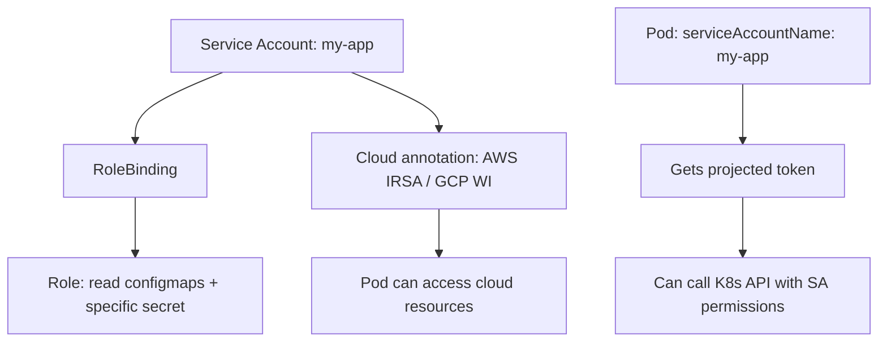

> 💡 **Quick Answer:** security

## The Problem

This is a fundamental Kubernetes topic that engineers search for frequently. A comprehensive reference with production-ready examples saves hours of trial and error.

## The Solution

### Create a Service Account

```yaml
apiVersion: v1
kind: ServiceAccount
metadata:
  name: my-app
  namespace: default
  annotations:
    # AWS IRSA
    eks.amazonaws.com/role-arn: arn:aws:iam::123456789:role/my-app-role
    # GCP Workload Identity
    iam.gke.io/gcp-service-account: my-app@project.iam.gserviceaccount.com
---
# Bind permissions
apiVersion: rbac.authorization.k8s.io/v1
kind: Role
metadata:
  name: my-app-role
rules:
  - apiGroups: [""]
    resources: ["configmaps"]
    verbs: ["get", "list"]
  - apiGroups: [""]
    resources: ["secrets"]
    resourceNames: ["my-app-config"]   # Only specific secret
    verbs: ["get"]
---
apiVersion: rbac.authorization.k8s.io/v1
kind: RoleBinding
metadata:
  name: my-app-binding
subjects:
  - kind: ServiceAccount
    name: my-app
roleRef:
  kind: Role
  name: my-app-role
  apiGroup: rbac.authorization.k8s.io
```

### Use in Pods

```yaml
apiVersion: v1
kind: Pod
spec:
  serviceAccountName: my-app      # Use specific SA
  automountServiceAccountToken: false  # Disable if not needed!
  containers:
    - name: app
      image: my-app:v1
```

### Projected Token (Short-Lived)

```yaml
# K8s 1.20+ bound tokens (auto-rotated, audience-scoped)
spec:
  containers:
    - name: app
      volumeMounts:
        - name: token
          mountPath: /var/run/secrets/tokens
  volumes:
    - name: token
      projected:
        sources:
          - serviceAccountToken:
              path: vault-token
              expirationSeconds: 3600
              audience: vault
```

```bash
# Check SA permissions
kubectl auth can-i --list --as=system:serviceaccount:default:my-app
kubectl auth can-i get secrets --as=system:serviceaccount:default:my-app
```



## Frequently Asked Questions

### Should every app have its own service account?

Yes — using the `default` SA means every pod in the namespace shares the same identity. Create dedicated SAs with minimal permissions per application.

### What is `automountServiceAccountToken: false`?

It prevents the SA token from being mounted into the pod. Use this for pods that don't need to call the Kubernetes API — reduces attack surface.

## Best Practices

- Start with the simplest configuration that meets your needs
- Test changes in staging before production
- Use `kubectl describe` and events for troubleshooting
- Document your decisions for the team

## Key Takeaways

- This is essential Kubernetes knowledge for production operations
- Follow the principle of least privilege and minimal configuration
- Monitor and iterate based on real-world behavior
- Automation reduces human error and improves consistency
