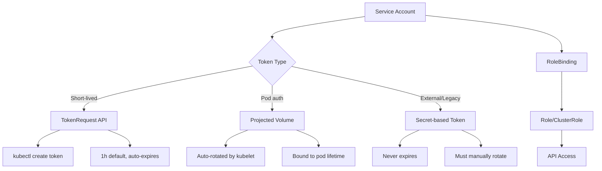

> 💡 **Quick Answer:** Since Kubernetes 1.24, service account tokens are no longer auto-created as Secrets. Use `kubectl create token <sa>` for short-lived tokens or projected volumes for pod authentication. Long-lived tokens require explicit Secret creation.

## The Problem

After Kubernetes 1.24:
- Auto-generated Secret-based tokens were removed (KEP-2799)
- Pods still need API authentication for controllers, operators, and sidecar access
- External systems (CI/CD, monitoring) need tokens to access the cluster
- Token rotation and expiry must be managed explicitly

## The Solution

### Short-Lived Token (TokenRequest API)

```bash
# Create a 1-hour token (default)
kubectl create token my-service-account

# Custom expiration (max depends on cluster config)
kubectl create token my-service-account --duration=24h

# For a specific namespace
kubectl create token my-service-account -n production

# With specific audience
kubectl create token my-service-account --audience=https://vault.example.com
```

### Create a Service Account

```yaml
# service-account.yaml
apiVersion: v1
kind: ServiceAccount
metadata:
  name: app-controller
  namespace: production
  annotations:
    description: "Used by app-controller deployment for API access"
automountServiceAccountToken: false  # Don't auto-mount in pods
```

### Bind RBAC Permissions

```yaml
# role-binding.yaml
apiVersion: rbac.authorization.k8s.io/v1
kind: Role
metadata:
  name: app-controller-role
  namespace: production
rules:
  - apiGroups: ["apps"]
    resources: ["deployments"]
    verbs: ["get", "list", "patch"]
  - apiGroups: [""]
    resources: ["pods", "services"]
    verbs: ["get", "list", "watch"]
---
apiVersion: rbac.authorization.k8s.io/v1
kind: RoleBinding
metadata:
  name: app-controller-binding
  namespace: production
subjects:
  - kind: ServiceAccount
    name: app-controller
    namespace: production
roleRef:
  kind: Role
  name: app-controller-role
  apiGroup: rbac.authorization.k8s.io
```

### Projected Volume Token (Recommended for Pods)

```yaml
# deployment.yaml
apiVersion: apps/v1
kind: Deployment
metadata:
  name: app-controller
spec:
  template:
    spec:
      serviceAccountName: app-controller
      automountServiceAccountToken: false
      containers:
        - name: controller
          image: myapp:1.0.0
          volumeMounts:
            - name: sa-token
              mountPath: /var/run/secrets/kubernetes.io/serviceaccount
              readOnly: true
      volumes:
        - name: sa-token
          projected:
            sources:
              - serviceAccountToken:
                  path: token
                  expirationSeconds: 3600   # Auto-rotated before expiry
                  audience: "https://kubernetes.default.svc"
              - configMap:
                  name: kube-root-ca.crt
                  items:
                    - key: ca.crt
                      path: ca.crt
              - downwardAPI:
                  items:
                    - path: namespace
                      fieldRef:
                        fieldPath: metadata.namespace
```

### Audience-Bound Token for an External Service

Mount a second token with its own audience (e.g. Vault's Kubernetes auth) instead of reusing the API-server token. The receiving service validates `aud`, so a leaked token can't be replayed against the API server.

```yaml
      volumes:
        - name: vault-token
          projected:
            sources:
              - serviceAccountToken:
                  path: vault-token
                  expirationSeconds: 600
                  audience: vault
```

Mount it at a non-default path (e.g. `/var/run/secrets/tokens`) and point the client at `/var/run/secrets/tokens/vault-token`. For cloud APIs, prefer OIDC federation (IRSA, GKE/Azure Workload Identity) — see [workload identity](/recipes/security/kubernetes-service-accounts-workload-identity/).

### Long-Lived Token (Legacy / External Use)

```yaml
# long-lived-token.yaml
# Only use when TokenRequest API isn't an option
apiVersion: v1
kind: Secret
metadata:
  name: app-controller-token
  namespace: production
  annotations:
    kubernetes.io/service-account.name: app-controller
type: kubernetes.io/service-account-token
```

```bash
# Retrieve the token
kubectl get secret app-controller-token -n production -o jsonpath='{.data.token}' | base64 -d
```

### Token Expiry Limits and Inspection

```bash
# Imperative SA + read-only binding
kubectl create serviceaccount app-sa -n production
kubectl create rolebinding app-sa-view -n production \
  --clusterrole=view --serviceaccount=production:app-sa

# Bind the token to a pod: it becomes invalid when the pod is deleted
kubectl create token app-sa -n production \
  --bound-object-kind=Pod --bound-object-name=app-7d9f-abcde

# Decode the JWT payload to check exp / aud / sub
kubectl create token app-sa -n production | cut -d. -f2 | base64 -d 2>/dev/null | jq '{sub, aud, exp: (.exp|todate)}'

# Test what the SA can do
kubectl auth can-i --list --as=system:serviceaccount:production:app-sa -n production
```

`--duration` is capped by the API server flag `--service-account-max-token-expiration`; a larger request is silently shortened. `kubectl create token` can't produce a non-expiring token — for that you need the Secret-based token below.

### Architecture


```mermaid
graph TD
    A[Service Account] --> B{Token Type}
    B -->|Short-lived| C[TokenRequest API]
    B -->|Pod auth| D[Projected Volume]
    B -->|External/Legacy| E[Secret-based Token]
    C --> F[kubectl create token]
    C --> G[1h default, auto-expires]
    D --> H[Auto-rotated by kubelet]
    D --> I[Bound to pod lifetime]
    E --> J[Never expires]
    E --> K[Must manually rotate]
    
    A --> L[RoleBinding]
    L --> M[Role/ClusterRole]
    M --> N[API Access]
```

### Use Token from Application Code

```python
# Python example — reading projected token
import requests
from pathlib import Path

TOKEN_PATH = "/var/run/secrets/kubernetes.io/serviceaccount/token"
CA_PATH = "/var/run/secrets/kubernetes.io/serviceaccount/ca.crt"
NAMESPACE = Path("/var/run/secrets/kubernetes.io/serviceaccount/namespace").read_text()

token = Path(TOKEN_PATH).read_text()
api_url = "https://kubernetes.default.svc"

# List pods in current namespace
resp = requests.get(
    f"{api_url}/api/v1/namespaces/{NAMESPACE}/pods",
    headers={"Authorization": f"Bearer {token}"},
    verify=CA_PATH
)
print(resp.json()["items"])
```

## Common Issues

| Issue | Cause | Fix |
|-------|-------|-----|
| "no service account token" in pod | `automountServiceAccountToken: false` without projected volume | Add projected volume or set `true` |
| Token expired error | TokenRequest token expired | Use projected volume (auto-rotates) |
| 403 Forbidden | Missing RBAC binding | Create Role + RoleBinding for the SA |
| Secret not populated | SA doesn't exist yet | Create ServiceAccount before Secret |
| Token works locally, fails in pod | Wrong audience claim | Match audience in TokenRequest and API server |

## Best Practices

1. **Use projected volumes over Secret-based tokens** — auto-rotated, bound to pod lifetime
2. **Set `automountServiceAccountToken: false`** on ServiceAccount — opt-in per deployment
3. **Scope RBAC minimally** — only the verbs and resources actually needed
4. **Avoid long-lived tokens** — use TokenRequest API or OIDC federation for external access
5. **Set token expiration** — `expirationSeconds: 3600` in projected volumes

## Key Takeaways

- Kubernetes 1.24+ no longer auto-creates Secret-based tokens
- `kubectl create token` generates short-lived tokens (default 1h)
- Projected volumes are the recommended pod authentication method — auto-rotated by kubelet
- Long-lived tokens still work via explicit Secret creation but should be avoided
- Always pair service accounts with least-privilege RBAC bindings
- Use a dedicated audience per external consumer; RBAC for the SA lives in [Service Account RBAC](/recipes/security/service-accounts-rbac/)

## Frequently Asked Questions

### How do I create a service account token without expiration?

`kubectl create token` always issues an expiring token. For a non-expiring token, create a `kubernetes.io/service-account-token` Secret annotated with `kubernetes.io/service-account.name`; the token controller populates it. Treat it like a password and rotate it by deleting and recreating the Secret. Since 1.29, unused legacy Secret tokens are labeled and can be auto-invalidated by the LegacyServiceAccountTokenCleanUp feature.

### Why doesn't my service account have a token Secret after Kubernetes 1.24?

Since 1.24 (KEP-2799), Secrets are no longer auto-generated for ServiceAccounts. Pods get a projected, auto-rotated token via the kubelet; external clients use `kubectl create token` or an explicitly created Secret.

### What is the maximum duration for kubectl create token?

It's bounded by `--service-account-max-token-expiration` on kube-apiserver (unset means no cap from that flag, but managed platforms often limit it). Tokens mounted into pods are refreshed by the kubelet at 80% of their lifetime or after 24h, whichever comes first.

### How do I use a service account token with kubectl?

```bash
TOKEN=$(kubectl create token app-sa -n production --duration=1h)
kubectl --token="$TOKEN" --server=https://api.example.com:6443 get pods -n production
```

