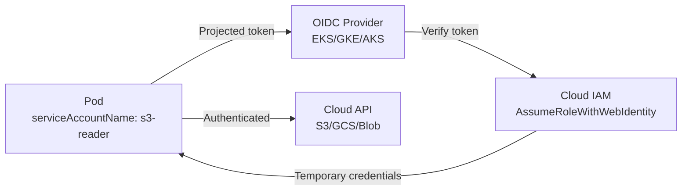

> 💡 **Quick Answer:** Annotate a Kubernetes ServiceAccount with your cloud provider's IAM role (AWS: `eks.amazonaws.com/role-arn`, GCP: `iam.gke.io/gcp-service-account`), and pods using that SA automatically get cloud credentials via projected token volumes — no static keys needed.

## The Problem

Applications running on Kubernetes need cloud API access (S3, Cloud Storage, Key Vault). Traditional approach: create IAM keys, store in Kubernetes Secrets. Problems: keys don't rotate automatically, secrets can leak, and there's no audit trail per-pod.

## The Solution

### AWS IRSA (IAM Roles for Service Accounts)

```yaml
apiVersion: v1
kind: ServiceAccount
metadata:
  name: s3-reader
  namespace: production
  annotations:
    eks.amazonaws.com/role-arn: arn:aws:iam::123456789012:role/s3-reader-role
---
apiVersion: apps/v1
kind: Deployment
metadata:
  name: data-processor
spec:
  template:
    spec:
      serviceAccountName: s3-reader
      containers:
        - name: processor
          image: registry.example.com/processor:1.0
          # AWS SDK auto-discovers credentials from projected token
```

### GCP Workload Identity

```yaml
apiVersion: v1
kind: ServiceAccount
metadata:
  name: gcs-writer
  namespace: production
  annotations:
    iam.gke.io/gcp-service-account: gcs-writer@my-project.iam.gserviceaccount.com
```

### Azure Workload Identity

```yaml
apiVersion: v1
kind: ServiceAccount
metadata:
  name: blob-reader
  namespace: production
  annotations:
    azure.workload.identity/client-id: "12345678-1234-1234-1234-123456789abc"
  labels:
    azure.workload.identity/use: "true"
```



## Common Issues

**Pod gets "AccessDenied" despite correct annotation**

Check the IAM trust policy allows the OIDC issuer and service account:
```json
{
  "Condition": {
    "StringEquals": {
      "oidc.eks.region.amazonaws.com/id/EXAMPLED539D4633E53DE1B71EXAMPLE:sub":
        "system:serviceaccount:production:s3-reader"
    }
  }
}
```

**SDK not picking up credentials**

Ensure you're using a recent SDK version that supports IRSA/Workload Identity token exchange.

## Best Practices

- **One ServiceAccount per application** — principle of least privilege
- **Never use the `default` ServiceAccount** — it may have unintended permissions
- **Set `automountServiceAccountToken: false`** on pods that don't need API access
- **Audit IAM role bindings** — which SA can access which cloud resources

## Key Takeaways

- Workload Identity eliminates static cloud credentials in Kubernetes
- Annotate ServiceAccount with IAM role → pods get temporary credentials automatically
- Cloud SDKs auto-discover projected tokens — no code changes needed
- Works with AWS IRSA, GCP Workload Identity, Azure AD Workload Identity
- One SA per application for least-privilege access
