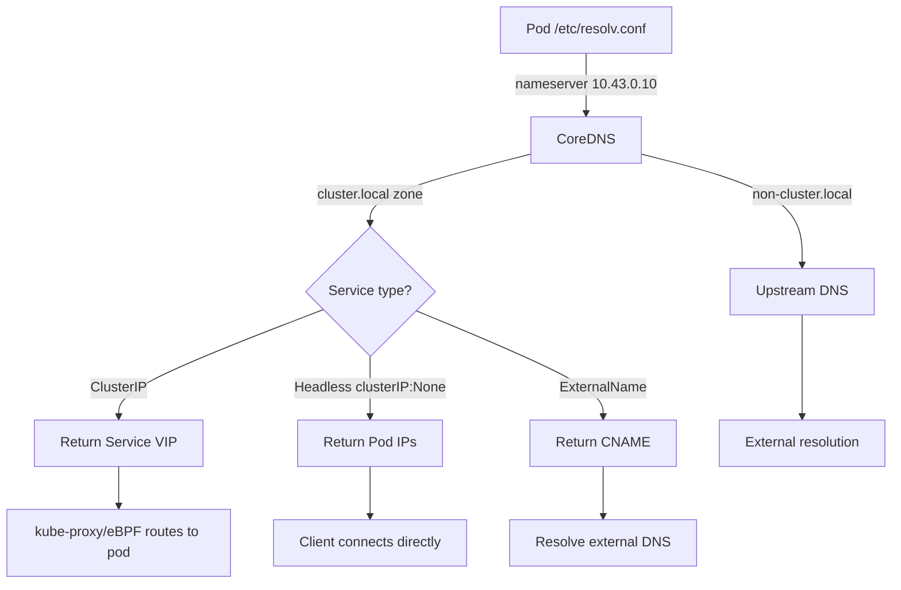

> 💡 **Quick Answer:** Every Kubernetes Service gets a DNS name: `<service>.<namespace>.svc.cluster.local`. Within the same namespace, just use `<service>`. Cross-namespace: `<service>.<namespace>`. Headless services resolve to pod IPs directly.

## The Problem

You need to connect services together:
- How does one pod find another service?
- What's the full DNS name format?
- How does cross-namespace resolution work?
- Why does DNS fail for headless services or StatefulSets?

## The Solution

### DNS Name Format

```bash
# Full qualified domain name (FQDN)
<service-name>.<namespace>.svc.cluster.local

# Examples:
postgres.default.svc.cluster.local          # postgres service in default namespace
redis.cache.svc.cluster.local               # redis in cache namespace
kubernetes.default.svc.cluster.local        # API server service

# Short names (resolved via search domains in /etc/resolv.conf):
postgres                    # Same namespace (most common)
postgres.default            # Cross-namespace
postgres.default.svc        # Explicit cluster scope
```

### Service Types and DNS

```yaml
# ClusterIP — resolves to virtual IP
apiVersion: v1
kind: Service
metadata:
  name: myapp
  namespace: production
spec:
  selector:
    app: myapp
  ports:
    - port: 80
      targetPort: 8080
# DNS: myapp.production.svc.cluster.local → 10.43.52.100 (ClusterIP)
---
# Headless Service — resolves to pod IPs directly
apiVersion: v1
kind: Service
metadata:
  name: postgres
  namespace: default
spec:
  clusterIP: None  # ← Makes it headless
  selector:
    app: postgres
  ports:
    - port: 5432
# DNS: postgres.default.svc.cluster.local → 10.244.1.5, 10.244.2.8 (pod IPs)
```

### StatefulSet Pod DNS

```yaml
# StatefulSet pods get individual DNS names
apiVersion: apps/v1
kind: StatefulSet
metadata:
  name: postgres
spec:
  serviceName: postgres  # Must match headless Service name
  replicas: 3
  # Pods get DNS: postgres-0.postgres.default.svc.cluster.local
  #               postgres-1.postgres.default.svc.cluster.local
  #               postgres-2.postgres.default.svc.cluster.local
```

```bash
# Connect to a specific replica
psql -h postgres-0.postgres.default.svc.cluster.local -U admin

# Connect to any replica (load balanced)
psql -h postgres.default.svc.cluster.local -U admin
```

### DNS Architecture



### SRV Records (Port Discovery)

```bash
# SRV records include port information
# Format: _<port-name>._<protocol>.<service>.<namespace>.svc.cluster.local

nslookup -type=SRV _http._tcp.myapp.default.svc.cluster.local
# _http._tcp.myapp.default.svc.cluster.local  SRV  0 100 80 myapp.default.svc.cluster.local

# Useful for services with multiple named ports
nslookup -type=SRV _metrics._tcp.myapp.default.svc.cluster.local
```

### ExternalName Service

```yaml
# Maps a service name to an external DNS name
apiVersion: v1
kind: Service
metadata:
  name: external-db
spec:
  type: ExternalName
  externalName: db.example.com
# DNS: external-db.default.svc.cluster.local → CNAME → db.example.com
```

### Debug DNS Resolution

```bash
# Deploy a debug pod
kubectl run dns-debug --image=busybox --restart=Never -- sleep 3600

# Test resolution
kubectl exec dns-debug -- nslookup myapp
kubectl exec dns-debug -- nslookup myapp.production.svc.cluster.local

# Check /etc/resolv.conf
kubectl exec dns-debug -- cat /etc/resolv.conf
# nameserver 10.43.0.10
# search default.svc.cluster.local svc.cluster.local cluster.local
# options ndots:5

# Verify CoreDNS is running
kubectl get pods -n kube-system -l k8s-app=kube-dns

# Check CoreDNS logs
kubectl logs -n kube-system -l k8s-app=kube-dns --tail=50
```

### Cross-Namespace Access

```yaml
# Pod in "frontend" namespace connecting to "backend" namespace service
apiVersion: apps/v1
kind: Deployment
metadata:
  name: frontend
  namespace: frontend
spec:
  template:
    spec:
      containers:
        - name: app
          env:
            - name: BACKEND_URL
              # Cross-namespace DNS
              value: "http://api.backend.svc.cluster.local:8080"
            - name: DB_HOST
              value: "postgres.database.svc.cluster.local"
```

## Common Issues

| Issue | Cause | Fix |
|-------|-------|-----|
| "could not resolve host" | Service doesn't exist or wrong name | `kubectl get svc -A` to verify |
| Resolves but connection refused | Service exists but no ready endpoints | Check `kubectl get endpoints myapp` |
| Cross-namespace fails | Using short name from different namespace | Use `service.namespace` format |
| Headless returns no IPs | No pods match the selector | Verify pod labels match service selector |
| DNS slow (5s timeout) | ndots:5 causes excessive lookups | Use FQDN with trailing dot or lower ndots |
| StatefulSet pod DNS fails | `serviceName` doesn't match Service | Ensure StatefulSet.spec.serviceName = Service.metadata.name |

## Best Practices

1. **Use short names within same namespace** — `postgres` not the full FQDN
2. **Use `<service>.<namespace>` for cross-namespace** — explicit and readable
3. **Always create headless Service for StatefulSets** — enables per-pod DNS
4. **Use FQDN with trailing dot for external** — `api.example.com.` avoids search domain appending
5. **Monitor CoreDNS latency** — `coredns_dns_request_duration_seconds` histogram

## Key Takeaways

- DNS format: `<service>.<namespace>.svc.cluster.local` — shortened by search domains
- ClusterIP services resolve to virtual IP; headless services resolve to pod IPs
- StatefulSet pods get stable DNS: `<pod-name>.<service>.<namespace>.svc.cluster.local`
- ExternalName services are CNAME aliases to external DNS names
- Always verify with `nslookup` from a debug pod when DNS issues occur
