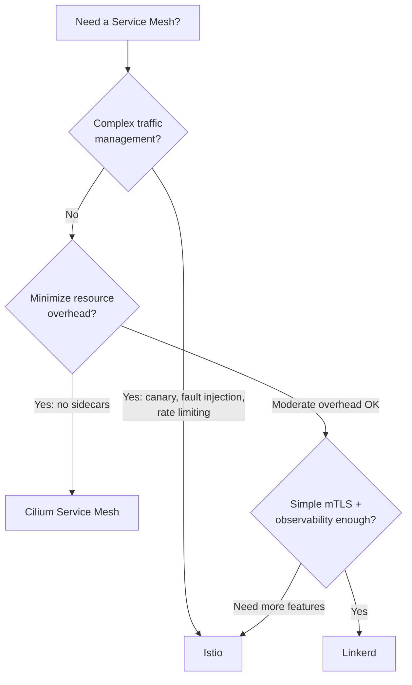

> 💡 **Quick Answer:** Use **Linkerd** for simplicity and low overhead, **Istio** for advanced traffic management (canary, fault injection, multi-cluster), or **Cilium** for sidecar-less mesh with eBPF (lowest latency, no extra containers). All three provide mTLS and observability.

## The Problem

Microservices need encrypted communication (mTLS), traffic observability (latency, error rates), and traffic control (canary deploys, retries, circuit breaking). Without a service mesh, you implement these in every application individually.

## The Solution

### Comparison Matrix

| Feature | Istio | Linkerd | Cilium |
|---------|-------|---------|--------|
| Architecture | Sidecar (Envoy) | Sidecar (linkerd2-proxy) | Sidecar-less (eBPF) |
| mTLS | ✅ Auto | ✅ Auto | ✅ Auto (SPIFFE) |
| Observability | ✅ Full (metrics, traces, logs) | ✅ Golden metrics | ✅ Hubble |
| Traffic splitting | ✅ VirtualService | ✅ TrafficSplit (SMI) | ✅ CiliumEnvoyConfig |
| Fault injection | ✅ Native | ❌ Not built-in | ⚠️ Limited |
| Multi-cluster | ✅ Mature | ✅ Multi-cluster | ✅ Cluster Mesh |
| Resource overhead | High (~128Mi per sidecar) | Low (~20Mi per sidecar) | Minimal (no sidecar) |
| Latency added | ~2-5ms p99 | ~1-2ms p99 | ~0.1-0.5ms p99 |
| Learning curve | Steep | Gentle | Moderate |
| Gateway API | ✅ Full support | ✅ Full support | ✅ Full support |
| CNCF Status | Graduated | Graduated | Graduated |

### Quick Start: Linkerd

```bash
# Install CLI
curl -sL https://run.linkerd.io/install | sh

# Install control plane
linkerd install --crds | kubectl apply -f -
linkerd install | kubectl apply -f -

# Mesh a namespace
kubectl annotate namespace production linkerd.io/inject=enabled

# Restart pods to inject sidecars
kubectl rollout restart deployment -n production
```

### Quick Start: Cilium Service Mesh

```bash
# Install Cilium with mesh enabled (no sidecars)
helm install cilium cilium/cilium \
  --namespace kube-system \
  --set encryption.enabled=true \
  --set encryption.type=wireguard \
  --set hubble.relay.enabled=true \
  --set hubble.ui.enabled=true
```

### Decision Guide



## Common Issues

**Sidecar injection breaks init containers**

Init containers run before sidecars start. If init containers need network access, use Istio's `holdApplicationUntilProxyStarts: true` or Linkerd's `config.linkerd.io/proxy-await: enabled`.

**Service mesh adds unacceptable latency for RDMA/GPU workloads**

Exclude GPU training namespaces from mesh injection. Service mesh is for application-layer (L7) traffic, not RDMA.

## Best Practices

- **Start with Linkerd** if you just need mTLS and golden metrics — simplest path
- **Choose Cilium** if you're already using it as CNI — adds mesh without sidecars
- **Choose Istio** only if you need its advanced traffic management features
- **Exclude high-performance namespaces** (GPU training, RDMA) from mesh injection
- **Use Gateway API** instead of mesh-specific CRDs for portability

## Key Takeaways

- All three provide mTLS and observability — the difference is architecture and features
- Sidecar-less (Cilium eBPF) has the lowest overhead and latency
- Linkerd is the simplest to operate — Rust-based proxy with minimal config
- Istio has the most features but highest complexity and resource cost
- Service mesh is for L7 application traffic — not RDMA or storage traffic
