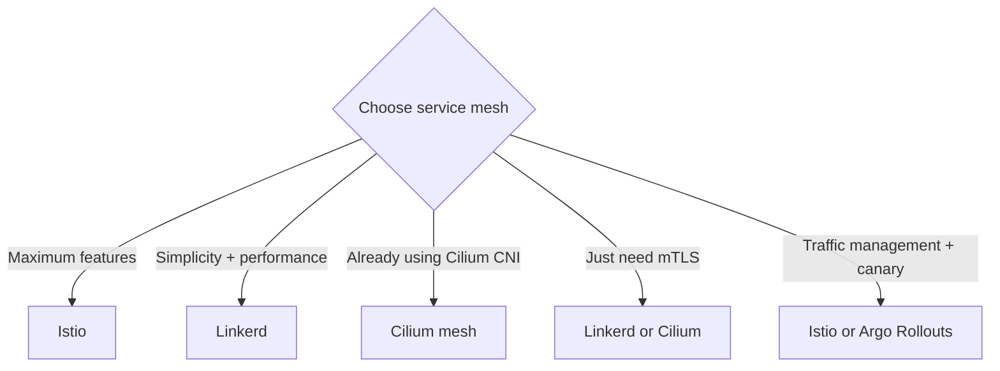

> 💡 **Quick Answer:** Compare Kubernetes service meshes: Istio, Linkerd, and Cilium. Covers mTLS, traffic management, observability, performance overhead, and when you need a mesh.

## The Problem

Engineers frequently search for this topic but find scattered, incomplete guides. This recipe provides a comprehensive, production-ready reference.

## The Solution

### When Do You Need a Service Mesh?

Use a service mesh when you need:
- **mTLS everywhere** (zero-trust networking)
- **Traffic splitting** (canary, A/B testing)
- **Observability** (distributed tracing without code changes)
- **Retries and circuit breaking** (resilience patterns)

### Comparison

| Feature | Istio | Linkerd | Cilium Service Mesh |
|---------|-------|---------|---------------------|
| Proxy | Envoy (heavy) | linkerd2-proxy (Rust, ultra-light) | eBPF (no sidecar!) |
| mTLS | ✅ | ✅ | ✅ |
| Memory per pod | ~50-100MB | ~10-20MB | 0 (kernel-level) |
| Latency overhead | ~3-5ms | ~1ms | <1ms |
| Traffic management | Advanced | Basic | Basic |
| Multi-cluster | ✅ | ✅ | ✅ |
| Learning curve | Steep | Easy | Medium |
| Best for | Feature-rich enterprise | Simple, fast | Performance-critical |

### Quick Install

```bash
# Linkerd (simplest)
curl -sL https://run.linkerd.io/install | sh
linkerd install --crds | kubectl apply -f -
linkerd install | kubectl apply -f -
# Inject into namespace
kubectl annotate namespace default linkerd.io/inject=enabled

# Istio
istioctl install --set profile=minimal
kubectl label namespace default istio-injection=enabled

# Cilium (if already your CNI)
cilium hubble enable
# Service mesh features are built into the CNI
```



## Frequently Asked Questions

### Do I need a service mesh?

Most clusters don't. If you have <20 services and don't need mTLS or traffic splitting, NetworkPolicies + Ingress are simpler. Service meshes add complexity and resource overhead.


## Best Practices

- Start with the simplest approach that solves your problem
- Test thoroughly in staging before production
- Monitor and iterate based on real metrics
- Document decisions for your team

## Key Takeaways

- This is essential Kubernetes operational knowledge
- Production-readiness requires proper configuration and monitoring
- Use `kubectl describe` and logs for troubleshooting
- Automate where possible to reduce human error
