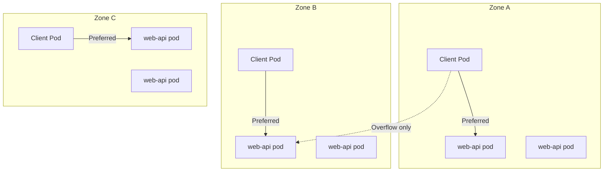

> 💡 **Quick Answer:** Set `service.kubernetes.io/topology-mode: Auto` to route traffic preferentially to endpoints in the same zone, reducing cross-zone latency and egress charges.

## The Problem

In multi-zone clusters, Services distribute traffic randomly across all zones. This causes:
- Cross-zone network latency (1-5ms added per hop)
- Significant egress costs ($0.01-0.02/GB between zones on major clouds)
- Unnecessary bandwidth consumption
- Inconsistent response times

## The Solution

### Enable Topology-Aware Routing

```yaml
apiVersion: v1
kind: Service
metadata:
  name: web-api
  annotations:
    service.kubernetes.io/topology-mode: Auto
spec:
  selector:
    app: web-api
  ports:
    - port: 80
      targetPort: 8080
```

### Traffic Distribution (1.30+)

```yaml
apiVersion: v1
kind: Service
metadata:
  name: web-api
spec:
  selector:
    app: web-api
  trafficDistribution: PreferClose
  ports:
    - port: 80
      targetPort: 8080
```

### Verify Topology Hints

```bash
# Check EndpointSlice for topology hints
kubectl get endpointslice -l kubernetes.io/service-name=web-api -o yaml

# Look for hints section
# endpoints:
# - addresses: ["10.244.1.5"]
#   zone: us-east-1a
#   hints:
#     forZones:
#       - name: us-east-1a
```

### Multi-Zone Deployment

```yaml
apiVersion: apps/v1
kind: Deployment
metadata:
  name: web-api
spec:
  replicas: 6
  selector:
    matchLabels:
      app: web-api
  template:
    metadata:
      labels:
        app: web-api
    spec:
      topologySpreadConstraints:
        - maxSkew: 1
          topologyKey: topology.kubernetes.io/zone
          whenUnsatisfiable: DoNotSchedule
          labelSelector:
            matchLabels:
              app: web-api
      containers:
        - name: api
          image: web-api:3.0
---
apiVersion: v1
kind: Service
metadata:
  name: web-api
  annotations:
    service.kubernetes.io/topology-mode: Auto
spec:
  selector:
    app: web-api
  ports:
    - port: 80
      targetPort: 8080
```



## Common Issues

**Topology hints not allocated**
Hints are only allocated when pods are reasonably balanced across zones. If one zone has 80% of pods, hints are disabled (falls back to random):
```bash
kubectl get endpointslice -l kubernetes.io/service-name=web-api -o yaml | grep -A5 hints
```

**Uneven traffic distribution**
If zone A has 1 pod and zone B has 5, the zone A pod gets disproportionate load. Use `topologySpreadConstraints` to balance pods.

**`topology-mode: Auto` vs deprecated `topologyKeys`**
`service.topology.kubernetes.io/topologyKeys` was removed in 1.22. Use `topology-mode: Auto` annotation or `trafficDistribution` field.

## Best Practices

- Combine topology routing with `topologySpreadConstraints` for even pod distribution
- Ensure each zone has enough replicas to handle its local traffic
- Monitor per-zone metrics to detect imbalanced load
- Use `trafficDistribution: PreferClose` (1.30+) as the modern API
- Set up pod autoscaling per zone if traffic patterns are zone-specific
- Test failover behavior: when a zone's pods are unhealthy, traffic should spill to other zones

## Key Takeaways

- Topology-aware routing keeps traffic within the same zone when possible
- Requires balanced pod distribution across zones to activate
- Falls back to cluster-wide routing when zones are imbalanced
- Reduces cross-zone egress costs by 40-80% in typical deployments
- `trafficDistribution: PreferClose` is the successor to annotation-based config
- kube-proxy and Cilium both support topology hints
