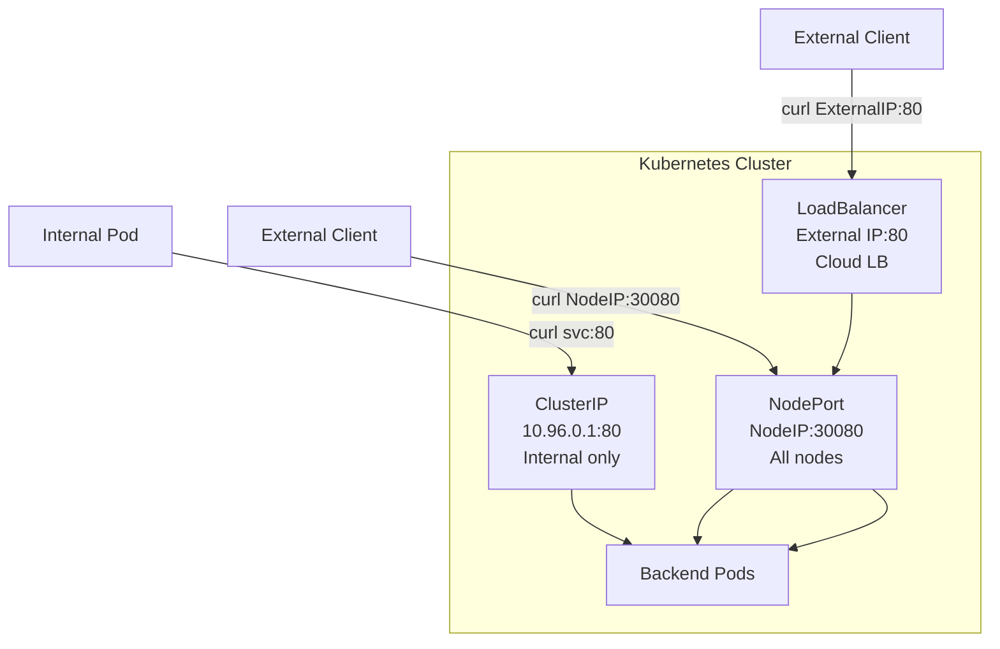

> 💡 **Quick Answer:** \`ClusterIP\` (default) = internal-only access within the cluster. \`NodePort\` = exposes on every node's IP at a static port (30000-32767). \`LoadBalancer\` = provisions an external cloud load balancer. \`ExternalName\` = DNS CNAME alias to an external service.

## The Problem

You need to expose your application, but Kubernetes offers four Service types with different networking behaviors. Choosing wrong means either no external access when you need it, or unnecessary exposure when you don't.



## The Solution

### ClusterIP (Default)

Internal-only access — pods within the cluster can reach this service:

```yaml
apiVersion: v1
kind: Service
metadata:
  name: backend-api
spec:
  type: ClusterIP               # Default — can be omitted
  selector:
    app: backend
  ports:
    - port: 80                   # Service port
      targetPort: 8080           # Container port
```

```bash
# Accessible only from within the cluster
kubectl exec frontend-pod -- curl http://backend-api:80
kubectl exec frontend-pod -- curl http://backend-api.default.svc.cluster.local:80
```

### NodePort

Exposes the service on a static port on every node:

```yaml
apiVersion: v1
kind: Service
metadata:
  name: web-app
spec:
  type: NodePort
  selector:
    app: web
  ports:
    - port: 80                   # ClusterIP port (internal)
      targetPort: 8080           # Container port
      nodePort: 30080            # External port (30000-32767)
```

```bash
# Accessible from outside on any node IP
curl http://192.168.1.10:30080   # worker-01
curl http://192.168.1.11:30080   # worker-02
curl http://192.168.1.12:30080   # worker-03 (even if no pods here)
```

### LoadBalancer

Provisions an external load balancer (cloud or MetalLB):

```yaml
apiVersion: v1
kind: Service
metadata:
  name: public-web
  annotations:
    # AWS-specific
    service.beta.kubernetes.io/aws-load-balancer-type: nlb
spec:
  type: LoadBalancer
  selector:
    app: web
  ports:
    - port: 80
      targetPort: 8080
```

```bash
kubectl get svc public-web
# NAME         TYPE           CLUSTER-IP    EXTERNAL-IP      PORT(S)
# public-web   LoadBalancer   10.96.0.50    203.0.113.100    80:31234/TCP

# Accessible from internet
curl http://203.0.113.100
```

### ExternalName

DNS alias to an external service (no proxying):

```yaml
apiVersion: v1
kind: Service
metadata:
  name: external-db
spec:
  type: ExternalName
  externalName: db.example.com   # DNS CNAME
```

```bash
# Resolves to db.example.com
kubectl exec app -- nslookup external-db
# external-db.default.svc.cluster.local → db.example.com
```

### Comparison Table

| Feature | ClusterIP | NodePort | LoadBalancer | ExternalName |
|---------|:---------:|:--------:|:------------:|:------------:|
| Internal access | ✅ | ✅ | ✅ | ✅ (DNS only) |
| External access | ❌ | ✅ (node IP) | ✅ (LB IP) | N/A |
| Port range | Any | 30000-32767 | Any | N/A |
| Load balancing | kube-proxy | kube-proxy | Cloud LB | None |
| Cost | Free | Free | Cloud LB fee | Free |
| Use case | Microservices | Dev/testing | Production | External DB |

### Headless Service (ClusterIP: None)

Returns pod IPs directly — no load balancing:

```yaml
apiVersion: v1
kind: Service
metadata:
  name: db-headless
spec:
  clusterIP: None               # Headless — no virtual IP
  selector:
    app: postgres
  ports:
    - port: 5432
```

```bash
# Returns individual pod IPs
kubectl exec app -- nslookup db-headless
# db-headless.default.svc.cluster.local → 10.244.1.5, 10.244.2.8, 10.244.3.12

# Used by StatefulSets for stable network identity
# postgres-0.db-headless.default.svc.cluster.local → 10.244.1.5
```

### Common Patterns

```yaml
# Internal microservice → ClusterIP
type: ClusterIP

# Development access → NodePort
type: NodePort

# Production web app → LoadBalancer (or Ingress + ClusterIP)
type: LoadBalancer

# Database in another VPC → ExternalName
type: ExternalName

# StatefulSet discovery → Headless
clusterIP: None
```

## Common Issues

| Issue | Cause | Fix |
|-------|-------|-----|
| LoadBalancer stuck in \`<pending>\` | No cloud LB provisioner | Install MetalLB for bare-metal |
| NodePort connection refused | Firewall blocking 30000-32767 | Open port range in firewall/security group |
| Service not resolving | Wrong selector labels | Verify \`kubectl get endpoints svc-name\` shows IPs |
| External traffic not reaching pods | \`externalTrafficPolicy: Cluster\` (default) | Set to \`Local\` to preserve source IP |
| ClusterIP not accessible from outside | By design — internal only | Use NodePort, LoadBalancer, or Ingress |

## Best Practices

- **Default to ClusterIP** — expose externally only when needed
- **Use Ingress/Gateway API instead of NodePort** — better routing, TLS, virtual hosts
- **Use \`externalTrafficPolicy: Local\`** for LoadBalancer — preserves client IP
- **Avoid NodePort in production** — limited port range, no DNS, no TLS
- **Use headless for StatefulSets** — enables direct pod-to-pod communication
- **Annotate LoadBalancer services** — cloud-specific settings (NLB vs ALB, internal vs external)

## Key Takeaways

- **ClusterIP** = internal only (default, most common)
- **NodePort** = all nodes listen on port 30000-32767 (dev/testing)
- **LoadBalancer** = cloud LB with external IP (production)
- **ExternalName** = DNS CNAME to external service (no proxy)
- **Headless (clusterIP: None)** = returns pod IPs directly (StatefulSets)
- In production, prefer Ingress/Gateway API + ClusterIP over direct LoadBalancer per service
