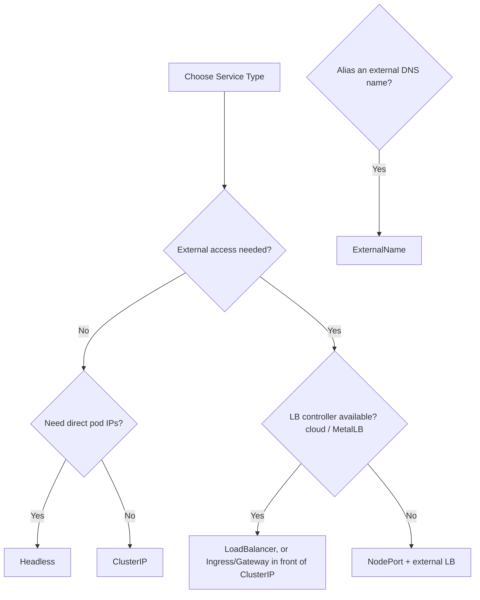

> 💡 **Quick Answer:** Kubernetes has 4 Service types: **ClusterIP** (internal-only, default) — accessible within the cluster via virtual IP. **NodePort** — exposes on every node's IP at a static port (30000-32767). **LoadBalancer** — provisions cloud load balancer with external IP. **ExternalName** — DNS CNAME alias to external service. Choose ClusterIP for microservice communication, NodePort for dev/testing, LoadBalancer for production external access.

## The Problem

Pods are ephemeral — their IPs change on restart. Services provide:

- Stable virtual IP for a set of pods
- Load balancing across pod replicas
- DNS-based service discovery
- External access to cluster workloads

But which Service type fits your use case?

## The Solution

### ClusterIP (Default)

```yaml
apiVersion: v1
kind: Service
metadata:
  name: api-service
spec:
  type: ClusterIP   # default, can be omitted
  selector:
    app: api
  ports:
  - port: 80         # Service port
    targetPort: 8080  # Pod port
```

```
[Pod A] → api-service:80 → [api pod 1]
                           → [api pod 2]
                           → [api pod 3]
# Only accessible within the cluster
# DNS: api-service.default.svc.cluster.local
```

**Use when:** microservices communicating within the cluster.

### Headless Service (ClusterIP: None)

```yaml
apiVersion: v1
kind: Service
metadata:
  name: db-service
spec:
  clusterIP: None    # Headless — no virtual IP
  selector:
    app: postgres
  ports:
  - port: 5432
```

```bash
# DNS returns individual pod IPs instead of virtual IP
nslookup db-service
# db-service.default.svc.cluster.local → 10.244.1.5
#                                       → 10.244.2.3
# Used by StatefulSets for stable network identities:
# postgres-0.db-service.default.svc.cluster.local → 10.244.1.5
```

### NodePort

```yaml
apiVersion: v1
kind: Service
metadata:
  name: web-nodeport
spec:
  type: NodePort
  selector:
    app: web
  ports:
  - port: 80
    targetPort: 8080
    nodePort: 30080    # Optional, auto-assigned if omitted (30000-32767)
```

```
[External] → <any-node-ip>:30080 → [web pod 1]
                                  → [web pod 2]
# Every node listens, even nodes with no web pod (kube-proxy forwards)
# Port range: 30000-32767 (--service-node-port-range)
```

**Use when:** development, testing, bare-metal clusters without cloud LB.

### LoadBalancer

```yaml
apiVersion: v1
kind: Service
metadata:
  name: web-lb
  annotations:
    # Cloud-specific annotations
    service.beta.kubernetes.io/aws-load-balancer-type: "nlb"
spec:
  type: LoadBalancer
  selector:
    app: web
  ports:
  - port: 80
    targetPort: 8080
```

```bash
kubectl get svc web-lb
# NAME     TYPE           CLUSTER-IP   EXTERNAL-IP     PORT(S)
# web-lb   LoadBalancer   10.96.0.50   203.0.113.100   80:31234/TCP
# 80:31234 → a NodePort is still allocated; the LB targets it
# (set spec.allocateLoadBalancerNodePorts: false if your LB routes to pod IPs directly)
```

**Use when:** production external access on cloud providers (AWS, GCP, Azure).

**Bare-metal:** Use MetalLB to provide LoadBalancer functionality.

### ExternalName

```yaml
apiVersion: v1
kind: Service
metadata:
  name: external-db
spec:
  type: ExternalName
  externalName: db.example.com
```

```bash
# DNS CNAME — no proxy, no port mapping
nslookup external-db
# external-db.default.svc.cluster.local → CNAME db.example.com
```

**Use when:** aliasing external services with cluster DNS names.

### Comparison Table

| Type | External Access | IP Type | Port Range | Cloud Required | Cost |
|------|----------------|---------|------------|----------------|------|
| ClusterIP | ❌ Internal only | Virtual IP | Any | No | Free |
| NodePort | ✅ Via node IP | Node IPs | 30000-32767 | No | Free |
| LoadBalancer | ✅ External IP | Cloud LB IP | Any | Yes (or MetalLB) | One cloud LB per Service |
| ExternalName | ❌ DNS alias | None | N/A | No | Free |
| Headless | ❌ Internal only | Pod IPs directly | Any | No | Free |

### Quick Create Commands

```bash
# ClusterIP
kubectl expose deployment nginx --port=80 --target-port=8080

# NodePort
kubectl expose deployment nginx --type=NodePort --port=80 --target-port=8080

# LoadBalancer
kubectl expose deployment nginx --type=LoadBalancer --port=80 --target-port=8080

# Generate YAML
kubectl expose deployment nginx --port=80 --dry-run=client -o yaml
```


```mermaid
graph TD
    A[Choose Service Type] --> B{External access needed?}
    B -->|No| C{Need direct pod IPs?}
    C -->|Yes| H[Headless]
    C -->|No| CI[ClusterIP]
    B -->|Yes| D{LB controller available? cloud / MetalLB}
    D -->|Yes| E[LoadBalancer, or Ingress/Gateway in front of ClusterIP]
    D -->|No| F[NodePort + external LB]
    I{Alias an external DNS name?} -->|Yes| J[ExternalName]
```

## Common Issues

**LoadBalancer stuck in "Pending" EXTERNAL-IP**

No cloud LB controller. On bare-metal, install MetalLB (`helm install metallb metallb/metallb -n metallb-system --create-namespace`) and define an `IPAddressPool` + `L2Advertisement` or BGP peering. On OpenShift, install the MetalLB Operator.

**NodePort not reachable**

Firewall blocking port range 30000-32767. Open these ports on cloud security groups or `iptables`.

**Service has no endpoints**

Selector doesn't match any pod labels. Check: `kubectl get endpoints <svc>`.

## Frequently Asked Questions

### What is the difference between ClusterIP, NodePort and LoadBalancer?
They build on each other: ClusterIP gives a cluster-internal virtual IP; NodePort adds a static port (30000-32767) on every node forwarding to that ClusterIP; LoadBalancer adds an external load balancer that targets the NodePorts (or pods directly, depending on the provider).

### Which Service type is most common?
ClusterIP by far — most services are internal. For external HTTP(S), a single LoadBalancer in front of an Ingress or Gateway controller routes to many ClusterIP Services.

### ExternalName vs a Service without a selector?
ExternalName returns a DNS CNAME and only works with hostnames. To point a Service at external IP addresses, create a Service without a selector and an `EndpointSlice` (label `kubernetes.io/service-name: <svc>`) listing the IPs.

### How do I preserve the client source IP?
Set `externalTrafficPolicy: Local` on NodePort/LoadBalancer Services. Traffic is only sent to nodes running a ready pod, and SNAT is skipped.

## Best Practices

- **ClusterIP for 90% of services** — internal microservice communication
- **Ingress/Gateway API over NodePort/LoadBalancer** — one LB for many services
- **Headless for StatefulSets** — stable network identity per pod
- **Set `externalTrafficPolicy: Local`** on NodePort/LB — preserves client IP
- **Use annotations for cloud LB tuning** — NLB vs ALB, internal vs external

## Key Takeaways

- ClusterIP is the default — internal-only, stable virtual IP
- NodePort opens a port on every node (30000-32767) — good for dev
- LoadBalancer provisions cloud infrastructure — production external access
- ExternalName creates DNS CNAME aliases to external services
- Most production apps use ClusterIP + Ingress (one LB for many services)
