> 💡 **Quick Answer:** Use `ClusterIP` (default) for internal services, `NodePort` for development/testing, `LoadBalancer` for production external access, `ExternalName` for external service aliasing, and headless (`clusterIP: None`) for StatefulSet direct pod addressing.

## The Problem

Which Service type should you use? ClusterIP for internal, LoadBalancer for external — but what about NodePort vs Ingress? When is headless appropriate? And what is ExternalName actually for? Each type has specific use cases and tradeoffs.

## The Solution

### Service Types Comparison

| Type | Accessible From | IP | Use Case |
|------|----------------|-----|----------|
| **ClusterIP** | Inside cluster only | Virtual IP | Internal services |
| **NodePort** | External via node IP:port | Node IP:30000-32767 | Dev/testing |
| **LoadBalancer** | External via cloud LB | Cloud LB IP | Production external |
| **ExternalName** | Inside cluster | DNS CNAME | External service alias |
| **Headless** | Inside cluster | No virtual IP | StatefulSet, direct pod |

### ClusterIP (Default)

```yaml
apiVersion: v1
kind: Service
metadata:
  name: backend-api
spec:
  type: ClusterIP
  selector:
    app: backend
  ports:
    - port: 80
      targetPort: 8080
```

### LoadBalancer

```yaml
apiVersion: v1
kind: Service
metadata:
  name: web-frontend
  annotations:
    service.beta.kubernetes.io/aws-load-balancer-type: nlb
spec:
  type: LoadBalancer
  selector:
    app: web-frontend
  ports:
    - port: 443
      targetPort: 8443
```

### Headless Service (StatefulSet)

```yaml
apiVersion: v1
kind: Service
metadata:
  name: postgres
spec:
  type: ClusterIP
  clusterIP: None
  selector:
    app: postgres
  ports:
    - port: 5432
```

Headless creates DNS records for each pod: `postgres-0.postgres.ns.svc.cluster.local`

```mermaid
graph TD
    subgraph ClusterIP
        INTERNAL[Internal Pod] -->|backend-api:80| CIP[Virtual IP<br/>10.96.x.x] --> BACKENDS[Backend Pods]
    end
    subgraph NodePort
        EXTERNAL1[External Client] -->|node-ip:30080| NP[Node] --> BACKENDS2[Backend Pods]
    end
    subgraph LoadBalancer
        EXTERNAL2[External Client] -->|lb-ip:443| LB[Cloud LB] --> NODES[Nodes] --> BACKENDS3[Backend Pods]
    end
    subgraph Headless
        CLIENT[Client Pod] -->|postgres-0.postgres:5432| POD0[postgres-0<br/>direct IP]
    end
```



## Common Issues

**LoadBalancer stuck in Pending — no external IP**

Cloud provider integration not configured, or you're on bare-metal. Use MetalLB for bare-metal LoadBalancer support.

**NodePort not accessible externally**

Check firewall rules allow the port range (30000-32767). Security groups must permit inbound traffic on the NodePort.

## Best Practices

- **ClusterIP for everything internal** — default, most common
- **LoadBalancer only when needed** — each one creates a cloud LB ($18/month on AWS)
- **Use Ingress instead of multiple LoadBalancers** — one LB, multiple services via hostname/path
- **Headless for StatefulSets** — enables direct pod addressing
- **ExternalName for gradual migration** — alias external services as cluster-internal names

## Key Takeaways

- ClusterIP is the default — internal-only virtual IP routed by kube-proxy
- NodePort exposes on all nodes at a high port — good for dev, not production
- LoadBalancer creates a cloud load balancer — one per Service, costs money
- Headless (clusterIP: None) gives direct pod DNS — essential for StatefulSets
- ExternalName creates a CNAME — no proxy, just DNS aliasing
- Use Ingress to expose multiple services through one LoadBalancer
