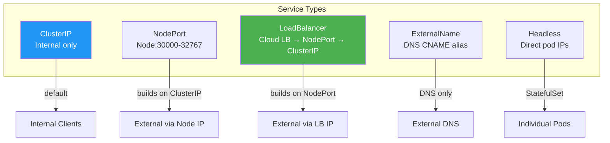

> 💡 **Quick Answer:** ClusterIP (internal only, default), NodePort (external via node ports 30000-32767), LoadBalancer (cloud LB provisioning), ExternalName (DNS CNAME alias), Headless (no ClusterIP, direct pod DNS). Use ClusterIP for internal services, LoadBalancer or Ingress for external traffic, and Headless for StatefulSets.

## The Problem

Pods have ephemeral IPs that change on restart. Services provide stable networking, but choosing the wrong type causes:

- Internal services accidentally exposed externally
- Unnecessary cloud load balancer costs
- StatefulSet pods unreachable by hostname
- External services not discoverable via Kubernetes DNS

## The Solution

### ClusterIP (Default)

```yaml
apiVersion: v1
kind: Service
metadata:
  name: api-service
spec:
  type: ClusterIP          # Default — internal only
  selector:
    app: api
  ports:
  - port: 80               # Service port
    targetPort: 8080        # Pod port
    protocol: TCP
```

Access: `api-service.namespace.svc.cluster.local:80` — cluster-internal only.

### NodePort

```yaml
apiVersion: v1
kind: Service
metadata:
  name: web-nodeport
spec:
  type: NodePort
  selector:
    app: web
  ports:
  - port: 80
    targetPort: 8080
    nodePort: 30080         # Optional: auto-assigned if omitted (30000-32767)
```

Access: `<any-node-ip>:30080` — external access without a load balancer.

### LoadBalancer

```yaml
apiVersion: v1
kind: Service
metadata:
  name: web-lb
  annotations:
    # Cloud-specific annotations
    service.beta.kubernetes.io/aws-load-balancer-type: nlb
spec:
  type: LoadBalancer
  selector:
    app: web
  ports:
  - port: 443
    targetPort: 8443
  loadBalancerSourceRanges:     # Restrict source IPs
  - 10.0.0.0/8
```

Access: `<external-lb-ip>:443` — cloud provider provisions a load balancer.

### ExternalName

```yaml
apiVersion: v1
kind: Service
metadata:
  name: external-db
spec:
  type: ExternalName
  externalName: db.legacy.example.com   # DNS CNAME
```

Access: `external-db.namespace.svc` resolves to `db.legacy.example.com` — no proxying, just DNS.

### Headless Service

```yaml
apiVersion: v1
kind: Service
metadata:
  name: postgres-headless
spec:
  clusterIP: None          # Headless
  selector:
    app: postgres
  ports:
  - port: 5432
```

Access: `postgres-0.postgres-headless.namespace.svc` — DNS returns individual pod IPs.

### Comparison



| Type | External Access | Use Case | Cost |
|------|---------------|----------|------|
| **ClusterIP** | No | Internal microservices | Free |
| **NodePort** | Yes (node IP) | Dev/test, bare metal | Free |
| **LoadBalancer** | Yes (LB IP) | Production external | $$$ per LB |
| **ExternalName** | DNS only | Legacy system integration | Free |
| **Headless** | No (pod IPs) | StatefulSets, peer discovery | Free |

## Common Issues

**LoadBalancer stuck in "Pending"**

No cloud controller or MetalLB installed. On bare metal, use MetalLB or switch to NodePort.

**Service not routing to pods**

Selector labels don't match pod labels. Compare `kubectl get svc <name> -o yaml` selectors with `kubectl get pods --show-labels`.

**ExternalName not resolving**

ExternalName doesn't work with IP addresses — it needs a DNS hostname. Use Endpoints for IP addresses instead.

## Best Practices

- **ClusterIP for everything internal** — don't expose unnecessarily
- **Ingress/Gateway API over LoadBalancer** — one LB for many services instead of one each
- **Headless for StatefulSets** — enables `pod-0.svc` DNS resolution
- **NodePort for dev/bare-metal only** — limited port range, security concern in production
- **Use `loadBalancerSourceRanges`** — restrict who can reach your LoadBalancer

## Key Takeaways

- Five Service types: ClusterIP, NodePort, LoadBalancer, ExternalName, Headless
- Each type builds on the previous: LoadBalancer → NodePort → ClusterIP
- ClusterIP is the default and right choice for most internal services
- Headless (clusterIP: None) is essential for StatefulSet pod discovery
- Use Ingress or Gateway API instead of individual LoadBalancer Services to reduce cost
