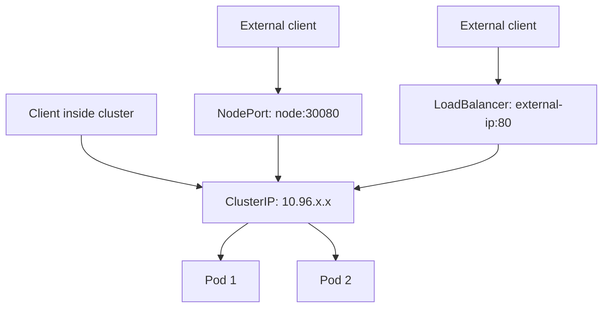

> 💡 **Quick Answer:** Understand ClusterIP, NodePort, LoadBalancer, and ExternalName service types in Kubernetes. When to use each type with practical examples and comparisons.

## The Problem

This is one of the most searched Kubernetes topics. Having a comprehensive, well-structured guide helps both beginners and experienced users quickly find what they need.

## The Solution

### The Four Service Types

```yaml
# ClusterIP (default) — internal only
apiVersion: v1
kind: Service
metadata:
  name: backend-api
spec:
  type: ClusterIP
  selector:
    app: backend
  ports:
    - port: 80
      targetPort: 8080
# Access: backend-api.default.svc.cluster.local:80
---
# NodePort — expose on every node's IP
apiVersion: v1
kind: Service
metadata:
  name: web-nodeport
spec:
  type: NodePort
  selector:
    app: web
  ports:
    - port: 80
      targetPort: 8080
      nodePort: 30080    # 30000-32767 range
# Access: <any-node-ip>:30080
---
# LoadBalancer — cloud load balancer
apiVersion: v1
kind: Service
metadata:
  name: web-public
spec:
  type: LoadBalancer
  selector:
    app: web
  ports:
    - port: 80
      targetPort: 8080
# Access: <external-ip>:80
---
# ExternalName — DNS alias to external service
apiVersion: v1
kind: Service
metadata:
  name: external-db
spec:
  type: ExternalName
  externalName: db.example.com
# Access: external-db.default.svc → CNAME → db.example.com
```

### Comparison

| Type | Scope | Use Case | Cost |
|------|-------|----------|------|
| ClusterIP | Internal only | Service-to-service | Free |
| NodePort | External via node IP | Dev/testing, bare metal | Free |
| LoadBalancer | External via cloud LB | Production cloud | $$$ per LB |
| ExternalName | DNS alias | External services | Free |

### Headless Service (StatefulSets)

```yaml
apiVersion: v1
kind: Service
metadata:
  name: postgres
spec:
  clusterIP: None     # Headless — no load balancing
  selector:
    app: postgres
  ports:
    - port: 5432
# DNS returns individual pod IPs:
# postgres-0.postgres.default.svc.cluster.local
# postgres-1.postgres.default.svc.cluster.local
```



## Frequently Asked Questions

### When should I use LoadBalancer vs Ingress?

Use **LoadBalancer** for non-HTTP traffic (databases, gRPC) or single services. Use **Ingress** for HTTP routing to multiple services with path/host-based rules — one LoadBalancer for many services.

### What is ClusterIP None (headless service)?

A headless service doesn't get a cluster IP. DNS returns individual pod IPs instead of load-balancing. Required for StatefulSets where clients need to reach specific pods.

## Best Practices

- **Start simple** — use the basic form first, add complexity as needed
- **Be consistent** — follow naming conventions across your cluster
- **Document your choices** — add annotations explaining why, not just what
- **Monitor and iterate** — review configurations regularly

## Key Takeaways

- This is fundamental Kubernetes knowledge every engineer needs
- Start with the simplest approach that solves your problem
- Use `kubectl explain` and `kubectl describe` when unsure
- Practice in a test cluster before applying to production
