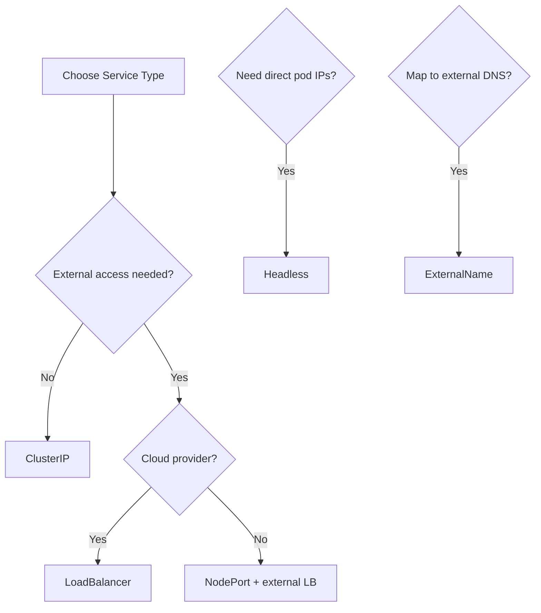

> 💡 **Quick Answer:** networking

## The Problem

This is one of the most searched Kubernetes topics with thousands of monthly searches. A comprehensive, production-ready guide prevents hours of trial and error.

## The Solution

### All Service Types

| Type | Access | Use Case |
|------|--------|----------|
| **ClusterIP** | Internal only | Default — pod-to-pod communication |
| **NodePort** | Internal + node IP:port | Dev/testing, on-prem |
| **LoadBalancer** | Internal + external LB IP | Production external access |
| **ExternalName** | DNS alias | Map to external service |
| **Headless** | Direct pod IPs | StatefulSets, client-side LB |

### ClusterIP (Default)

```yaml
apiVersion: v1
kind: Service
metadata:
  name: api
spec:
  # type: ClusterIP (default, can be omitted)
  selector:
    app: api
  ports:
    - port: 80
      targetPort: 8080
# Access: http://api.default.svc.cluster.local
```

### NodePort

```yaml
spec:
  type: NodePort
  ports:
    - port: 80
      targetPort: 8080
      nodePort: 30080     # 30000-32767
# Access: http://<any-node-ip>:30080
```

### LoadBalancer

```yaml
spec:
  type: LoadBalancer
  ports:
    - port: 80
      targetPort: 8080
# Access: http://<external-lb-ip>
```

### ExternalName (DNS alias)

```yaml
apiVersion: v1
kind: Service
metadata:
  name: external-db
spec:
  type: ExternalName
  externalName: db.example.com
# Pods can use: http://external-db → resolves to db.example.com
# No proxying — just DNS CNAME
```

### Headless (clusterIP: None)

```yaml
spec:
  clusterIP: None
  selector:
    app: postgres
  ports:
    - port: 5432
# DNS returns all pod IPs instead of virtual IP
```



## Frequently Asked Questions

### Which is most common?

ClusterIP by far — most services are internal. For external access, LoadBalancer + Ingress is the standard production setup.

### ExternalName vs Endpoints?

ExternalName creates a DNS CNAME (domain only). For IP addresses, create a Service without selector and manually create an Endpoints object pointing to the external IP.

## Best Practices

- Start with the simplest configuration that solves your problem
- Test in staging before production
- Use `kubectl describe` and events for troubleshooting
- Document team conventions for consistency

## Key Takeaways

- This is fundamental Kubernetes operational knowledge
- Follow established conventions and recommended labels
- Monitor and iterate based on real production behavior
- Automate repetitive tasks to reduce human error
