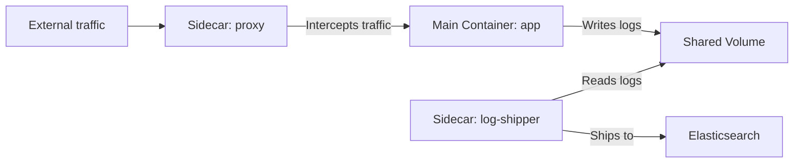

> 💡 **Quick Answer:** configuration

## The Problem

This is a fundamental Kubernetes topic that engineers search for frequently. A comprehensive reference with production-ready examples saves hours of trial and error.

## The Solution

### Classic Sidecar Pattern

```yaml
apiVersion: v1
kind: Pod
metadata:
  name: web-app
spec:
  containers:
    # Main application
    - name: app
      image: my-app:v1
      ports:
        - containerPort: 8080
      volumeMounts:
        - name: logs
          mountPath: /var/log/app

    # Sidecar: log shipper
    - name: log-shipper
      image: fluent/fluent-bit:2.2
      volumeMounts:
        - name: logs
          mountPath: /var/log/app
          readOnly: true
        - name: fluent-config
          mountPath: /fluent-bit/etc/

  volumes:
    - name: logs
      emptyDir: {}
    - name: fluent-config
      configMap:
        name: fluent-bit-config
```

### Native Sidecar (K8s 1.28+)

```yaml
# restartPolicy: Always makes init containers act as sidecars
# They start before main containers and run for the pod's lifetime
spec:
  initContainers:
    - name: istio-proxy
      image: istio/proxyv2:1.20
      restartPolicy: Always     # ← This makes it a native sidecar
      ports:
        - containerPort: 15001
      resources:
        requests:
          cpu: 100m
          memory: 128Mi
  containers:
    - name: app
      image: my-app:v1
```

### Common Sidecar Patterns

| Pattern | Sidecar | Purpose |
|---------|---------|---------|
| Logging | Fluent Bit / Fluentd | Ship logs to central store |
| Proxy | Envoy / Istio | Service mesh, mTLS |
| Config sync | git-sync | Pull config from Git |
| Adapter | Custom | Transform metrics format |
| Ambassador | Custom | Proxy to external service |



## Frequently Asked Questions

### Classic sidecar vs native sidecar (K8s 1.28+)?

Classic sidecars are regular containers — no guaranteed startup order. Native sidecars use `restartPolicy: Always` on init containers — they start before and stop after main containers, fixing ordering issues.

### Do sidecars share networking?

Yes — all containers in a pod share the same network namespace (same IP, same localhost). Sidecars can proxy traffic on localhost.

## Best Practices

- Start with the simplest configuration that meets your needs
- Test changes in staging before production
- Use `kubectl describe` and events for troubleshooting
- Document your decisions for the team

## Key Takeaways

- This is essential Kubernetes knowledge for production operations
- Follow the principle of least privilege and minimal configuration
- Monitor and iterate based on real-world behavior
- Automation reduces human error and improves consistency
