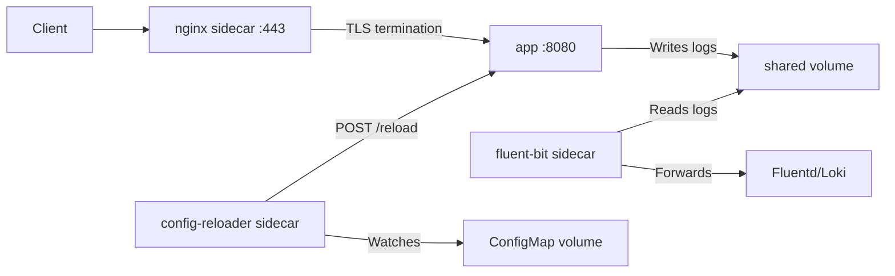

> 💡 **Quick Answer:** Implement sidecar containers for logging, proxying, config reload, and security. Built-in sidecar support in Kubernetes 1.28+ with restartPolicy Always.

## The Problem

Sidecar containers extend your application without modifying its code. Common uses: log forwarding, reverse proxying, config reloading, and TLS termination. Kubernetes 1.28+ has native sidecar support via init containers with `restartPolicy: Always`.

## The Solution

### Native Sidecar (Kubernetes 1.28+)

```yaml
apiVersion: v1
kind: Pod
metadata:
  name: app-with-sidecar
spec:
  initContainers:
    # Native sidecar — runs alongside main container
    - name: log-forwarder
      image: fluent/fluent-bit:3.0
      restartPolicy: Always    # Makes it a sidecar!
      volumeMounts:
        - name: logs
          mountPath: /var/log/app
      env:
        - name: FLUENT_OUTPUT
          value: "forward://fluentd.logging:24224"
  containers:
    - name: app
      image: my-app:v1
      volumeMounts:
        - name: logs
          mountPath: /var/log/app
  volumes:
    - name: logs
      emptyDir: {}
```

### Pattern: Reverse Proxy Sidecar

```yaml
containers:
  - name: app
    image: my-app:v1
    ports:
      - containerPort: 8080    # App on internal port
  - name: nginx-proxy
    image: nginx:1.25
    ports:
      - containerPort: 443     # HTTPS on external port
    volumeMounts:
      - name: nginx-config
        mountPath: /etc/nginx/conf.d
      - name: tls-certs
        mountPath: /etc/nginx/tls
        readOnly: true
volumes:
  - name: nginx-config
    configMap:
      name: nginx-proxy-config
  - name: tls-certs
    secret:
      secretName: app-tls
```

### Pattern: Config Reloader Sidecar

```yaml
containers:
  - name: app
    image: my-app:v1
    volumeMounts:
      - name: config
        mountPath: /app/config
  - name: config-reloader
    image: jimmidyson/configmap-reload:v0.12.0
    args:
      - --volume-dir=/config
      - --webhook-url=http://localhost:8080/-/reload
      - --webhook-method=POST
    volumeMounts:
      - name: config
        mountPath: /config
```



## Best Practices

- **Start small and iterate** — don't over-engineer on day one
- **Monitor and measure** — you can't improve what you don't measure
- **Automate repetitive tasks** — reduce human error and toil
- **Document your decisions** — future you will thank present you

## Key Takeaways

- This is essential knowledge for production Kubernetes operations
- Start with the simplest approach that solves your problem
- Monitor the impact of every change you make
- Share knowledge across your team with internal runbooks
