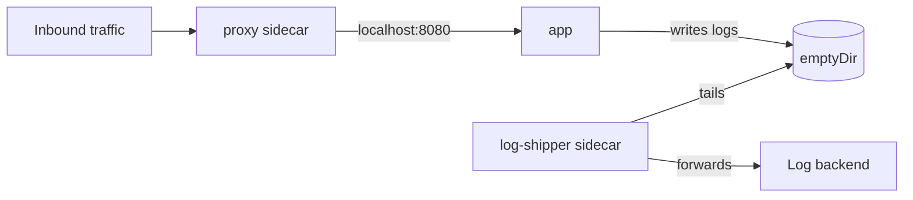

> 💡 **Quick Answer:** A sidecar is a helper container in the same pod as your app: it shares the pod's network (talk over `localhost`) and can share volumes. Declare it as a **native sidecar** — an entry in `initContainers` with `restartPolicy: Always` (on by default since 1.29, GA 1.33). Native sidecars start before the app, keep running, stop **after** the app, and don't block Job completion. Common uses: log shippers (Fluent Bit), proxies (Envoy, istio-proxy, Cloud SQL proxy), config reloaders, secret agents (Vault), metrics exporters.

## Native Sidecar (Recommended)

```yaml
apiVersion: v1
kind: Pod
metadata:
  name: app-with-sidecar
spec:
  initContainers:
    - name: log-shipper
      image: fluent/fluent-bit:3.1
      restartPolicy: Always          # ← makes this init container a sidecar
      volumeMounts:
        - name: logs
          mountPath: /var/log/app
          readOnly: true
        - name: fluent-config
          mountPath: /fluent-bit/etc/
      resources:
        requests: {cpu: 50m, memory: 64Mi}
        limits: {memory: 128Mi}
  containers:
    - name: app
      image: myapp:v2
      volumeMounts:
        - name: logs
          mountPath: /var/log/app
  volumes:
    - name: logs
      emptyDir: {}
    - name: fluent-config
      configMap:
        name: fluent-bit-config
---
apiVersion: v1
kind: ConfigMap
metadata:
  name: fluent-bit-config
data:
  fluent-bit.conf: |
    [INPUT]
        Name tail
        Path /var/log/app/*.log
        Tag app.logs
    [OUTPUT]
        Name forward
        Match *
        Host fluentd.logging
        Port 24224
```

### Lifecycle order

```text
Pod start
1. Regular init containers run to completion, in order
2. Each sidecar (restartPolicy: Always) starts in its position in initContainers;
   the next init entry waits until the sidecar has *started* (startupProbe passed, if set)
3. App containers start
4. Sidecars are restarted independently if they crash; they don't restart the pod

Pod termination
1. App containers get SIGTERM and exit
2. Sidecars get SIGTERM afterwards, in reverse order
3. Pod terminates (all within terminationGracePeriodSeconds)
```

Readiness probes on a sidecar affect **pod readiness**, not app startup. To make the app wait until a proxy is actually listening, give the sidecar a `startupProbe`.

### Ordering multiple sidecars

Sidecars and regular init containers can be interleaved; position in `initContainers` is the start order, shutdown is the reverse.

```yaml
spec:
  initContainers:
    - name: vault-agent                 # 1. sidecar: starts first, stops last
      image: hashicorp/vault:1.17
      restartPolicy: Always
      args: ["agent", "-config=/etc/vault/agent.hcl"]
      startupProbe:
        exec: {command: ["test", "-f", "/vault/secrets/config"]}
        periodSeconds: 1
        failureThreshold: 60
    - name: db-schema-check             # 2. regular init: runs once vault-agent has started, then exits
      image: myorg/schema-checker:v1.0
      command: ["check", "--wait"]
    - name: envoy                       # 3. sidecar: starts after the schema check exits 0
      image: envoyproxy/envoy:v1.31-latest
      restartPolicy: Always
      startupProbe:
        httpGet: {path: /ready, port: 9901}
  containers:
    - name: app                         # 4. starts after every sidecar has started
      image: myorg/app:v3.0
# Shutdown: app → envoy → vault-agent
```

### Migrating a classic sidecar

Move the container from `containers` to `initContainers` and add `restartPolicy: Always`. Replace any `readinessProbe` you relied on for ordering with a `startupProbe` — only the startup probe gates the next container.

## Classic Sidecar (Regular Container)

```yaml
spec:
  containers:
    - name: app
      image: myapp:v2
    - name: log-shipper        # just another container
      image: fluent/fluent-bit:3.1
```

Still works everywhere and is what most Helm charts and injectors produced before 1.29, but:

- **No startup order** — the app may start before the proxy is listening
- **Jobs never complete** — the pod keeps running while the sidecar runs
- **Shutdown race** — app and sidecar get SIGTERM together; the proxy can die before the app finishes in-flight requests

Mesh injectors can emit native sidecars instead: Istio via the `ENABLE_NATIVE_SIDECARS` istiod setting, Linkerd via the `config.alpha.linkerd.io/proxy-enable-native-sidecar` annotation. Check your mesh version's docs for the default.

## Job with a Sidecar That Completes

```yaml
apiVersion: batch/v1
kind: Job
metadata:
  name: data-export
spec:
  template:
    spec:
      restartPolicy: Never
      initContainers:
        - name: cloud-sql-proxy
          image: gcr.io/cloud-sql-connectors/cloud-sql-proxy:2.11.0
          restartPolicy: Always
          args: ["--port=5432", "--private-ip", "project:region:instance"]
          startupProbe:                     # exporter starts only once the proxy is up
            tcpSocket: {port: 5432}
            periodSeconds: 1
            failureThreshold: 30
          securityContext:
            runAsNonRoot: true
      containers:
        - name: exporter
          image: myapp:v2
          command: ["./export-data"]
          env:
            - name: DATABASE_HOST
              value: "127.0.0.1"
# exporter exits 0 → proxy gets SIGTERM → Job Complete
```

## Common Sidecar Patterns

| Pattern | Sidecar | Purpose |
|---------|---------|---------|
| Log shipping | Fluent Bit, Vector | Tail files from a shared volume and forward |
| Proxy / mesh | Envoy, istio-proxy, linkerd-proxy | mTLS, routing, retries |
| TLS termination | nginx, Envoy | Serve HTTPS on :443, forward to the app on `localhost:8080` |
| Cloud DB proxy | Cloud SQL proxy, RDS IAM proxy | IAM auth + TLS to managed DB |
| Config sync / reload | git-sync, configmap-reload | Pull config, signal the app |
| Secrets | Vault Agent | Render and renew secrets into tmpfs |
| Adapter | redis_exporter, custom | Expose metrics in Prometheus format |
| Ambassador | Custom | Local endpoint for an external service |


```mermaid
graph LR
    A[app] -->|writes logs| B[(emptyDir)]
    C[log-shipper sidecar] -->|tails| B
    C -->|forwards| D[Log backend]
    F[Inbound traffic] --> E[proxy sidecar]
    E -->|localhost:8080| A
```

### Envoy proxy

```yaml
spec:
  initContainers:
    - name: envoy
      image: envoyproxy/envoy:v1.31-latest
      restartPolicy: Always
      ports:
        - containerPort: 10000   # ingress listener
        - containerPort: 9901    # admin
      startupProbe:
        httpGet: {path: /ready, port: 9901}
      volumeMounts:
        - name: envoy-config
          mountPath: /etc/envoy
      resources:
        requests: {cpu: 100m, memory: 128Mi}
  containers:
    - name: app
      image: myapp:v1
      ports:
        - containerPort: 8080     # Service targets 10000, Envoy forwards to localhost:8080
  volumes:
    - name: envoy-config
      configMap:
        name: envoy-config
```

### Config reloader

```yaml
spec:
  initContainers:
    - name: config-reloader
      image: ghcr.io/jimmidyson/configmap-reload:v0.13.1
      restartPolicy: Always
      args:
        - --volume-dir=/etc/app/config
        - --webhook-url=http://localhost:8080/-/reload
      volumeMounts:
        - name: config
          mountPath: /etc/app/config
          readOnly: true
      resources:
        requests: {cpu: 10m, memory: 16Mi}
  containers:
    - name: app
      image: myapp:v1
      volumeMounts:
        - name: config
          mountPath: /etc/app/config
  volumes:
    - name: config
      configMap:
        name: app-config
```

Mounted ConfigMaps update in place (not with `subPath`) after the kubelet sync period; the reloader then hits the app's reload endpoint. See [ConfigMap hot reload](/recipes/configuration/kubernetes-configmap-hot-reload/).

### Metrics exporter (adapter)

```yaml
spec:
  containers:
    - name: redis
      image: redis:7
      ports:
        - containerPort: 6379
    - name: exporter
      image: oliver006/redis_exporter:v1.62.0
      ports:
        - containerPort: 9121
          name: metrics
      env:
        - name: REDIS_ADDR
          value: "localhost:6379"
      resources:
        requests: {cpu: 50m, memory: 64Mi}
```

### Vault Agent (injected)

```yaml
metadata:
  annotations:
    vault.hashicorp.com/agent-inject: "true"
    vault.hashicorp.com/role: "myapp"
    vault.hashicorp.com/agent-inject-secret-config: "secret/data/myapp/config"
spec:
  serviceAccountName: myapp
  containers:
    - name: app
      image: myapp:v1
      # secrets appear at /vault/secrets/config — the injector adds the tmpfs volume itself
```

### Debug sidecar with shared process namespace

```yaml
spec:
  shareProcessNamespace: true      # containers see each other's processes
  containers:
    - name: app
      image: myapp:v1
    - name: debug
      image: busybox:1.36
      command: ["sleep", "infinity"]
      securityContext:
        capabilities:
          add: ["SYS_PTRACE"]
```

For ad-hoc debugging prefer `kubectl debug -it <pod> --image=busybox:1.36 --target=app` (ephemeral container) over baking a debug sidecar into the spec.

## Sidecar Resources

```yaml
containers:
  - name: app
    resources: {requests: {cpu: 500m, memory: 512Mi}}
  - name: sidecar-1
    resources: {requests: {cpu: 50m, memory: 64Mi}}
  - name: sidecar-2
    resources: {requests: {cpu: 50m, memory: 64Mi}}
# Pod request = 600m CPU / 640Mi
```

Native sidecar requests are **added** to the app containers (they run for the whole pod life), unlike regular init containers where only the max counts. Sidecars run in every replica — 50m × 200 pods is 10 cores. Always set requests and a memory limit.

## Common Issues

**App starts before the proxy is ready** — classic sidecar or native sidecar without `startupProbe`. Add a `startupProbe` on the native sidecar.

**Job stuck Running after the main container finished** — the sidecar is a regular container. Move it to `initContainers` with `restartPolicy: Always`.

**Pod stuck in `Init:` with a native sidecar** — its `startupProbe` never succeeds. `kubectl logs <pod> -c <sidecar>` and `kubectl describe pod`.

**`restartPolicy` field rejected** — the API server is older than 1.28, or 1.28 without the `SidecarContainers` feature gate. It's enabled by default from 1.29.

**Sidecar OOMKilled** — it restarts independently (native) but may drop logs or connections. Right-size its memory limit.

## Frequently Asked Questions

### What is a sidecar container in Kubernetes?

A secondary container in the same pod as the main app that adds a capability without changing the app: log shipping, proxying, secret rendering, config reload, metrics. It shares the pod's IP, `localhost` and volumes.

### How do I define a native sidecar?

Put it in `spec.initContainers` and set `restartPolicy: Always` on that container. It starts before the app containers, runs alongside them, and is stopped after them.

### Classic sidecar vs native sidecar?

Classic sidecars are regular containers with no ordering: they start together with the app, get SIGTERM at the same time, and keep Jobs from completing. Native sidecars fix all three.

### Which Kubernetes version supports native sidecars?

Alpha in 1.28 (feature gate `SidecarContainers`), beta and enabled by default in 1.29, GA in 1.33. OpenShift 4.16+ (Kubernetes 1.29) has it on by default.

### Do sidecars share networking and storage with the app?

Networking always — same IP and port space, so ports must not collide. Storage only through volumes both containers mount.

### Sidecar vs init container?

Init containers run once and must exit before the app starts. Sidecars keep running for the pod's lifetime. See [init containers](/recipes/deployments/kubernetes-init-containers-patterns-examples/).
