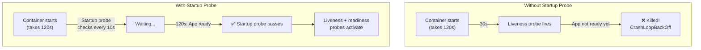

> 💡 **Quick Answer:** Startup probes protect slow-starting containers from being killed by liveness probes. The liveness and readiness probes are disabled until the startup probe succeeds. Set \`failureThreshold × periodSeconds\` to cover your worst-case startup time (e.g., \`failureThreshold: 30, periodSeconds: 10\` = 5-minute startup window).

## The Problem

Java applications, ML model loading, or database containers can take 60-300+ seconds to start. If your liveness probe has a 30-second \`initialDelaySeconds\`, pods get killed during startup and enter CrashLoopBackOff. Increasing \`initialDelaySeconds\` delays failure detection after the app is running. Startup probes solve this by separating startup detection from runtime health checking.



## The Solution

### Basic Startup Probe

```yaml
apiVersion: v1
kind: Pod
metadata:
  name: java-app
spec:
  containers:
    - name: app
      image: spring-boot-app:v1.0
      ports:
        - containerPort: 8080

      # Startup probe: protects during slow startup
      startupProbe:
        httpGet:
          path: /healthz
          port: 8080
        failureThreshold: 30       # 30 failures × 10s = 300s max startup
        periodSeconds: 10

      # Liveness probe: only runs AFTER startup probe succeeds
      livenessProbe:
        httpGet:
          path: /healthz
          port: 8080
        periodSeconds: 10
        failureThreshold: 3

      # Readiness probe: only runs AFTER startup probe succeeds
      readinessProbe:
        httpGet:
          path: /ready
          port: 8080
        periodSeconds: 5
        failureThreshold: 3
```

### How the Timing Works

```
Timeline:
t=0:      Container starts
t=0-300s: Startup probe checks every 10s (up to 30 failures allowed)
t=120s:   App responds to /healthz → startup probe SUCCEEDS
t=120s+:  Liveness probe starts (every 10s)
t=120s+:  Readiness probe starts (every 5s)

If app never starts within 300s → pod killed (startup probe failed)
If app crashes after startup  → liveness probe catches it in 30s
```

### Java Spring Boot Example

```yaml
startupProbe:
  httpGet:
    path: /actuator/health/liveness
    port: 8080
  failureThreshold: 30
  periodSeconds: 10           # 30 × 10 = 300s for Spring Boot startup

livenessProbe:
  httpGet:
    path: /actuator/health/liveness
    port: 8080
  periodSeconds: 10
  failureThreshold: 3         # Kill after 30s of failures

readinessProbe:
  httpGet:
    path: /actuator/health/readiness
    port: 8080
  periodSeconds: 5
  failureThreshold: 3
```

### ML Model Loading Example

```yaml
# NIM or HuggingFace model that takes 2-10 minutes to load
startupProbe:
  httpGet:
    path: /v1/health/ready
    port: 8000
  failureThreshold: 60
  periodSeconds: 10           # 60 × 10 = 600s (10 min) for model loading

livenessProbe:
  httpGet:
    path: /v1/health/live
    port: 8000
  periodSeconds: 15
  failureThreshold: 3
```

### TCP Startup Probe

For services that accept connections before HTTP endpoints are ready:

```yaml
startupProbe:
  tcpSocket:
    port: 5432                 # PostgreSQL port
  failureThreshold: 30
  periodSeconds: 5             # 30 × 5 = 150s for database startup
```

### Exec Startup Probe

For custom readiness checks:

```yaml
startupProbe:
  exec:
    command:
      - sh
      - -c
      - "pg_isready -U postgres -d mydb"
  failureThreshold: 20
  periodSeconds: 5
```

### Probe Comparison

| Probe | When It Runs | On Failure | Purpose |
|-------|-------------|------------|---------|
| **Startup** | Until first success | Kill pod (after failureThreshold) | Protect slow-starting containers |
| **Liveness** | After startup succeeds | Kill pod → restart | Detect deadlocked/stuck apps |
| **Readiness** | After startup succeeds | Remove from Service endpoints | Control traffic routing |

### Calculate Your Startup Budget

```
Max startup time = failureThreshold × periodSeconds

Examples:
  30 × 10s = 300s (5 min) — Java apps, Spring Boot
  60 × 10s = 600s (10 min) — ML model loading
  12 × 5s  = 60s (1 min) — Standard web apps
  90 × 10s = 900s (15 min) — Large NIM models on slow storage
```

## Common Issues

| Issue | Cause | Fix |
|-------|-------|-----|
| Pod killed during startup | Startup budget too short | Increase \`failureThreshold\` or \`periodSeconds\` |
| Startup probe never succeeds | App crash, wrong port/path | Check pod logs, verify health endpoint |
| Liveness probe killing healthy pod | No startup probe, \`initialDelaySeconds\` too short | Add startup probe instead |
| readiness never runs | Startup probe failing | Fix startup probe first |
| False positive startup | Probe endpoint returns 200 before app is truly ready | Use a dedicated startup endpoint that checks all dependencies |

## Best Practices

- **Always use startup probes for slow containers** — cleaner than large \`initialDelaySeconds\`
- **Set generous startup budgets** — 2× your worst observed startup time
- **Use different endpoints** — \`/healthz\` for liveness, \`/ready\` for readiness, can share for startup
- **Don't check dependencies in liveness** — liveness should only check if the process is alive
- **Monitor startup durations** — track P99 startup time to right-size failureThreshold

## Key Takeaways

- Startup probes disable liveness/readiness probes until the container is ready
- Max startup window = \`failureThreshold × periodSeconds\`
- Essential for Java, ML models, databases, and any container with >30s startup
- Liveness and readiness probes only activate after startup probe succeeds
- Replaces the anti-pattern of large \`initialDelaySeconds\` on liveness probes
- Available since Kubernetes 1.20 (GA)
