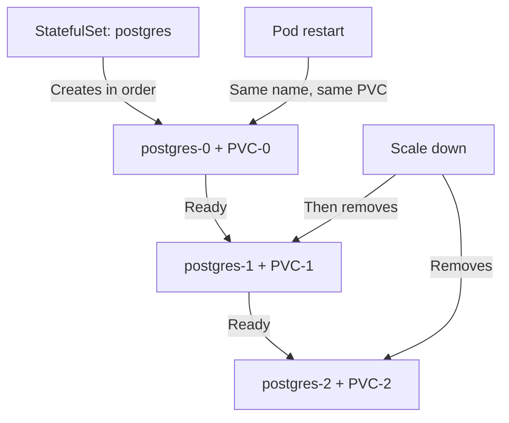

> 💡 **Quick Answer:** deployments

## The Problem

This is a fundamental Kubernetes topic that engineers search for frequently. A comprehensive reference with production-ready examples saves hours of trial and error.

## The Solution

### Create a StatefulSet

```yaml
apiVersion: apps/v1
kind: StatefulSet
metadata:
  name: postgres
spec:
  serviceName: postgres    # Required headless service name
  replicas: 3
  selector:
    matchLabels:
      app: postgres
  template:
    metadata:
      labels:
        app: postgres
    spec:
      containers:
        - name: postgres
          image: postgres:16
          ports:
            - containerPort: 5432
          env:
            - name: POSTGRES_PASSWORD
              valueFrom:
                secretKeyRef:
                  name: pg-secret
                  key: password
            - name: POD_NAME
              valueFrom:
                fieldRef:
                  fieldPath: metadata.name
          volumeMounts:
            - name: data
              mountPath: /var/lib/postgresql/data
          resources:
            requests:
              cpu: 500m
              memory: 1Gi
  volumeClaimTemplates:
    - metadata:
        name: data
      spec:
        accessModes: ["ReadWriteOnce"]
        storageClassName: fast-ssd
        resources:
          requests:
            storage: 50Gi
  podManagementPolicy: OrderedReady   # Sequential startup (default)
  # Or: Parallel — start all pods simultaneously
---
# Required headless service
apiVersion: v1
kind: Service
metadata:
  name: postgres
spec:
  clusterIP: None
  selector:
    app: postgres
  ports:
    - port: 5432
```

### What You Get

```bash
# Stable pod names (ordinal index)
kubectl get pods
# postgres-0   Running
# postgres-1   Running
# postgres-2   Running

# Stable DNS per pod
# postgres-0.postgres.default.svc.cluster.local
# postgres-1.postgres.default.svc.cluster.local

# Unique PVC per pod (persists across restarts)
kubectl get pvc
# data-postgres-0   Bound   50Gi
# data-postgres-1   Bound   50Gi
# data-postgres-2   Bound   50Gi
```

### Scaling and Updates

```bash
# Scale up — adds postgres-3, postgres-4 (in order)
kubectl scale statefulset postgres --replicas=5

# Scale down — removes highest ordinal first (4, then 3)
kubectl scale statefulset postgres --replicas=3

# Rolling update — updates in reverse order (2 → 1 → 0)
kubectl set image statefulset/postgres postgres=postgres:17

# Partition update — only update pods >= ordinal 2 (canary)
kubectl patch statefulset postgres -p '{"spec":{"updateStrategy":{"rollingUpdate":{"partition":2}}}}'
```



## Frequently Asked Questions

### When should I use StatefulSet vs Deployment?

Use StatefulSet when you need: stable pod identity (pod-0, pod-1), unique persistent storage per pod, or ordered startup/shutdown. Databases, Kafka, Elasticsearch — all need StatefulSets.

### What happens when a StatefulSet pod is deleted?

It's recreated with the exact same name (e.g., postgres-1) and reattaches to its original PVC (data-postgres-1). Data persists across pod restarts.

## Best Practices

- Start with the simplest configuration that meets your needs
- Test changes in staging before production
- Use `kubectl describe` and events for troubleshooting
- Document your decisions for the team

## Key Takeaways

- This is essential Kubernetes knowledge for production operations
- Follow the principle of least privilege and minimal configuration
- Monitor and iterate based on real-world behavior
- Automation reduces human error and improves consistency
