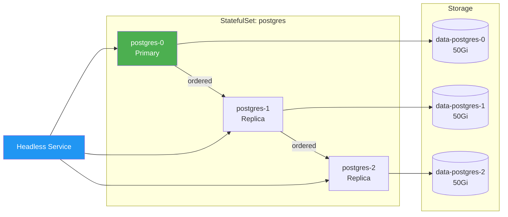

> 💡 **Quick Answer:** StatefulSets provide stable pod identities (`pod-0`, `pod-1`, `pod-2`), ordered deployment/scaling, and per-pod persistent storage via `volumeClaimTemplates`. Use for databases (PostgreSQL, MySQL), message queues (Kafka, RabbitMQ), and any workload needing stable hostnames or persistent identity. Requires a Headless Service for DNS.

## The Problem

Deployments treat pods as interchangeable — fine for stateless apps, broken for:

- Databases needing stable storage per replica
- Distributed systems requiring peer discovery by hostname
- Applications needing ordered startup (primary before replicas)
- Workloads where pod identity matters (Kafka broker IDs, ZooKeeper ensemble)

## The Solution

### StatefulSet with Headless Service

```yaml
apiVersion: v1
kind: Service
metadata:
  name: postgres-headless
spec:
  clusterIP: None             # Headless — required for StatefulSet
  selector:
    app: postgres
  ports:
  - port: 5432
---
apiVersion: apps/v1
kind: StatefulSet
metadata:
  name: postgres
spec:
  serviceName: postgres-headless   # Must match headless service
  replicas: 3
  selector:
    matchLabels:
      app: postgres
  template:
    metadata:
      labels:
        app: postgres
    spec:
      containers:
      - name: postgres
        image: postgres:16
        ports:
        - containerPort: 5432
        env:
        - name: POSTGRES_PASSWORD
          valueFrom:
            secretKeyRef:
              name: pg-secret
              key: password
        volumeMounts:
        - name: data
          mountPath: /var/lib/postgresql/data
  
  volumeClaimTemplates:          # One PVC per pod, automatically
  - metadata:
      name: data
    spec:
      accessModes: ["ReadWriteOnce"]
      storageClassName: fast-ssd
      resources:
        requests:
          storage: 50Gi
```

### Pod Identity and DNS

```bash
# Pods get stable names
kubectl get pods
# postgres-0   Running
# postgres-1   Running
# postgres-2   Running

# Stable DNS names (within cluster)
# postgres-0.postgres-headless.default.svc.cluster.local
# postgres-1.postgres-headless.default.svc.cluster.local
# postgres-2.postgres-headless.default.svc.cluster.local

# PVCs are per-pod and retained
kubectl get pvc
# data-postgres-0   Bound   50Gi
# data-postgres-1   Bound   50Gi
# data-postgres-2   Bound   50Gi
```

### Update Strategies

```yaml
spec:
  updateStrategy:
    type: RollingUpdate       # Default
    rollingUpdate:
      partition: 1            # Only update pods ≥ ordinal 1
      maxUnavailable: 1       # v1.24+: parallel updates
```

| Strategy | Behavior |
|----------|----------|
| `RollingUpdate` | Updates pods in reverse order (N-1 → 0) |
| `OnDelete` | Only updates when pod is manually deleted |
| `partition: N` | Canary: only update pods with ordinal ≥ N |

### Pod Management Policies

```yaml
spec:
  podManagementPolicy: Parallel    # Start all pods simultaneously
  # Default: OrderedReady — one at a time, wait for Ready
```



### Scaling

```bash
# Scale up (new pods get sequential ordinals)
kubectl scale statefulset postgres --replicas=5
# Creates postgres-3, postgres-4

# Scale down (removes highest ordinal first)
kubectl scale statefulset postgres --replicas=3
# Removes postgres-4, then postgres-3
# PVCs are NOT deleted — data preserved
```

## Common Issues

**Pod stuck in Pending after scale-up**

PVC can't be provisioned — check StorageClass and available capacity. With `WaitForFirstConsumer`, the pod must be schedulable first.

**Pods not starting in order**

Default `OrderedReady` waits for each pod to be Ready before starting the next. If pod-0 has no readiness probe, it may never be "Ready" and blocks pod-1.

**PVCs remain after StatefulSet deletion**

By design — PVCs are NOT garbage collected. Delete them manually if data isn't needed: `kubectl delete pvc data-postgres-{0,1,2}`.

## Best Practices

- **Always use a Headless Service** — StatefulSet requires it for stable DNS
- **`volumeClaimTemplates` for per-pod storage** — don't share PVCs between StatefulSet pods
- **Use `partition` for canary updates** — test on one replica before rolling out
- **PDBs are critical** — `minAvailable: 2` for a 3-replica database ensures quorum
- **Back up before scaling down** — data on removed PVCs is preserved but pod is gone
- **`OrderedReady` for databases** — primary must be ready before replicas start

## Key Takeaways

- StatefulSets provide stable pod names, ordered lifecycle, and per-pod persistent storage
- Headless Service is mandatory for stable DNS resolution (`pod-0.svc.ns.svc`)
- `volumeClaimTemplates` automatically create one PVC per pod
- PVCs survive pod deletion and scale-down — data is preserved
- Update in reverse order (highest ordinal first) — primary is last to update
- Use Deployment for stateless, StatefulSet for stateful workloads
