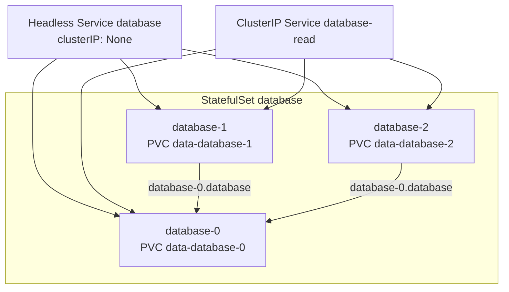

> 💡 **Quick Answer:** A StatefulSet's `spec.serviceName` must name a **headless Service** (`clusterIP: None`) with a matching selector. That Service is what creates stable per-pod DNS: `<pod>.<service>.<namespace>.svc.cluster.local` (e.g. `database-0.database.production.svc.cluster.local`). The Service name itself resolves to all Ready pod IPs — no VIP, no load balancing. Add a second, normal ClusterIP Service for load-balanced client traffic.

Regular Services hide pods behind one virtual IP. Stateful systems (databases, brokers, consensus clusters) need to address **specific** replicas — "connect to the primary at `-0`", "join peers `-1` and `-2`". The headless Service gives each StatefulSet pod a stable, predictable DNS name that survives rescheduling even though the pod IP changes.

## StatefulSet with Headless Service

```yaml
# Headless Service: governs the StatefulSet's network identity
apiVersion: v1
kind: Service
metadata:
  name: database
  namespace: production
spec:
  clusterIP: None          # headless
  selector:
    app: database
  ports:
    - port: 5432
      name: postgres
---
apiVersion: apps/v1
kind: StatefulSet
metadata:
  name: database
  namespace: production
spec:
  serviceName: database    # must match the headless Service name exactly
  replicas: 3
  selector:
    matchLabels:
      app: database
  template:
    metadata:
      labels:
        app: database
    spec:
      containers:
        - name: postgres
          image: postgres:16
          ports:
            - containerPort: 5432
              name: postgres
          env:
            - name: POSTGRES_PASSWORD
              valueFrom:
                secretKeyRef:
                  name: db-credentials
                  key: password
          volumeMounts:
            - name: data
              mountPath: /var/lib/postgresql/data
  volumeClaimTemplates:
    - metadata:
        name: data
      spec:
        accessModes: ["ReadWriteOnce"]
        storageClassName: fast-ssd
        resources:
          requests:
            storage: 50Gi
```

Create the Service first (or in the same `kubectl apply`). The StatefulSet controller doesn't create or validate it — a typo in `serviceName` produces pods with **no** per-pod DNS and no error.

## DNS Records Created

```text
StatefulSet: database (3 replicas)   Headless Service: database

A records
├── database-0.database.production.svc.cluster.local → 10.0.1.5
├── database-1.database.production.svc.cluster.local → 10.0.1.6
├── database-2.database.production.svc.cluster.local → 10.0.1.7
└── database.production.svc.cluster.local           → 10.0.1.5, 10.0.1.6, 10.0.1.7

SRV records (per named port)
└── _postgres._tcp.database.production.svc.cluster.local
      → database-0.database..., database-1.database..., database-2.database...
```

The StatefulSet controller also sets each pod's `spec.hostname` to the pod name and `spec.subdomain` to `serviceName`, so `hostname -f` inside `database-1` returns its FQDN.

```bash
# Per-pod A record
kubectl run dns-test -n production --rm -it --restart=Never --image=busybox:1.36 -- \
  nslookup database-0.database
# Name: database-0.database.production.svc.cluster.local
# Address: 10.0.1.5

# All Ready pods behind the Service
kubectl run dns-test -n production --rm -it --restart=Never --image=busybox:1.36 -- \
  nslookup database

# SRV lookup for peer discovery
kubectl run dns-test -n production --rm -it --restart=Never --image=tutum/dnsutils -- \
  dig +short SRV _postgres._tcp.database.production.svc.cluster.local
```

Short names work within the namespace (`database-0.database`); across namespaces use `database-0.database.production`.

## Headless for Peers, ClusterIP for Clients

```yaml
# Headless: per-pod identity, replication, peer discovery
apiVersion: v1
kind: Service
metadata:
  name: database
spec:
  clusterIP: None
  selector:
    app: database
  ports:
    - port: 5432
---
# Normal ClusterIP: load-balanced client connections
apiVersion: v1
kind: Service
metadata:
  name: database-read
spec:
  selector:
    app: database
  ports:
    - port: 5432
```

For a writable primary, don't point clients at a Service that selects all replicas — use an operator (CloudNativePG, Patroni) that labels the current primary and exposes a `-rw` Service.

## Readiness and `publishNotReadyAddresses`

By default DNS only publishes pods that pass readiness. That breaks clusters whose members must discover each other **before** they are Ready (etcd, ZooKeeper, Cassandra, Elasticsearch bootstrap):

```yaml
apiVersion: v1
kind: Service
metadata:
  name: etcd-peers
spec:
  clusterIP: None
  publishNotReadyAddresses: true   # DNS records exist as soon as the pod has an IP
  selector:
    app: etcd
  ports:
    - port: 2380
      name: peer
```

Use a separate headless Service with `publishNotReadyAddresses: true` for peer traffic and keep the client Service readiness-gated.

## Bootstrap Using the Ordinal and Peer DNS

```yaml
spec:
  template:
    spec:
      initContainers:
        - name: init-cluster
          image: postgres:16
          command:
            - bash
            - -c
            - |
              ORDINAL=${HOSTNAME##*-}
              if [ "$ORDINAL" = "0" ]; then
                echo "primary: initialising"
              else
                echo "replica $ORDINAL: waiting for primary"
                until pg_isready -h database-0.database.production; do sleep 2; done
                # pg_basebackup from database-0 ...
              fi
```

This works because `OrderedReady` (the default `podManagementPolicy`) starts `database-0` first. For scaling, updates, partitions and PVC retention see the full [StatefulSet guide](/recipes/deployments/statefulset-management/).



## Common Issues

### Pod names don't resolve
- `spec.serviceName` doesn't match the Service name, or the Service is in another namespace
- The Service isn't headless (`clusterIP` set) — per-pod records are only created for headless Services
- Selector doesn't match the pod labels: `kubectl get endpointslices -l kubernetes.io/service-name=database`
- Pod isn't Ready yet — set `publishNotReadyAddresses: true` if peers need it earlier

### Client sticks to a dead pod IP
Apps or JVMs caching DNS indefinitely. Reduce DNS cache TTL (e.g. `networkaddress.cache.ttl` for Java) and always connect by name.

### Changing `serviceName` on an existing StatefulSet
`serviceName` is immutable. Delete with `kubectl delete statefulset database --cascade=orphan`, recreate with the new name (pods and PVCs are adopted), then restart pods to pick up the new subdomain.

### Pods stuck in Pending after scale-up
New ordinals get new PVCs from `volumeClaimTemplates`. Check provisioning: `kubectl describe pvc data-database-3`.

## Frequently Asked Questions

### Does a StatefulSet require a headless Service?

`spec.serviceName` is a required field, and it must point at a headless Service for pods to get stable DNS names. Kubernetes won't stop you from omitting or misnaming the Service, but then `database-0.database` won't resolve — which defeats most of the reason to use a StatefulSet.

### What is the DNS name of a StatefulSet pod?

`<statefulset-name>-<ordinal>.<serviceName>.<namespace>.svc.cluster.local`, for example `database-0.database.production.svc.cluster.local`. It stays the same across restarts and rescheduling; the IP behind it changes.

### What's the difference between a headless Service and a ClusterIP Service?

A ClusterIP Service gets a virtual IP and kube-proxy load-balances across pods. A headless Service (`clusterIP: None`) gets no VIP: DNS returns the pod IPs directly, plus per-pod A records for StatefulSet members.

### Can I use one Service for both peers and clients?

Yes for simple cases, but production setups usually run a headless Service for peer identity (often with `publishNotReadyAddresses: true`) and a separate ClusterIP Service for client traffic.
