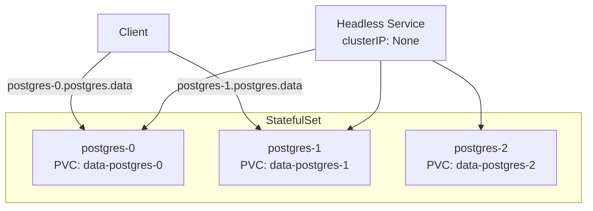

> 💡 **Quick Answer:** A headless Service (`clusterIP: None`) gives each StatefulSet pod a stable DNS name: `<pod-name>.<service-name>.<namespace>.svc.cluster.local`, enabling direct pod-to-pod communication.

## The Problem

Regular Services load-balance across pods randomly. Stateful workloads (databases, message brokers, consensus systems) need:
- Stable, predictable hostnames
- Ordered startup and shutdown
- Persistent storage tied to specific pods
- Direct addressing of individual replicas

## The Solution

### StatefulSet with Headless Service

```yaml
apiVersion: v1
kind: Service
metadata:
  name: postgres
  namespace: data
spec:
  clusterIP: None
  selector:
    app: postgres
  ports:
    - port: 5432
      targetPort: 5432
---
apiVersion: apps/v1
kind: StatefulSet
metadata:
  name: postgres
  namespace: data
spec:
  serviceName: postgres
  replicas: 3
  selector:
    matchLabels:
      app: postgres
  template:
    metadata:
      labels:
        app: postgres
    spec:
      containers:
        - name: postgres
          image: postgres:16
          ports:
            - containerPort: 5432
          env:
            - name: POSTGRES_PASSWORD
              valueFrom:
                secretKeyRef:
                  name: pg-secret
                  key: password
          volumeMounts:
            - name: data
              mountPath: /var/lib/postgresql/data
  volumeClaimTemplates:
    - metadata:
        name: data
      spec:
        accessModes: ["ReadWriteOnce"]
        storageClassName: fast-ssd
        resources:
          requests:
            storage: 50Gi
```

### DNS Resolution

```bash
# Each pod gets a predictable DNS name
postgres-0.postgres.data.svc.cluster.local
postgres-1.postgres.data.svc.cluster.local
postgres-2.postgres.data.svc.cluster.local

# Service DNS returns ALL pod IPs (no load balancing)
nslookup postgres.data.svc.cluster.local
# Returns: 10.244.1.5, 10.244.2.8, 10.244.3.2
```

### Parallel Pod Management

```yaml
spec:
  podManagementPolicy: Parallel  # Don't wait for ordered startup
  replicas: 5
```

### Update Strategy

```yaml
spec:
  updateStrategy:
    type: RollingUpdate
    rollingUpdate:
      partition: 2  # Only update pods with ordinal >= 2
```



## Common Issues

**Pods stuck in Pending after StatefulSet scale-up**
VolumeClaimTemplates create new PVCs. Check StorageClass and available PVs:
```bash
kubectl get pvc -n data
kubectl describe pvc data-postgres-3
```

**DNS not resolving individual pods**
Ensure `serviceName` in StatefulSet matches the headless Service name exactly.

**PVCs not deleted on scale-down**
By design — PVCs persist after pod deletion. Manual cleanup required:
```bash
kubectl delete pvc data-postgres-2 -n data
```

**Pod stuck terminating during updates**
StatefulSets respect ordering: pod N must be Running before pod N+1 starts. Check pod N's readiness probe.

## Best Practices

- Always create the headless Service before the StatefulSet
- Use `volumeClaimTemplates` for per-pod persistent storage
- Set `podManagementPolicy: Parallel` when ordering doesn't matter
- Use `partition` for canary updates (test on higher-ordinal pods first)
- Configure PDB to prevent losing quorum during disruptions
- Use init containers for cluster bootstrap logic (detect first-run vs join)

## Key Takeaways

- Headless Service (`clusterIP: None`) enables per-pod DNS
- Pod names are deterministic: `<statefulset>-<ordinal>` (0-indexed)
- PVCs from `volumeClaimTemplates` survive pod deletion and rescheduling
- Default ordering: pods created 0→N, deleted N→0, updated N→0
- `Parallel` management policy removes ordering guarantees for faster scaling
- `partition` enables rolling updates of a subset of pods
