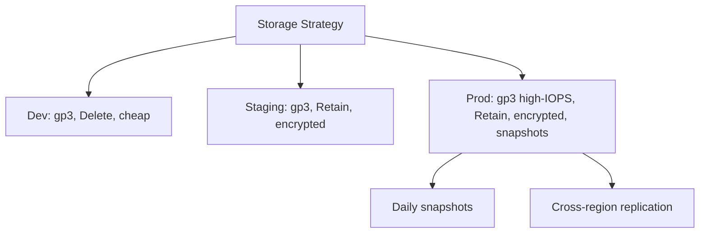

> 💡 **Quick Answer:** Production storage best practices for Kubernetes. StorageClass selection, backup strategies, volume expansion, data migration, and performance tuning.

## The Problem

Engineers frequently search for this topic but find scattered, incomplete guides. This recipe provides a comprehensive, production-ready reference.

## The Solution

### StorageClass Recommendations

```yaml
# Production: encrypted, high IOPS
apiVersion: storage.k8s.io/v1
kind: StorageClass
metadata:
  name: fast-encrypted
provisioner: ebs.csi.aws.com
parameters:
  type: gp3
  iops: "5000"
  throughput: "250"
  encrypted: "true"
  kmsKeyId: "arn:aws:kms:..."
reclaimPolicy: Retain        # Don't auto-delete data!
allowVolumeExpansion: true
volumeBindingMode: WaitForFirstConsumer
---
# Development: cheap, no encryption
apiVersion: storage.k8s.io/v1
kind: StorageClass
metadata:
  name: dev-storage
provisioner: ebs.csi.aws.com
parameters:
  type: gp3
reclaimPolicy: Delete
allowVolumeExpansion: true
```

### Checklist

| Practice | Why | Priority |
|----------|-----|----------|
| `reclaimPolicy: Retain` for prod | Prevent accidental data loss | Critical |
| `allowVolumeExpansion: true` | Resize without recreating PVC | High |
| `WaitForFirstConsumer` | Ensure PV is in same AZ as pod | High |
| Encryption at rest | Compliance and security | Critical |
| Regular snapshots | Point-in-time recovery | Critical |
| Monitor PV usage | Alert before disk full | High |
| Test restore procedures | Backups are useless if untested | Critical |

### Volume Expansion

```bash
# Expand a PVC (no downtime for most CSI drivers)
kubectl patch pvc postgres-data -p '{"spec":{"resources":{"requests":{"storage":"100Gi"}}}}'

# Some drivers need pod restart for filesystem resize
kubectl delete pod <pod-using-pvc>
# Pod recreates and filesystem expands on mount
```



## Frequently Asked Questions

### What happens if my PV's AZ doesn't match my pod's node?

The pod stays Pending because the volume can't be attached. Use `WaitForFirstConsumer` binding mode to create the PV in the same AZ as the pod's node.


## Best Practices

- Start with the simplest approach that solves your problem
- Test thoroughly in staging before production
- Monitor and iterate based on real metrics
- Document decisions for your team

## Key Takeaways

- This is essential Kubernetes operational knowledge
- Production-readiness requires proper configuration and monitoring
- Use `kubectl describe` and logs for troubleshooting
- Automate where possible to reduce human error
