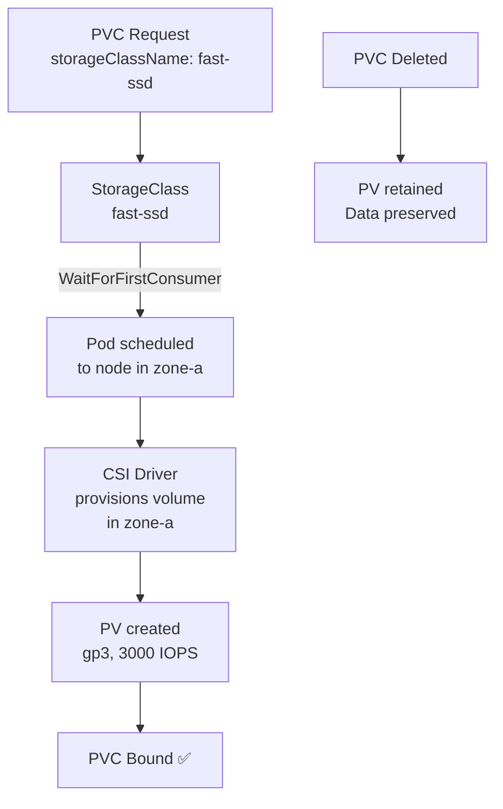

> 💡 **Quick Answer:** Create StorageClasses with `reclaimPolicy: Retain` for databases (preserves data on PVC deletion), `allowVolumeExpansion: true` for growing volumes, and `volumeBindingMode: WaitForFirstConsumer` for topology-aware scheduling. Use `Retain` for production, `Delete` for dev.

## The Problem

The default StorageClass with `reclaimPolicy: Delete` destroys your data when a PVC is deleted. Without `allowVolumeExpansion`, you can't grow volumes without recreating them. And `Immediate` binding breaks topology-aware scheduling — pods can't reach volumes provisioned in the wrong zone.

## The Solution

### Production StorageClass

```yaml
apiVersion: storage.k8s.io/v1
kind: StorageClass
metadata:
  name: fast-ssd
  annotations:
    storageclass.kubernetes.io/is-default-class: "true"
provisioner: ebs.csi.aws.com
parameters:
  type: gp3
  iops: "3000"
  throughput: "125"
  encrypted: "true"
  fsType: ext4
reclaimPolicy: Retain
allowVolumeExpansion: true
volumeBindingMode: WaitForFirstConsumer
mountOptions:
  - noatime
```

### Storage Class Comparison

| Purpose | Reclaim | Expansion | Binding | Type |
|---------|---------|-----------|---------|------|
| Database (prod) | Retain | true | WaitForFirstConsumer | gp3/io2 |
| App cache (prod) | Delete | true | WaitForFirstConsumer | gp3 |
| Dev/test | Delete | true | Immediate | gp3 |
| AI model storage | Retain | true | WaitForFirstConsumer | io2 |

### High-Performance AI Storage

```yaml
apiVersion: storage.k8s.io/v1
kind: StorageClass
metadata:
  name: ai-model-storage
provisioner: ebs.csi.aws.com
parameters:
  type: io2
  iops: "64000"
  encrypted: "true"
reclaimPolicy: Retain
allowVolumeExpansion: true
volumeBindingMode: WaitForFirstConsumer
```

### NFS StorageClass (ReadWriteMany)

```yaml
apiVersion: storage.k8s.io/v1
kind: StorageClass
metadata:
  name: nfs-shared
provisioner: nfs.csi.k8s.io
parameters:
  server: nfs.example.com
  share: /exports/kubernetes
reclaimPolicy: Retain
mountOptions:
  - nfsvers=4.1
  - hard
  - nconnect=8
```



## Common Issues

**PVC stuck in Pending**

Check events: `kubectl describe pvc`. Common causes: no CSI driver installed, wrong StorageClass name, or no capacity in the zone.

**Volume provisioned in wrong zone — pod can't mount**

Use `volumeBindingMode: WaitForFirstConsumer` instead of `Immediate`. This delays provisioning until the pod is scheduled.

## Best Practices

- **`Retain` for production data** — never lose data on accidental PVC deletion
- **`WaitForFirstConsumer` always** — ensures volume is in the same zone as the pod
- **`allowVolumeExpansion: true`** — lets you grow volumes without recreation
- **Separate StorageClasses** for different workloads — databases vs cache vs AI models
- **Encrypt all volumes** — `encrypted: true` parameter for cloud CSI drivers

## Key Takeaways

- StorageClass controls how volumes are dynamically provisioned
- `reclaimPolicy: Retain` preserves data when PVC is deleted — essential for databases
- `WaitForFirstConsumer` ensures volumes are provisioned in the correct topology zone
- `allowVolumeExpansion: true` enables growing volumes without recreation
- Create separate StorageClasses for different performance tiers and workload types
