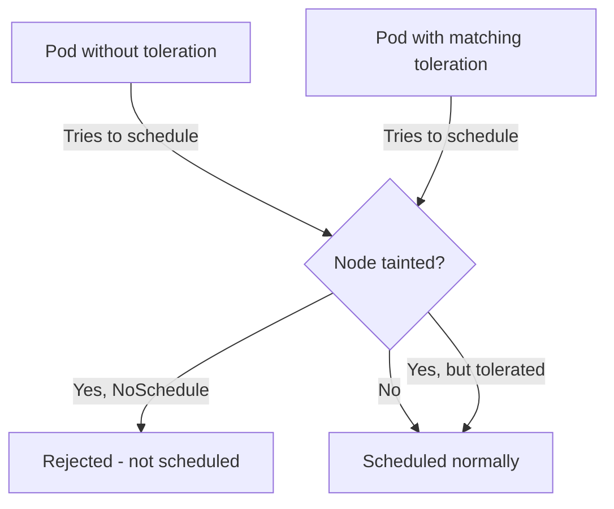

> 💡 **Quick Answer:** Use Kubernetes taints and tolerations to control pod scheduling. Dedicate nodes for GPU workloads, isolate teams, and prevent scheduling on specific nodes.

## The Problem

This is one of the most searched Kubernetes topics. Having a comprehensive, well-structured guide helps both beginners and experienced users quickly find what they need.

## The Solution

### Add Taints to Nodes

```bash
# Taint a node (NoSchedule — pods won't be scheduled unless they tolerate it)
kubectl taint nodes gpu-node-1 nvidia.com/gpu=true:NoSchedule

# PreferNoSchedule — soft version, scheduler avoids but doesn't forbid
kubectl taint nodes expensive-node cost=high:PreferNoSchedule

# NoExecute — evict existing pods that don't tolerate
kubectl taint nodes maintenance-node maintenance=true:NoExecute

# Remove a taint
kubectl taint nodes gpu-node-1 nvidia.com/gpu=true:NoSchedule-

# View taints
kubectl describe node gpu-node-1 | grep -A5 Taints
```

### Add Tolerations to Pods

```yaml
apiVersion: apps/v1
kind: Deployment
metadata:
  name: gpu-training
spec:
  template:
    spec:
      tolerations:
        # Exact match
        - key: "nvidia.com/gpu"
          operator: "Equal"
          value: "true"
          effect: "NoSchedule"
        # Key exists (any value)
        - key: "nvidia.com/gpu"
          operator: "Exists"
          effect: "NoSchedule"
        # Tolerate NoExecute with timeout
        - key: "maintenance"
          operator: "Exists"
          effect: "NoExecute"
          tolerationSeconds: 3600    # Stay 1 hour then evict
      nodeSelector:
        nvidia.com/gpu: "true"      # Also select GPU nodes
      containers:
        - name: training
          image: training:v1
          resources:
            limits:
              nvidia.com/gpu: 1
```

### Common Patterns

| Pattern | Taint | Toleration on |
|---------|-------|---------------|
| GPU nodes | `nvidia.com/gpu=true:NoSchedule` | Only GPU workloads |
| Spot/preemptible | `cloud.google.com/gke-spot=true:NoSchedule` | Tolerant workloads |
| Control plane | `node-role.kubernetes.io/control-plane:NoSchedule` | System pods |
| Team isolation | `team=frontend:NoSchedule` | Frontend team pods |
| Maintenance | `maintenance=true:NoExecute` | Nothing (drains all pods) |



## Frequently Asked Questions

### What's the difference between taints/tolerations and node affinity?

**Taints** repel pods (opt-out model). **Node affinity** attracts pods (opt-in model). Use together: taint GPU nodes AND use nodeSelector to ensure GPU pods land on GPU nodes.

### Does adding a toleration guarantee scheduling on that node?

No! Tolerations only allow scheduling — they don't attract. Use `nodeSelector` or node affinity together with tolerations to ensure pods land on specific nodes.

## Best Practices

- **Start simple** — use the basic form first, add complexity as needed
- **Be consistent** — follow naming conventions across your cluster
- **Document your choices** — add annotations explaining why, not just what
- **Monitor and iterate** — review configurations regularly

## Key Takeaways

- This is fundamental Kubernetes knowledge every engineer needs
- Start with the simplest approach that solves your problem
- Use `kubectl explain` and `kubectl describe` when unsure
- Practice in a test cluster before applying to production
