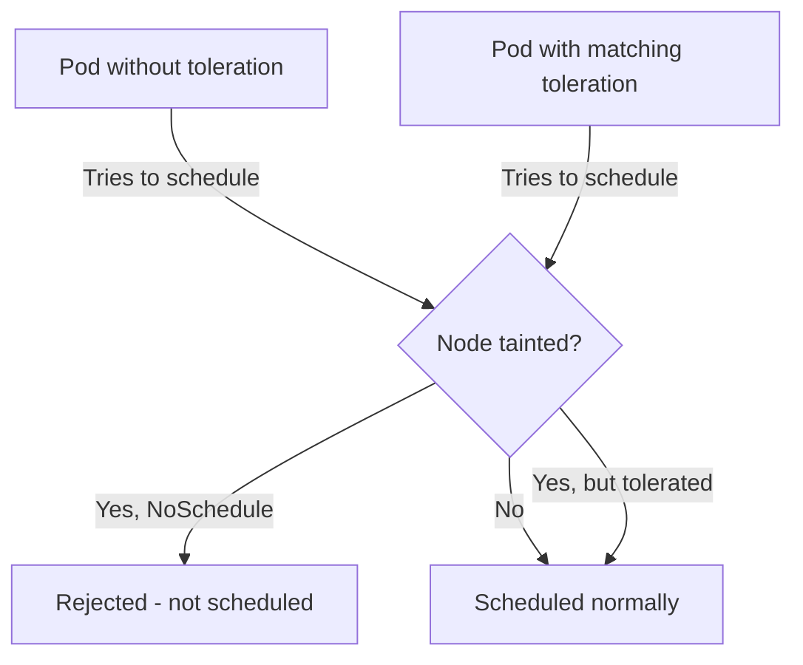

> 💡 **Quick Answer:** A **taint** on a node repels pods: `kubectl taint nodes <node> key=value:NoSchedule`. Only pods with a matching **toleration** in `spec.tolerations` can schedule there. Remove it with a trailing `-`: `kubectl taint nodes <node> key=value:NoSchedule-`. Tolerations only *allow* placement — pair them with a `nodeSelector` or node affinity to *force* pods onto dedicated nodes.
>
> **Pending with "node(s) had untolerated taint"?** See [fix untolerated taint scheduling errors](/recipes/troubleshooting/taint-toleration-scheduling-issues/).

## Taint Effects

| Effect | New pods without toleration | Running pods without toleration |
|--------|----------------------------|--------------------------------|
| `NoSchedule` | Not scheduled | Keep running |
| `PreferNoSchedule` | Avoided if another node fits | Keep running |
| `NoExecute` | Not scheduled | Evicted (after `tolerationSeconds` if the toleration sets one) |

A toleration matches when `key` and `effect` match and either `operator: Equal` with the same `value`, or `operator: Exists` (any value). An empty `effect` matches all effects; `operator: Exists` with no key tolerates every taint.

## Taints and Tolerations in Practice

### Add Taints to Nodes

```bash
# Taint a node (NoSchedule — pods won't be scheduled unless they tolerate it)
kubectl taint nodes gpu-node-1 nvidia.com/gpu=true:NoSchedule

# PreferNoSchedule — soft version, scheduler avoids but doesn't forbid
kubectl taint nodes expensive-node cost=high:PreferNoSchedule

# NoExecute — evict existing pods that don't tolerate
kubectl taint nodes maintenance-node maintenance=true:NoExecute

# Remove a taint
kubectl taint nodes gpu-node-1 nvidia.com/gpu=true:NoSchedule-

# View taints
kubectl describe node gpu-node-1 | grep -A5 Taints
```

### Add Tolerations to Pods

```yaml
apiVersion: apps/v1
kind: Deployment
metadata:
  name: gpu-training
spec:
  template:
    spec:
      tolerations:
        # Exact match (key, value and effect)
        - key: "nvidia.com/gpu"
          operator: "Equal"
          value: "true"
          effect: "NoSchedule"
        # Alternative: key exists with any value
        # - key: "nvidia.com/gpu"
        #   operator: "Exists"
        #   effect: "NoSchedule"
        # Tolerate NoExecute with timeout
        - key: "maintenance"
          operator: "Exists"
          effect: "NoExecute"
          tolerationSeconds: 3600    # Stay 1 hour then evict
      nodeSelector:
        nvidia.com/gpu.present: "true"   # Label set by GPU Feature Discovery; forces GPU nodes
      containers:
        - name: training
          image: training:v1
          resources:
            limits:
              nvidia.com/gpu: 1
```

### Common Patterns

| Pattern | Taint | Toleration on |
|---------|-------|---------------|
| GPU nodes | `nvidia.com/gpu=true:NoSchedule` | Only GPU workloads |
| Spot/preemptible | `cloud.google.com/gke-spot=true:NoSchedule` | Tolerant workloads |
| Control plane | `node-role.kubernetes.io/control-plane:NoSchedule` (OpenShift: `node-role.kubernetes.io/master:NoSchedule`) | System pods |
| Team isolation | `team=frontend:NoSchedule` | Frontend team pods |
| Maintenance | `maintenance=true:NoExecute` | Nothing (drains all pods) |


```mermaid
graph TD
    A[Pod without toleration] -->|Tries to schedule| B{Node tainted?}
    B -->|Yes, NoSchedule| C[Rejected - not scheduled]
    B -->|No| D[Scheduled normally]
    E[Pod with matching toleration] -->|Tries to schedule| B
    B -->|Yes, but tolerated| D
```

### Built-in Node Condition Taints

Kubernetes automatically applies these when a node has a problem — no manual `kubectl taint` needed:

```text
node.kubernetes.io/not-ready              node.kubernetes.io/memory-pressure
node.kubernetes.io/unreachable            node.kubernetes.io/disk-pressure
node.kubernetes.io/network-unavailable    node.kubernetes.io/pid-pressure
node.kubernetes.io/unschedulable
```

The `*-pressure`, `unschedulable` and `network-unavailable` taints use `NoSchedule`; `not-ready` and `unreachable` use `NoExecute`. The `DefaultTolerationSeconds` admission plugin adds tolerations for `not-ready`/`unreachable` with `tolerationSeconds: 300` to every pod, which is why pods on a dead node are evicted after about 5 minutes. DaemonSet pods automatically tolerate all of these.

Stateless pods that should fail over faster use a shorter value; critical pods that must ride out a brief node blip (rather than reschedule immediately) tolerate these explicitly with a bounded `tolerationSeconds`:

```yaml
tolerations:
  - {key: "node.kubernetes.io/not-ready", operator: "Exists", effect: "NoExecute", tolerationSeconds: 300}
  - {key: "node.kubernetes.io/unreachable", operator: "Exists", effect: "NoExecute", tolerationSeconds: 300}
```

### Graceful Node Maintenance Script

Taint first (stop new pods, let tolerant pods migrate on their own schedule), then drain what's left:

```bash
#!/bin/bash
NODE=$1
kubectl taint nodes "$NODE" maintenance=true:NoSchedule
sleep 60   # let pods with tolerationSeconds migrate gracefully first
kubectl drain "$NODE" --ignore-daemonsets --delete-emptydir-data
# ... perform maintenance ...
kubectl uncordon "$NODE"
kubectl taint nodes "$NODE" maintenance=true:NoSchedule-
```

### Allow Pods on Control Plane Nodes

```bash
# Single-node or lab clusters: remove the control-plane taint from all nodes
kubectl taint nodes --all node-role.kubernetes.io/control-plane-
```

Or tolerate it only for specific pods (monitoring agents, DaemonSets):

```yaml
tolerations:
  - key: node-role.kubernetes.io/control-plane
    operator: Exists
    effect: NoSchedule
```

### Tolerate Everything (DaemonSets)

```yaml
tolerations:
  - operator: Exists      # No key: matches every taint and effect
```

### Multi-Tenant Team Isolation

The same taint+toleration+nodeSelector combination used for GPU nodes works for dedicating nodes to a specific team:

```bash
kubectl taint nodes team-a-node-1 team=team-a:NoSchedule
```

```yaml
spec:
  tolerations: [{key: "team", operator: "Equal", value: "team-a", effect: "NoSchedule"}]
  nodeSelector: {team: team-a}
```

### Auditing Taints Across the Cluster

```bash
kubectl get nodes -o custom-columns='NAME:.metadata.name,TAINTS:.spec.taints[*].key'
kubectl get nodes -o json | jq '.items[] | select(.spec.taints == null) | .metadata.name'   # untainted nodes
```

## Common Issues

| Symptom | Cause | Fix |
|---|---|---|
| Pending: `node(s) had untolerated taint {key: value}` | No matching toleration | Add the toleration or remove the taint ([troubleshooting](/recipes/troubleshooting/taint-toleration-scheduling-issues/)) |
| Tolerating pods land on untainted nodes | Toleration only *allows* | Add `nodeSelector`/required node affinity |
| Every pod on a node evicted at once | `NoExecute` taint added | Use `NoSchedule` to only block new pods, or add tolerations (with `tolerationSeconds`) before tainting |
| DaemonSet missing on tainted nodes | Custom taints aren't auto-tolerated by DaemonSets | Add the toleration (or `operator: Exists`) to the DaemonSet template |
| CoreDNS/metrics-server Pending after tainting all workers | System pods have nowhere to go | Leave an untainted pool or tolerate the taint in system workloads |

## Frequently Asked Questions

### What is the difference between taints/tolerations and node affinity?

Taints repel pods from nodes (opt-out); node affinity and `nodeSelector` attract pods to nodes (opt-in). To dedicate nodes, use both: taint the nodes so other pods stay off, and give your pods a toleration plus a nodeSelector so they only land there.

### Does adding a toleration guarantee scheduling on that node?

No. A toleration only permits scheduling onto a tainted node; the scheduler may still place the pod elsewhere. Add a `nodeSelector` or required node affinity to pin it.

### How do I remove a taint from a node?

Repeat the taint with a trailing minus: `kubectl taint nodes node1 key=value:NoSchedule-`. `kubectl taint nodes node1 key-` removes the taint with that key for all effects.

### What does tolerationSeconds do?

It only applies to `NoExecute` taints: a pod that tolerates the taint stays bound for that many seconds after the taint appears, then is evicted. Without `tolerationSeconds`, a matching toleration keeps the pod on the node indefinitely.

### Why use taints instead of just nodeSelector?

A nodeSelector controls where *your* pod goes, but does nothing to keep *other* pods off your dedicated nodes. Taints protect the node itself, so expensive GPU or tenant-dedicated nodes aren't filled by unrelated workloads.

## Best Practices

- **Taint + label every dedicated pool** (GPU, spot, tenant) and add both toleration and selector to its workloads
- **Use `NoExecute` carefully** — adding it instantly evicts every non-tolerating pod on the node
- **Prefer `PreferNoSchedule`** for "expensive, use only if needed" nodes
- **Keep taint keys namespaced** (`example.com/dedicated`) to avoid collisions with vendor taints
- **Audit taints regularly** — a forgotten maintenance taint silently shrinks cluster capacity
