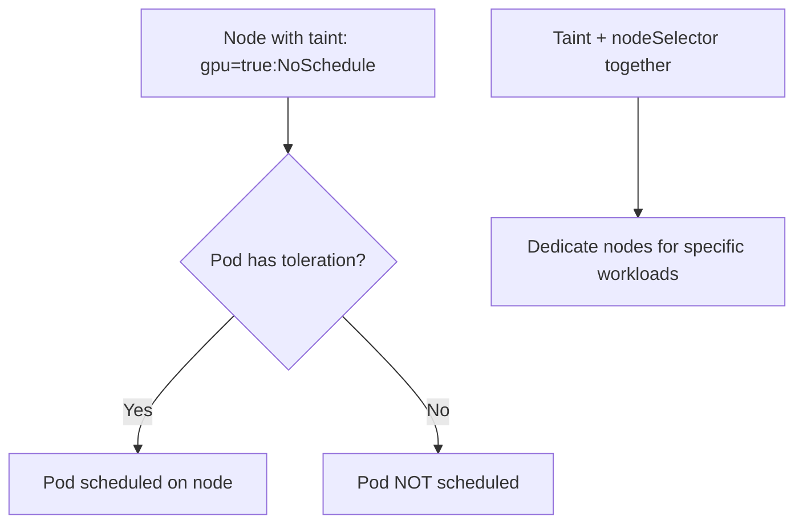

> 💡 **Quick Answer:** configuration

## The Problem

This is one of the most searched Kubernetes topics with thousands of monthly searches. A comprehensive, production-ready guide prevents hours of trial and error.

## The Solution

### Add Taints to Nodes

```bash
# Taint a node (pods without toleration won't schedule here)
kubectl taint nodes gpu-node-1 nvidia.com/gpu=true:NoSchedule

# Multiple taints
kubectl taint nodes special-node dedicated=ml-training:NoSchedule
kubectl taint nodes special-node expensive=true:PreferNoSchedule

# Remove a taint (add minus at end)
kubectl taint nodes gpu-node-1 nvidia.com/gpu=true:NoSchedule-

# View taints
kubectl describe node gpu-node-1 | grep Taints
```

### Taint Effects

| Effect | Behavior |
|--------|----------|
| `NoSchedule` | New pods won't schedule (existing stay) |
| `PreferNoSchedule` | Try to avoid, but schedule if no other option |
| `NoExecute` | Evict existing pods + prevent new |

### Tolerations in Pods

```yaml
apiVersion: apps/v1
kind: Deployment
metadata:
  name: ml-training
spec:
  template:
    spec:
      # Tolerate GPU node taint
      tolerations:
        - key: nvidia.com/gpu
          operator: Equal
          value: "true"
          effect: NoSchedule
      # Also use nodeSelector to PREFER these nodes
      nodeSelector:
        accelerator: nvidia-gpu
      containers:
        - name: training
          image: ml-training:v1
          resources:
            limits:
              nvidia.com/gpu: 1
```

### Common Patterns

```yaml
# Tolerate ALL taints (run everywhere — DaemonSets)
tolerations:
  - operator: Exists

# Tolerate NoExecute with timeout (evict after 300s)
tolerations:
  - key: node.kubernetes.io/unreachable
    operator: Exists
    effect: NoExecute
    tolerationSeconds: 300
```

### Built-in Taints

| Taint | Added When |
|-------|-----------|
| `node-role.kubernetes.io/control-plane:NoSchedule` | Control plane nodes |
| `node.kubernetes.io/not-ready:NoExecute` | Node not ready |
| `node.kubernetes.io/unreachable:NoExecute` | Node unreachable |
| `node.kubernetes.io/disk-pressure:NoSchedule` | Low disk space |
| `node.kubernetes.io/memory-pressure:NoSchedule` | Low memory |



## Frequently Asked Questions

### Taints vs node affinity?

**Taints** repel pods (keep pods OFF a node). **Node affinity** attracts pods (put pods ON a node). Use both together: taint to block other workloads + affinity to direct your workload.

### Why use taints instead of just nodeSelector?

nodeSelector only controls WHERE your pod goes. Taints control what OTHERS can schedule. Without taints, random pods can still land on your dedicated GPU nodes.

## Best Practices

- Start with the simplest configuration that solves your problem
- Test in staging before production
- Use `kubectl describe` and events for troubleshooting
- Document team conventions for consistency

## Key Takeaways

- This is fundamental Kubernetes operational knowledge
- Follow established conventions and recommended labels
- Monitor and iterate based on real production behavior
- Automate repetitive tasks to reduce human error
