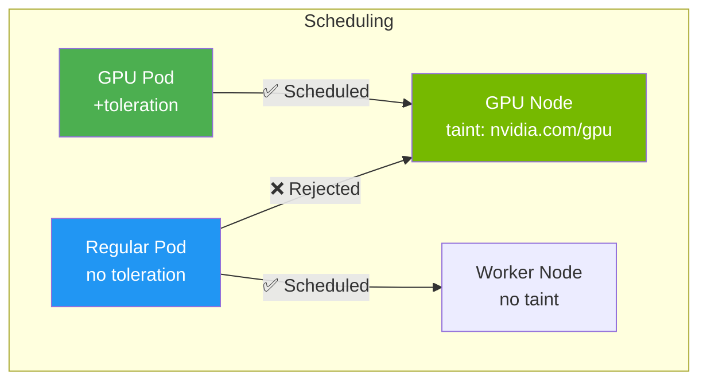

> 💡 **Quick Answer:** Taints on nodes repel pods unless the pod has a matching toleration. `kubectl taint nodes gpu-1 nvidia.com/gpu=true:NoSchedule` prevents non-GPU pods from scheduling on GPU nodes. Pods needing GPU add a toleration to bypass the taint. Three effects: `NoSchedule` (prevent scheduling), `PreferNoSchedule` (soft preference), `NoExecute` (evict existing pods).

## The Problem

Without scheduling constraints:

- Non-GPU workloads consume expensive GPU nodes
- Noisy neighbors affect latency-sensitive workloads
- Development pods land on production-dedicated nodes
- System maintenance needs drain all pods (not just some)

## The Solution

### Taint a Node

```bash
# Add taint
kubectl taint nodes gpu-node-1 nvidia.com/gpu=present:NoSchedule

# Add taint for dedicated team
kubectl taint nodes team-a-node-1 team=team-a:NoSchedule

# View taints
kubectl describe node gpu-node-1 | grep Taints

# Remove taint (trailing minus)
kubectl taint nodes gpu-node-1 nvidia.com/gpu=present:NoSchedule-
```

### Pod with Toleration

```yaml
apiVersion: v1
kind: Pod
metadata:
  name: gpu-workload
spec:
  tolerations:
  - key: nvidia.com/gpu
    operator: Equal
    value: present
    effect: NoSchedule
  containers:
  - name: training
    image: pytorch/pytorch:2.4.0-cuda12.4-cudnn9-runtime
    resources:
      limits:
        nvidia.com/gpu: 1
```

### Taint Effects

| Effect | Behavior |
|--------|----------|
| `NoSchedule` | New pods without toleration won't schedule |
| `PreferNoSchedule` | Scheduler tries to avoid, but can still place |
| `NoExecute` | Evict running pods without toleration |

### NoExecute with Eviction Timeout

```yaml
tolerations:
- key: node.kubernetes.io/unreachable
  operator: Exists
  effect: NoExecute
  tolerationSeconds: 300    # Evict after 5 minutes if node unreachable
```

### Operator Types

```yaml
# Equal: key, value, and effect must match
tolerations:
- key: team
  operator: Equal
  value: team-a
  effect: NoSchedule

# Exists: key and effect match (any value)
tolerations:
- key: nvidia.com/gpu
  operator: Exists
  effect: NoSchedule

# Tolerate everything (DaemonSets do this)
tolerations:
- operator: Exists
```

### Built-in Taints

Kubernetes auto-adds these taints on node conditions:

| Taint | Trigger |
|-------|---------|
| `node.kubernetes.io/not-ready` | Node NotReady |
| `node.kubernetes.io/unreachable` | Node unreachable |
| `node.kubernetes.io/memory-pressure` | Memory pressure |
| `node.kubernetes.io/disk-pressure` | Disk pressure |
| `node.kubernetes.io/pid-pressure` | PID pressure |
| `node.kubernetes.io/unschedulable` | Node cordoned |

### Common Patterns

```bash
# Dedicated GPU nodes
kubectl taint nodes gpu-pool nvidia.com/gpu=present:NoSchedule

# Dedicated team nodes
kubectl taint nodes team-a-pool team=a:NoSchedule

# Spot/preemptible nodes
kubectl taint nodes spot-pool cloud.google.com/gke-spot=true:NoSchedule

# Control plane (already tainted by default)
# node-role.kubernetes.io/control-plane:NoSchedule
```



## Common Issues

**Pods pending with "node(s) had untolerated taint"**

Pod doesn't have a toleration matching the node's taint. Add the correct toleration or remove the taint.

**Toleration exists but pod still not scheduled**

Taints + tolerations only remove the repulsion. You also need node affinity or nodeSelector to ATTRACT the pod to specific nodes. Tolerations alone don't guarantee placement.

**DaemonSet pods not running on tainted nodes**

Add tolerations to the DaemonSet pod template. System DaemonSets (like kube-proxy) have `operator: Exists` to tolerate everything.

## Best Practices

- **Combine taints with node affinity** — tolerations allow, affinity attracts
- **Use `NoSchedule` for dedication** — prevents scheduling but doesn't evict existing pods
- **Use `NoExecute` for isolation** — evicts pods that shouldn't be there
- **`PreferNoSchedule` for soft preferences** — avoids but allows overflow
- **Automate taints with labels** — use admission webhooks to auto-taint based on labels

## Key Takeaways

- Taints repel pods, tolerations are the exception pass
- Three effects: NoSchedule (block), PreferNoSchedule (soft), NoExecute (evict)
- Tolerations alone don't attract — combine with nodeSelector or affinity
- Kubernetes auto-taints nodes on conditions (NotReady, disk-pressure, etc.)
- Essential for GPU dedication, team isolation, and spot instance workloads
