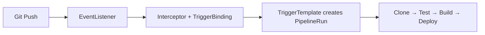

> 💡 **Quick Answer:** Tekton runs CI/CD pipelines as Kubernetes CRDs. Install: `kubectl apply -f https://infra.tekton.dev/tekton-releases/pipeline/latest/release.yaml`. A `Task` is a pod whose `steps` are containers; a `Pipeline` orders Tasks (`runAfter`) and shares files through `workspaces`; a `PipelineRun` executes it. Pull community tasks (git-clone, buildah) with resolvers, and start runs on git push with Tekton Triggers. On OpenShift, install the **OpenShift Pipelines** operator instead.
>
> **Gotcha:** Each Task is a separate pod — data only flows between Tasks through a workspace (PVC), never through the container filesystem.

## The Problem

Jenkins, GitLab CI, and GitHub Actions run outside the cluster:

- Different infrastructure for CI/CD vs applications
- Limited Kubernetes integration
- Vendor lock-in for pipeline definitions
- Can't leverage cluster resources for builds
- No Kubernetes-native pipeline CRDs

## The Solution

### Install Tekton

```bash
# Pipelines (pin a version in production instead of latest)
kubectl apply -f https://infra.tekton.dev/tekton-releases/pipeline/latest/release.yaml

# Triggers + interceptors (webhooks)
kubectl apply -f https://infra.tekton.dev/tekton-releases/triggers/latest/release.yaml
kubectl apply -f https://infra.tekton.dev/tekton-releases/triggers/latest/interceptors.yaml

# Dashboard (optional)
kubectl apply -f https://infra.tekton.dev/tekton-releases/dashboard/latest/release.yaml
kubectl port-forward -n tekton-pipelines svc/tekton-dashboard 9097:9097

# CLI
brew install tektoncd-cli     # or a release binary from github.com/tektoncd/cli

kubectl get pods -n tekton-pipelines
tkn version
```

Release manifests moved from `storage.googleapis.com/tekton-releases` to `infra.tekton.dev/tekton-releases`; older URLs in blog posts may no longer resolve. On OpenShift, the OpenShift Pipelines operator installs Pipelines, Triggers, Chains and ships `buildah`/`git-clone` tasks in the `openshift-pipelines` namespace.

### Task (Building Block)

```yaml
apiVersion: tekton.dev/v1
kind: Task
metadata:
  name: build-and-push
spec:
  params:
  - name: image
    type: string
  - name: tag
    type: string
    default: latest
  
  workspaces:
  - name: source
  - name: dockerconfig          # Secret with .dockerconfigjson
  
  steps:
  - name: build-push
    image: quay.io/buildah/stable:latest
    workingDir: $(workspaces.source.path)
    env:
    - name: REGISTRY_AUTH_FILE
      value: $(workspaces.dockerconfig.path)/.dockerconfigjson
    securityContext:
      privileged: true          # or run rootless with a suitable SCC / user namespaces
    script: |
      buildah bud --storage-driver=vfs -f Dockerfile -t $(params.image):$(params.tag) .
      buildah push --storage-driver=vfs $(params.image):$(params.tag)

---
apiVersion: tekton.dev/v1
kind: Task
metadata:
  name: run-tests
spec:
  workspaces:
  - name: source
  steps:
  - name: test
    image: python:3.12
    workingDir: $(workspaces.source.path)
    script: |
      pip install -r requirements.txt
      pytest tests/ -v

---
apiVersion: tekton.dev/v1
kind: Task
metadata:
  name: deploy
spec:
  params:
  - name: image
    type: string
  - name: namespace
    type: string
    default: production
  steps:
  - name: deploy
    image: bitnami/kubectl:1.30
    script: |
      kubectl set image deployment/myapp \
        app=$(params.image) \
        -n $(params.namespace)
      kubectl rollout status deployment/myapp \
        -n $(params.namespace) --timeout=300s
```

### Pipeline

```yaml
apiVersion: tekton.dev/v1
kind: Pipeline
metadata:
  name: build-test-deploy
spec:
  params:
  - name: repo-url
    type: string
  - name: image
    type: string
  - name: tag
    type: string
  
  workspaces:
  - name: shared-workspace
  - name: docker-credentials
  
  tasks:
  - name: clone
    taskRef:
      resolver: git                # fetch the catalog task at run time
      params:
      - name: url
        value: https://github.com/tektoncd/catalog.git
      - name: revision
        value: main
      - name: pathInRepo
        value: task/git-clone/0.9/git-clone.yaml
    workspaces:
    - name: output
      workspace: shared-workspace
    params:
    - name: url
      value: $(params.repo-url)
  
  - name: test
    taskRef:
      name: run-tests
    runAfter: [clone]
    workspaces:
    - name: source
      workspace: shared-workspace
  
  - name: build
    taskRef:
      name: build-and-push
    runAfter: [test]
    workspaces:
    - name: source
      workspace: shared-workspace
    params:
    - name: image
      value: $(params.image)
    - name: tag
      value: $(params.tag)
    workspaces:
    - name: dockerconfig
      workspace: docker-credentials
  
  - name: deploy
    taskRef:
      name: deploy
    runAfter: [build]
    params:
    - name: image
      value: "$(params.image):$(params.tag)"
```

### PipelineRun (Trigger)

```yaml
apiVersion: tekton.dev/v1
kind: PipelineRun
metadata:
  generateName: build-test-deploy-
spec:
  pipelineRef:
    name: build-test-deploy
  params:
  - name: repo-url
    value: https://github.com/myorg/myapp.git
  - name: image
    value: registry.example.com/myapp
  - name: tag
    value: v2.0.0
  workspaces:
  - name: shared-workspace
    volumeClaimTemplate:
      spec:
        accessModes: [ReadWriteOnce]
        resources:
          requests:
            storage: 1Gi
  - name: docker-credentials
    secret:
      secretName: docker-registry-creds
```

### Reusable Catalog Tasks

Tekton Hub (hub.tekton.dev) has been retired in favour of Artifact Hub. Reference community tasks with a resolver instead of copying YAML into the cluster:

```yaml
# Git resolver (shown in the Pipeline above) — or the hub resolver against Artifact Hub:
taskRef:
  resolver: hub
  params:
  - name: kind
    value: task
  - name: name
    value: git-clone
  - name: version
    value: "0.9"
# Bundles resolver for OCI-packaged tasks: resolver: bundles
```

For air-gapped clusters, mirror the catalog repo and point the git resolver at the mirror, or `kubectl apply` the task YAML from `github.com/tektoncd/catalog`.

### Tekton Triggers (Webhook)

```yaml
# EventListener — receives webhooks
apiVersion: triggers.tekton.dev/v1beta1
kind: EventListener
metadata:
  name: github-listener
spec:
  serviceAccountName: tekton-triggers-sa   # needs the tekton-triggers-eventlistener-roles
  triggers:
  - name: github-push
    interceptors:
    - ref:
        name: github
      params:
      - name: secretRef
        value:
          secretName: github-webhook-secret
          secretKey: token
      - name: eventTypes
        value: ["push"]
    bindings:
    - ref: github-push-binding
    template:
      ref: build-template

---
# TriggerBinding — extract data from webhook
apiVersion: triggers.tekton.dev/v1beta1
kind: TriggerBinding
metadata:
  name: github-push-binding
spec:
  params:
  - name: repo-url
    value: $(body.repository.clone_url)
  - name: revision
    value: $(body.head_commit.id)

---
# TriggerTemplate — create PipelineRun
apiVersion: triggers.tekton.dev/v1beta1
kind: TriggerTemplate
metadata:
  name: build-template
spec:
  params:
  - name: repo-url
  - name: revision
  resourcetemplates:
  - apiVersion: tekton.dev/v1
    kind: PipelineRun
    metadata:
      generateName: github-build-
    spec:
      pipelineRef:
        name: build-test-deploy
      params:
      - name: repo-url
        value: $(tt.params.repo-url)
      - name: image
        value: registry.example.com/myapp
      - name: tag
        value: $(tt.params.revision)
      workspaces:
      - name: shared-workspace
        volumeClaimTemplate:
          spec:
            accessModes: [ReadWriteOnce]
            resources:
              requests:
                storage: 1Gi
      - name: docker-credentials
        secret:
          secretName: docker-registry-creds
```

Expose the EventListener service (`el-github-listener`, port 8080) through an Ingress/Route and point the GitHub webhook at it.



### CLI Operations

```bash
# List pipelines
tkn pipeline list

# Start a pipeline
tkn pipeline start build-test-deploy \
  -p repo-url=https://github.com/myorg/myapp.git \
  -p image=registry.example.com/myapp \
  -p tag=v2.0.0 \
  -w name=shared-workspace,claimName=build-pvc

# List runs
tkn pipelinerun list

# View logs
tkn pipelinerun logs build-test-deploy-xxx -f

# List tasks
tkn task list

# Run a single task
tkn task start run-tests -w name=source,claimName=source-pvc
```

## Common Issues

**"pod not scheduled" during pipeline**

Workspace PVC not available or resource quota exceeded. Use `volumeClaimTemplate` for dynamic PVCs.

**Steps can't share files**

Steps within a Task share a workspace. Tasks in a Pipeline need explicit workspace passing.

**Image push fails with `unauthorized`**

Registry credentials not mounted. `kubectl create secret docker-registry docker-registry-creds --docker-server=... --docker-username=... --docker-password=...` and bind it to the `dockerconfig` workspace (or link it to the pipeline ServiceAccount).

**EventListener pod CrashLoopBackOff / webhook 403**

The EventListener ServiceAccount lacks the Triggers roles, or the interceptor secret doesn't match the GitHub webhook secret.

**`kubectl set image` forbidden in deploy step**

TaskRun pods run as the PipelineRun's `serviceAccountName` (default `default`, `pipeline` on OpenShift); grant it a Role on the target namespace.

## Best Practices

- **Resolvers for catalog tasks** — git-clone, buildah, kubectl — don't reinvent, pin versions
- **Workspaces for data sharing** — PVCs between tasks, emptyDir within tasks
- **Triggers for automation** — GitHub/GitLab webhooks start pipelines
- **Tekton Chains for supply chain security** — sign and verify artifacts
- **Combine with ArgoCD** — Tekton builds, ArgoCD deploys (GitOps)

## Key Takeaways

- Tekton runs CI/CD as Kubernetes-native CRDs (Task, Pipeline, PipelineRun)
- Each step is a container — full isolation and reproducibility
- Workspaces share data between tasks (PVCs) and steps (emptyDir)
- Resolvers pull reusable catalog tasks at run time
- Triggers enable webhook-driven pipeline execution

## Frequently Asked Questions

### What is Tekton Pipelines?

An open-source (CD Foundation) framework that adds CI/CD CRDs to Kubernetes: `Task`, `Pipeline`, `TaskRun`, `PipelineRun`. Every step runs as a container in a pod on your cluster, so builds use cluster resources, RBAC and quotas. It is the engine behind OpenShift Pipelines.

### Tekton vs GitHub Actions?

GitHub Actions is managed SaaS (or self-hosted runners) tied to GitHub. Tekton runs entirely on your cluster with no vendor lock-in — a better fit for on-prem, air-gapped, regulated or multi-cloud environments, at the cost of operating it yourself.

### Tekton vs Argo Workflows?

Tekton is CI/CD-focused (Triggers, Chains for signing/SLSA provenance, catalog tasks). Argo Workflows is a general DAG engine with a richer UI, loops and artifact handling, popular for data/ML pipelines. See [Argo Workflows](/recipes/deployments/kubernetes-argo-workflows-guide/).

### How do Tasks share files?

Steps inside one Task share the pod and any workspace. Between Tasks you must bind the same workspace — usually a PVC from `volumeClaimTemplate` — because each Task is a separate pod.
