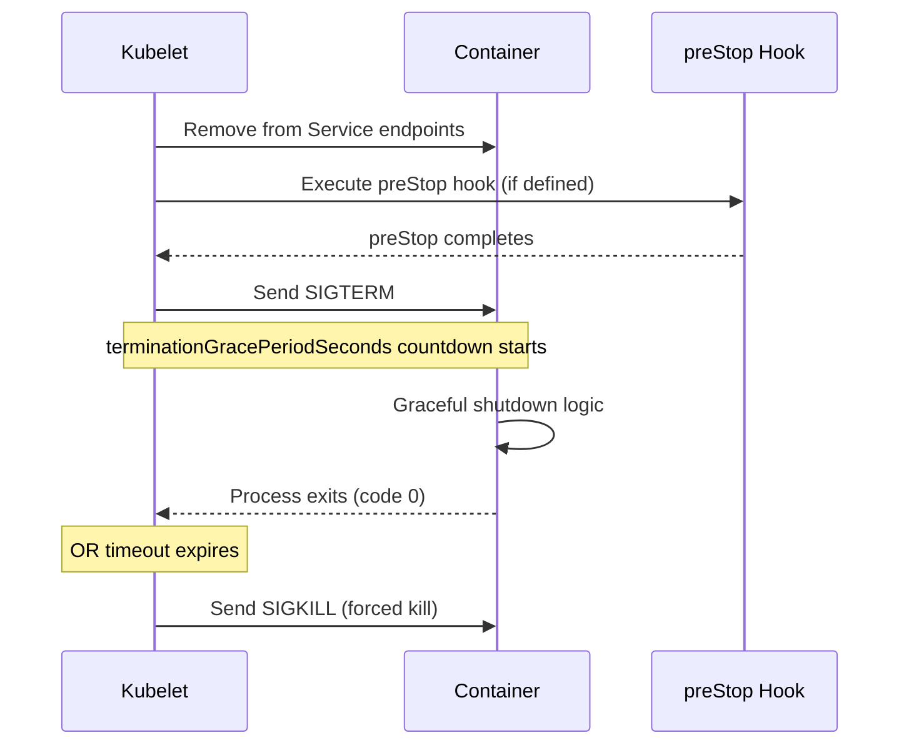

> 💡 **Quick Answer:** `terminationGracePeriodSeconds` defaults to **30 seconds**. When a pod is deleted, Kubernetes sends SIGTERM, waits this duration for graceful shutdown, then sends SIGKILL. Set higher for slow-draining apps (databases, message queues).

## The Problem

Your application needs time to:
- Finish processing in-flight requests
- Close database connections cleanly
- Flush buffers and commit pending writes
- Deregister from service discovery
- Complete background job processing

The default 30s may be too short for some workloads or too long for fast-terminating ones.

## The Solution

### Default Behavior (30 seconds)

```yaml
apiVersion: v1
kind: Pod
metadata:
  name: myapp
spec:
  # Default: 30 seconds (omitting is the same as setting 30)
  terminationGracePeriodSeconds: 30
  containers:
    - name: app
      image: myapp:1.0.0
```

### Custom Grace Period

```yaml
apiVersion: apps/v1
kind: Deployment
metadata:
  name: kafka-consumer
spec:
  template:
    spec:
      # Long grace period for message processing
      terminationGracePeriodSeconds: 120
      containers:
        - name: consumer
          image: kafka-consumer:1.0.0
---
apiVersion: apps/v1
kind: Deployment
metadata:
  name: nginx-proxy
spec:
  template:
    spec:
      # Short grace period — nginx drains fast
      terminationGracePeriodSeconds: 5
      containers:
        - name: nginx
          image: nginx:1.27
```

### Pod Termination Sequence



### With preStop Hook

```yaml
spec:
  terminationGracePeriodSeconds: 60
  containers:
    - name: app
      image: myapp:1.0.0
      lifecycle:
        preStop:
          exec:
            command: ["/bin/sh", "-c", "sleep 5 && kill -SIGTERM 1"]
          # OR
          httpGet:
            path: /shutdown
            port: 8080
```

**Important:** preStop hook time is INCLUDED in `terminationGracePeriodSeconds`. If preStop takes 10s and grace period is 30s, your app only has 20s for SIGTERM handling.

### Recommended Values by Workload Type

| Workload | Recommended | Reason |
|----------|-------------|--------|
| Stateless web server | 5-15s | Fast connection drain |
| API gateway | 15-30s | Wait for in-flight requests |
| Database | 60-120s | WAL flush, connection close |
| Message queue consumer | 60-300s | Finish processing batch |
| ML inference | 30-60s | Complete current request |
| Batch job | 600-3600s | Job may take hours |
| Init/sidecar | 5s | Fast cleanup |

### Application SIGTERM Handler

```python
# Python example
import signal
import sys

def graceful_shutdown(signum, frame):
    print("SIGTERM received, shutting down...")
    # Close database connections
    db.close()
    # Flush metrics
    metrics.flush()
    # Stop accepting new requests
    server.stop(grace=10)
    sys.exit(0)

signal.signal(signal.SIGTERM, graceful_shutdown)
```

```go
// Go example
ctx, stop := signal.NotifyContext(context.Background(), syscall.SIGTERM)
defer stop()

<-ctx.Done()
log.Println("Shutting down gracefully...")
server.Shutdown(context.Background())
```

## Common Issues

| Issue | Cause | Fix |
|-------|-------|-----|
| Pod killed before finishing | Grace period too short | Increase `terminationGracePeriodSeconds` |
| Pod hangs after delete | App ignores SIGTERM | Handle SIGTERM in code or use preStop |
| Rolling update too slow | High grace period × many pods | Reduce grace period or increase `maxUnavailable` |
| preStop + SIGTERM timeout | Both share the same countdown | Set grace period = preStop time + app drain time |
| Container gets SIGKILL immediately | `terminationGracePeriodSeconds: 0` | Don't set to 0 in production |

## Best Practices

1. **Always handle SIGTERM** in your application — don't rely on SIGKILL
2. **Set grace period = actual drain time + 5s buffer** — not excessively high
3. **Use preStop `sleep 5`** for load balancer deregistration race condition
4. **Test with `kubectl delete pod --grace-period=0`** only in development
5. **Monitor `pod_termination_duration` metrics** — know how long your pods actually take

## Key Takeaways

- Default is 30 seconds — sufficient for most web apps
- SIGTERM is sent AFTER preStop hook completes (same countdown timer)
- After grace period expires, SIGKILL is sent unconditionally — no negotiation
- Set based on actual workload needs: 5s for nginx, 300s for Kafka consumers
- Rolling updates multiply this: 3 replicas × 120s = potentially 6 minutes for full rollout
