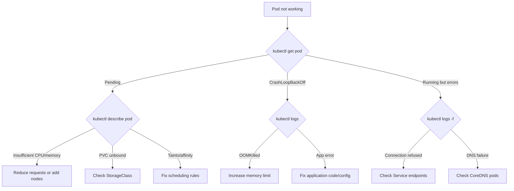

> 💡 **Quick Answer:** troubleshooting

## The Problem

This is a fundamental Kubernetes topic that engineers search for frequently. A comprehensive reference with production-ready examples saves hours of trial and error.

## The Solution

### Pod Troubleshooting Flowchart

```bash
# Step 1: What's the pod status?
kubectl get pod <name> -o wide

# Step 2: Check events and conditions
kubectl describe pod <name>

# Step 3: Check logs
kubectl logs <name>
kubectl logs <name> --previous    # Previous crash
kubectl logs <name> -c <init-container>
```

| Pod Status | Cause | Fix |
|-----------|-------|-----|
| **Pending** | No node has enough resources | Check requests, add nodes |
| **Pending** | PVC not bound | Check StorageClass, PV availability |
| **Pending** | Node selector/taint mismatch | Fix nodeSelector or add toleration |
| **ImagePullBackOff** | Wrong image or missing secret | Fix image name, create pull secret |
| **CrashLoopBackOff** | App crashes on startup | Check logs, fix config/code |
| **OOMKilled** | Memory limit exceeded | Increase memory limit |
| **Evicted** | Node disk/memory pressure | Set resource requests, check node |
| **Running but not ready** | Readiness probe failing | Fix probe or app health endpoint |

### Service Troubleshooting

```bash
# Is the service selecting the right pods?
kubectl get endpoints <service-name>
# Empty endpoints = selector doesn't match any pods

# Check pod labels match service selector
kubectl get pods --show-labels
kubectl get svc <service-name> -o yaml | grep selector -A5

# Test DNS
kubectl run test --rm -it --image=busybox -- nslookup <service-name>

# Test connectivity
kubectl run test --rm -it --image=nicolaka/netshoot -- curl http://<service>:<port>
```

### Node Troubleshooting

```bash
# Node not ready?
kubectl describe node <name> | grep -A10 Conditions
# MemoryPressure, DiskPressure, PIDPressure → resource exhaustion

# Check kubelet
ssh <node> "systemctl status kubelet"
ssh <node> "journalctl -u kubelet --since '10 minutes ago'"

# Resource usage
kubectl top nodes
kubectl top pods --sort-by=memory
```

### Quick Reference

```bash
# Most useful debug commands
kubectl get events --sort-by='.lastTimestamp' -A
kubectl describe pod <name>                     # Events section!
kubectl logs <name> -f --tail=100
kubectl exec -it <name> -- sh
kubectl debug <name> -it --image=netshoot
kubectl get pods -A | grep -v Running
kubectl top pods --sort-by=cpu
```



## Frequently Asked Questions

### What's the first thing to check?

Always start with `kubectl describe pod <name>` — the Events section at the bottom tells you exactly what went wrong 90% of the time.

### How do I debug a pod with no shell?

Use ephemeral debug containers: `kubectl debug <pod> -it --image=nicolaka/netshoot --target=<container>`. This attaches a debug container that shares the pod's network namespace.

## Best Practices

- Start with the simplest configuration that meets your needs
- Test changes in staging before production
- Use `kubectl describe` and events for troubleshooting
- Document your decisions for the team

## Key Takeaways

- This is essential Kubernetes knowledge for production operations
- Follow the principle of least privilege and minimal configuration
- Monitor and iterate based on real-world behavior
- Automation reduces human error and improves consistency
