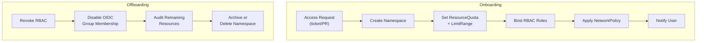

> 💡 **Quick Answer:** Automate user onboarding with a script or GitOps pipeline that creates a **namespace**, assigns **ResourceQuotas**, binds **RBAC roles**, and configures **NetworkPolicies** — all from a single config file. Offboarding revokes RoleBindings, disables OIDC group membership, and optionally archives the namespace. Use OIDC group sync for hands-free access management.

## The Problem

Manual user management doesn't scale. Every new developer needs a namespace, RBAC permissions, quotas, network policies, and credentials. When someone leaves, their access must be revoked immediately — missed revocations are security incidents. You need a repeatable, auditable process.



## Onboarding: GitOps Approach (Recommended)

Define each user/team as a YAML file in Git. ArgoCD or Flux applies them automatically:

```
repo/
├── teams/
│   ├── team-alpha/
│   │   ├── namespace.yaml
│   │   ├── resourcequota.yaml
│   │   ├── limitrange.yaml
│   │   ├── rbac.yaml
│   │   └── networkpolicy.yaml
│   ├── team-beta/
│   │   └── ...
│   └── _template/           # Copy this for new teams
│       ├── namespace.yaml
│       ├── resourcequota.yaml
│       ├── limitrange.yaml
│       ├── rbac.yaml
│       └── networkpolicy.yaml
```

### Namespace Template

```yaml
# teams/_template/namespace.yaml
apiVersion: v1
kind: Namespace
metadata:
  name: "${TEAM_NAME}"
  labels:
    team: "${TEAM_NAME}"
    environment: dev
    managed-by: platform-team
    pod-security.kubernetes.io/enforce: restricted
    pod-security.kubernetes.io/warn: restricted
```

### ResourceQuota + LimitRange

```yaml
# teams/_template/resourcequota.yaml
apiVersion: v1
kind: ResourceQuota
metadata:
  name: default-quota
  namespace: "${TEAM_NAME}"
spec:
  hard:
    requests.cpu: "8"
    requests.memory: 16Gi
    limits.cpu: "16"
    limits.memory: 32Gi
    pods: "50"
    services: "10"
    persistentvolumeclaims: "20"
    requests.storage: 100Gi
---
apiVersion: v1
kind: LimitRange
metadata:
  name: default-limits
  namespace: "${TEAM_NAME}"
spec:
  limits:
    - type: Container
      default:
        cpu: 500m
        memory: 512Mi
      defaultRequest:
        cpu: 100m
        memory: 128Mi
      max:
        cpu: "4"
        memory: 8Gi
    - type: PersistentVolumeClaim
      max:
        storage: 50Gi
```

### RBAC Bindings

```yaml
# teams/_template/rbac.yaml
# Team members get edit access to their namespace
apiVersion: rbac.authorization.k8s.io/v1
kind: RoleBinding
metadata:
  name: team-edit
  namespace: "${TEAM_NAME}"
subjects:
  # OIDC group — adding users to the IdP group auto-grants access
  - kind: Group
    name: "team-${TEAM_NAME}"
    apiGroup: rbac.authorization.k8s.io
roleRef:
  kind: ClusterRole
  name: edit
  apiGroup: rbac.authorization.k8s.io
---
# Team lead gets admin
apiVersion: rbac.authorization.k8s.io/v1
kind: RoleBinding
metadata:
  name: team-admin
  namespace: "${TEAM_NAME}"
subjects:
  - kind: Group
    name: "team-${TEAM_NAME}-leads"
    apiGroup: rbac.authorization.k8s.io
roleRef:
  kind: ClusterRole
  name: admin
  apiGroup: rbac.authorization.k8s.io
---
# Read-only for observability
apiVersion: rbac.authorization.k8s.io/v1
kind: RoleBinding
metadata:
  name: team-view
  namespace: "${TEAM_NAME}"
subjects:
  - kind: Group
    name: "team-${TEAM_NAME}-readonly"
    apiGroup: rbac.authorization.k8s.io
roleRef:
  kind: ClusterRole
  name: view
  apiGroup: rbac.authorization.k8s.io
```

### NetworkPolicy

```yaml
# teams/_template/networkpolicy.yaml
apiVersion: networking.k8s.io/v1
kind: NetworkPolicy
metadata:
  name: default-deny-all
  namespace: "${TEAM_NAME}"
spec:
  podSelector: {}
  policyTypes:
    - Ingress
    - Egress
---
# Allow intra-namespace traffic
apiVersion: networking.k8s.io/v1
kind: NetworkPolicy
metadata:
  name: allow-same-namespace
  namespace: "${TEAM_NAME}"
spec:
  podSelector: {}
  policyTypes:
    - Ingress
    - Egress
  ingress:
    - from:
        - podSelector: {}
  egress:
    - to:
        - podSelector: {}
    # Allow DNS
    - to:
        - namespaceSelector: {}
          podSelector:
            matchLabels:
              k8s-app: kube-dns
      ports:
        - port: 53
          protocol: UDP
        - port: 53
          protocol: TCP
```

### Onboarding Script

```bash
#!/bin/bash
# onboard-team.sh — Create all resources for a new team
set -euo pipefail

TEAM_NAME="${1:?Usage: onboard-team.sh <team-name>}"
TEMPLATE_DIR="teams/_template"
TARGET_DIR="teams/${TEAM_NAME}"

if [ -d "$TARGET_DIR" ]; then
  echo "❌ Team '$TEAM_NAME' already exists"
  exit 1
fi

echo "=== Onboarding team: $TEAM_NAME ==="

# 1. Copy template
cp -r "$TEMPLATE_DIR" "$TARGET_DIR"

# 2. Replace placeholders
find "$TARGET_DIR" -type f -name "*.yaml" -exec \
  sed -i "s/\${TEAM_NAME}/${TEAM_NAME}/g" {} +

# 3. Apply to cluster (or commit to Git for ArgoCD)
kubectl apply -f "$TARGET_DIR/"

# 4. Verify
echo ""
echo "=== Verification ==="
kubectl get namespace "$TEAM_NAME"
kubectl get resourcequota -n "$TEAM_NAME"
kubectl get rolebinding -n "$TEAM_NAME"
kubectl get networkpolicy -n "$TEAM_NAME"

echo ""
echo "✅ Team '$TEAM_NAME' onboarded"
echo "   Namespace: $TEAM_NAME"
echo "   RBAC: team-${TEAM_NAME} (edit), team-${TEAM_NAME}-leads (admin)"
echo "   Quota: 8 CPU / 16Gi RAM / 50 pods"
echo ""
echo "Next: Add users to OIDC group 'team-${TEAM_NAME}' in your identity provider"
```

## OIDC Group Sync: Hands-Free Access

With OIDC, adding a user to an IdP group automatically grants Kubernetes access:

```yaml
# kube-apiserver OIDC configuration
apiVersion: v1
kind: Pod
metadata:
  name: kube-apiserver
spec:
  containers:
    - name: kube-apiserver
      command:
        - kube-apiserver
        - --oidc-issuer-url=https://idp.example.com
        - --oidc-client-id=kubernetes
        - --oidc-username-claim=email
        - --oidc-groups-claim=groups          # Map IdP groups to K8s groups
        - --oidc-groups-prefix=oidc:          # Prefix to avoid collisions
```

```bash
# User's JWT token contains:
# {
#   "email": "alice@example.com",
#   "groups": ["team-alpha", "team-alpha-leads"]
# }

# Kubernetes sees:
# User: alice@example.com
# Groups: ["oidc:team-alpha", "oidc:team-alpha-leads"]

# RoleBinding matches the group:
# subjects:
#   - kind: Group
#     name: "oidc:team-alpha"
```

### OpenShift Group Sync

```yaml
# OpenShift syncs LDAP/OIDC groups automatically
apiVersion: config.openshift.io/v1
kind: OAuth
metadata:
  name: cluster
spec:
  identityProviders:
    - name: corporate-ldap
      type: LDAP
      ldap:
        url: "ldaps://ldap.example.com/ou=people,dc=example,dc=com?uid"
        bindDN: "cn=admin,dc=example,dc=com"
        bindPassword:
          name: ldap-bind-password
        insecure: false
        attributes:
          id: ["uid"]
          email: ["mail"]
          name: ["cn"]
---
# CronJob to sync LDAP groups
apiVersion: batch/v1
kind: CronJob
metadata:
  name: ldap-group-sync
  namespace: openshift-authentication
spec:
  schedule: "*/30 * * * *"    # Every 30 minutes
  jobTemplate:
    spec:
      template:
        spec:
          serviceAccountName: ldap-group-syncer
          restartPolicy: OnFailure
          containers:
            - name: sync
              image: registry.redhat.io/openshift4/ose-cli:latest
              command:
                - /bin/bash
                - -c
                - |
                  oc adm groups sync \
                    --sync-config=/config/sync.yaml \
                    --confirm
              volumeMounts:
                - name: config
                  mountPath: /config
          volumes:
            - name: config
              configMap:
                name: ldap-sync-config
```

## Offboarding

### Offboarding Script

```bash
#!/bin/bash
# offboard-user.sh — Revoke all access for a departing user
set -euo pipefail

USER_EMAIL="${1:?Usage: offboard-user.sh <user-email>}"

echo "=== Offboarding user: $USER_EMAIL ==="

# 1. Find all RoleBindings for this user
echo "--- RoleBindings ---"
kubectl get rolebindings -A -o json | jq -r "
  .items[] |
  select(.subjects[]? |
    select(.kind == \"User\" and .name == \"$USER_EMAIL\")
  ) |
  \"\(.metadata.namespace)/\(.metadata.name)\"
"

# 2. Find all ClusterRoleBindings
echo "--- ClusterRoleBindings ---"
kubectl get clusterrolebindings -o json | jq -r "
  .items[] |
  select(.subjects[]? |
    select(.kind == \"User\" and .name == \"$USER_EMAIL\")
  ) |
  .metadata.name
"

# 3. Remove user from all RoleBindings
for rb in $(kubectl get rolebindings -A -o json | jq -r "
  .items[] |
  select(.subjects[]? |
    select(.kind == \"User\" and .name == \"$USER_EMAIL\")
  ) |
  \"\(.metadata.namespace) \(.metadata.name)\"
"); do
  NS=$(echo "$rb" | awk '{print $1}')
  NAME=$(echo "$rb" | awk '{print $2}')
  echo "Removing from RoleBinding $NS/$NAME"
  kubectl patch rolebinding "$NAME" -n "$NS" --type=json \
    -p="[{\"op\":\"remove\",\"path\":\"/subjects/$(kubectl get rolebinding $NAME -n $NS -o json | jq "[.subjects[] | .name] | index(\"$USER_EMAIL\")")\"}]" \
    2>/dev/null || echo "  (already removed or last subject)"
done

# 4. Remove from ClusterRoleBindings
for crb in $(kubectl get clusterrolebindings -o json | jq -r "
  .items[] |
  select(.subjects[]? |
    select(.kind == \"User\" and .name == \"$USER_EMAIL\")
  ) |
  .metadata.name
"); do
  echo "Removing from ClusterRoleBinding $crb"
  kubectl patch clusterrolebinding "$crb" --type=json \
    -p="[{\"op\":\"remove\",\"path\":\"/subjects/0\"}]" \
    2>/dev/null || true
done

# 5. Revoke active tokens (delete service account tokens if any)
echo ""
echo "--- Revoking tokens ---"
kubectl get secrets -A -o json | jq -r "
  .items[] |
  select(.metadata.annotations[\"kubernetes.io/service-account.name\"]? // \"\" |
    contains(\"$USER_EMAIL\")
  ) |
  \"\(.metadata.namespace) \(.metadata.name)\"
" | while read -r line; do
  NS=$(echo "$line" | awk '{print $1}')
  NAME=$(echo "$line" | awk '{print $2}')
  echo "Deleting token secret $NS/$NAME"
  kubectl delete secret "$NAME" -n "$NS"
done

echo ""
echo "✅ User '$USER_EMAIL' offboarded from Kubernetes"
echo ""
echo "⚠️  ALSO DO:"
echo "   1. Remove from OIDC/LDAP groups in identity provider"
echo "   2. Revoke any kubeconfig files distributed to user"
echo "   3. Rotate any shared secrets the user had access to"
echo "   4. Review audit logs for recent activity"
```

### Team Offboarding (Archive Namespace)

```bash
#!/bin/bash
# offboard-team.sh — Archive and remove a team's namespace
set -euo pipefail

TEAM_NAME="${1:?Usage: offboard-team.sh <team-name>}"
ARCHIVE_DIR="/backup/teams/${TEAM_NAME}-$(date +%Y%m%d)"

echo "=== Offboarding team: $TEAM_NAME ==="

# 1. Export all resources for audit
mkdir -p "$ARCHIVE_DIR"
kubectl get all -n "$TEAM_NAME" -o yaml > "$ARCHIVE_DIR/all-resources.yaml"
kubectl get secrets -n "$TEAM_NAME" -o yaml > "$ARCHIVE_DIR/secrets.yaml"
kubectl get configmaps -n "$TEAM_NAME" -o yaml > "$ARCHIVE_DIR/configmaps.yaml"
kubectl get pvc -n "$TEAM_NAME" -o yaml > "$ARCHIVE_DIR/pvcs.yaml"
echo "Archived to $ARCHIVE_DIR"

# 2. Scale down all workloads
kubectl scale deploy --all -n "$TEAM_NAME" --replicas=0
kubectl scale sts --all -n "$TEAM_NAME" --replicas=0

# 3. Wait for pods to terminate
kubectl wait --for=delete pods --all -n "$TEAM_NAME" --timeout=120s 2>/dev/null || true

# 4. Delete namespace (removes everything inside)
read -p "Delete namespace '$TEAM_NAME'? (yes/no): " CONFIRM
if [ "$CONFIRM" = "yes" ]; then
  kubectl delete namespace "$TEAM_NAME"
  echo "✅ Namespace deleted"
  
  # Remove GitOps files
  rm -rf "teams/${TEAM_NAME}"
  echo "✅ GitOps files removed"
else
  echo "⚠️ Namespace preserved — delete manually when ready"
fi
```

## Common Issues

| Issue | Cause | Fix |
|-------|-------|-----|
| User still has access after offboarding | OIDC token cached (valid until expiry) | Set short token TTL (1h), revoke at IdP |
| Namespace deletion stuck | Finalizers on resources | Remove finalizers: `kubectl patch -p '{"metadata":{"finalizers":null}}'` |
| Quota too restrictive | Team can't deploy | Review and adjust ResourceQuota |
| NetworkPolicy blocks needed traffic | Egress to external APIs blocked | Add egress rules for required endpoints |
| Group sync lag | LDAP sync runs every 30 min | Reduce sync interval or trigger manual sync |

## Best Practices

- **Use OIDC groups, not individual users** — add/remove from IdP group, K8s access follows
- **GitOps for onboarding** — PR to add team dir, ArgoCD applies automatically
- **Offboard within 1 hour** — security requirement for most compliance frameworks
- **Audit before deleting** — always export namespace resources before deletion
- **Short-lived tokens** — 1h OIDC token TTL limits blast radius
- **Default-deny NetworkPolicy** — every new namespace starts locked down
- **Pod Security Admission: restricted** — new namespaces get restricted by default
- **Automate everything** — manual processes get skipped under pressure

## Key Takeaways

- Onboarding = namespace + quota + RBAC + NetworkPolicy (templated, GitOps-managed)
- OIDC group sync is the best approach — IdP is the source of truth
- Offboarding = revoke RBAC + disable IdP group + archive + delete namespace
- Never rely on manual processes — automate onboarding/offboarding scripts
- Always export resources before deleting a namespace
- Short-lived OIDC tokens (1h) limit damage from delayed offboarding
