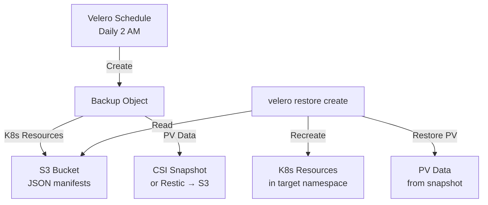

> 💡 **Quick Answer:** Install Velero with your cloud provider plugin, create a `Schedule` for daily namespace backups with 30-day retention, and use CSI snapshots for persistent volumes. Restore with `velero restore create --from-backup <name>`.

## The Problem

Kubernetes doesn't provide built-in backup/restore. If you lose a namespace (accidental deletion, ransomware, cluster failure), you need to recover all resources: Deployments, Services, ConfigMaps, Secrets, PVCs, and the data in persistent volumes.

## The Solution

### Install Velero (AWS Example)

```bash
velero install \
  --provider aws \
  --plugins velero/velero-plugin-for-aws:v1.10.0 \
  --bucket velero-backups \
  --backup-location-config region=eu-west-1 \
  --snapshot-location-config region=eu-west-1 \
  --secret-file ./credentials-velero \
  --features=EnableCSI \
  --use-node-agent
```

### Scheduled Backups

```yaml
apiVersion: velero.io/v1
kind: Schedule
metadata:
  name: daily-production
  namespace: velero
spec:
  schedule: "0 2 * * *"
  template:
    includedNamespaces:
      - production
      - staging
    excludedResources:
      - events
      - events.events.k8s.io
    storageLocation: default
    volumeSnapshotLocations:
      - default
    ttl: 720h0m0s
    defaultVolumesToFsBackup: false
    snapshotMoveData: true
```

### On-Demand Backup

```bash
# Backup a namespace
velero backup create prod-backup \
  --include-namespaces production \
  --wait

# Backup with label selector
velero backup create app-backup \
  --selector app=critical-service \
  --wait

# Check backup status
velero backup describe prod-backup --details
```

### Restore

```bash
# Restore entire backup
velero restore create --from-backup prod-backup

# Restore to different namespace
velero restore create --from-backup prod-backup \
  --namespace-mappings production:production-restored

# Restore specific resources only
velero restore create --from-backup prod-backup \
  --include-resources deployments,services,configmaps

# Check restore status
velero restore describe <restore-name> --details
```

### PV Backup Methods

| Method | Speed | Storage | Use Case |
|--------|-------|---------|----------|
| CSI Snapshots | Fast (copy-on-write) | Cloud provider | Cloud PVs (EBS, Azure Disk) |
| Restic/Kopia | Slow (file-level) | S3 bucket | Any PV type, including NFS |
| `snapshotMoveData` | Medium | S3 bucket | Portable snapshots across regions |



## Common Issues

**Backup shows "PartiallyFailed"**

Some PVs couldn't be snapshotted. Check: `velero backup logs <name>`. Common cause: PV type doesn't support CSI snapshots (use Restic/Kopia for those).

**Restore fails with "already exists"**

Resources already exist in the target namespace. Use `--existing-resource-policy=update` to overwrite, or restore to a new namespace with `--namespace-mappings`.

**PV data not included in backup**

Velero only backs up PV data if explicitly configured. Use `--default-volumes-to-fs-backup` for Restic, or ensure CSI snapshot location is configured.

## Best Practices

- **Daily scheduled backups** with 30-day TTL (`720h`)
- **Exclude `events`** from backups — they're noisy and not useful for recovery
- **Test restores regularly** — a backup you can't restore is worthless
- **CSI snapshots for cloud PVs** — fastest backup/restore
- **Restic/Kopia for NFS and hostPath** — works with any storage
- **`snapshotMoveData: true`** for cross-region DR — moves snapshots to S3

## Key Takeaways

- Velero backs up both K8s resources (as JSON) and PV data (via CSI or Restic)
- Scheduled backups with TTL automate retention — no manual cleanup needed
- `--namespace-mappings` enables migration between namespaces or clusters
- CSI snapshots are fast but provider-specific; Restic/Kopia is universal but slower
- Always test restores — `velero restore create` should be a practiced operation, not an emergency discovery
