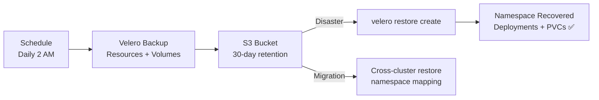

> 💡 **Quick Answer:** Install Velero with a cloud storage plugin, create `Schedule` resources for automated daily backups, and use `Restore` to recover applications. Velero backs up both Kubernetes resources (YAML) and persistent volume data (via snapshots or Restic/Kopia).

## The Problem

etcd backups protect cluster state, but not application data on persistent volumes. If a namespace is accidentally deleted, you lose both the Kubernetes resources AND the PVC data. Velero backs up the complete application: manifests + volume data, enabling full application recovery.

## The Solution

### Install Velero

```bash
velero install \
  --provider aws \
  --bucket velero-backups \
  --secret-file ./credentials \
  --backup-location-config region=us-east-1 \
  --snapshot-location-config region=us-east-1 \
  --use-node-agent \
  --default-volumes-to-fs-backup
```

### Scheduled Backup

```yaml
apiVersion: velero.io/v1
kind: Schedule
metadata:
  name: daily-production
  namespace: velero
spec:
  schedule: "0 2 * * *"
  template:
    includedNamespaces:
      - production
      - databases
    storageLocation: default
    volumeSnapshotLocations:
      - default
    ttl: 720h
    defaultVolumesToFsBackup: true
```

### Restore Application

```bash
# List available backups
velero backup get

# Restore entire namespace
velero restore create --from-backup daily-production-20260424

# Restore specific resources
velero restore create --from-backup daily-production-20260424 \
  --include-resources deployments,services,configmaps \
  --include-namespaces production

# Cross-cluster migration
velero restore create --from-backup daily-production-20260424 \
  --namespace-mappings production:staging
```

### Backup Hooks (Pre/Post)

```yaml
apiVersion: v1
kind: Pod
metadata:
  annotations:
    pre.hook.backup.velero.io/command: '["/bin/sh", "-c", "pg_dump -U postgres mydb > /backup/dump.sql"]'
    pre.hook.backup.velero.io/container: postgres
    post.hook.backup.velero.io/command: '["/bin/sh", "-c", "rm /backup/dump.sql"]'
```



## Common Issues

**Backup stuck in 'InProgress'**: Volume snapshots failing. Check: `velero backup describe <name> --details`. Common: CSI driver doesn't support snapshots.

**Restore creates PVCs but they're Pending**: StorageClass doesn't exist in target cluster. Use `--restore-volumes=false` and recreate PVCs manually, or ensure matching StorageClasses.

## Best Practices

- **Daily backups with 30-day TTL** — good baseline for production
- **Pre-backup hooks for databases** — pg_dump before snapshotting
- **Test restores monthly** — untested backups are not backups
- **Cross-cluster migration** — restore to a different cluster with namespace mapping
- **Exclude ephemeral namespaces** — don't waste storage backing up dev/test

## Key Takeaways

- Velero backs up Kubernetes resources AND persistent volume data
- Scheduled backups with TTL for automated retention management
- Pre/post-backup hooks enable application-consistent snapshots (database dumps)
- Cross-cluster restore enables migration with namespace mapping
- Test restores regularly — the backup is only as good as the restore
