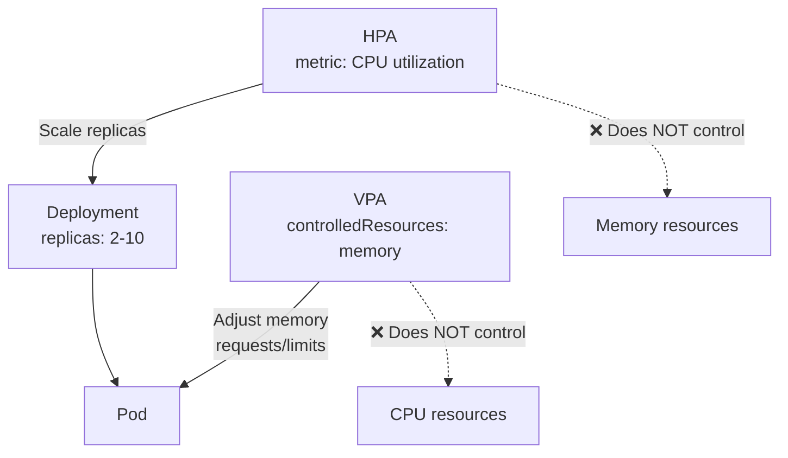

> 💡 **Quick Answer:** Deploy VPA in `Off` mode first to get recommendations without changes, then switch to `Auto` for memory only (let HPA handle CPU scaling). Set `minAllowed` and `maxAllowed` to prevent extreme values. VPA and HPA can coexist if they control different resources.

## The Problem

Developers guess resource requests/limits at deploy time — usually too high (wasting cluster capacity) or too low (causing OOM kills and throttling). VPA observes actual usage and adjusts requests automatically, but misconfiguration can cause pod restarts or conflict with HPA.

## The Solution

### Step 1: Recommendation Mode (Safe Start)

```yaml
apiVersion: autoscaling.k8s.io/v1
kind: VerticalPodAutoscaler
metadata:
  name: my-app-vpa
spec:
  targetRef:
    apiVersion: apps/v1
    kind: Deployment
    name: my-app
  updatePolicy:
    updateMode: "Off"
```

Check recommendations:
```bash
kubectl describe vpa my-app-vpa
# Recommendation:
#   Container: app
#     Lower Bound:  Cpu: 25m, Memory: 128Mi
#     Target:       Cpu: 100m, Memory: 256Mi
#     Upper Bound:  Cpu: 500m, Memory: 1Gi
#     Uncapped:     Cpu: 100m, Memory: 256Mi
```

### Step 2: Auto Mode with Bounds

```yaml
apiVersion: autoscaling.k8s.io/v1
kind: VerticalPodAutoscaler
metadata:
  name: my-app-vpa
spec:
  targetRef:
    apiVersion: apps/v1
    kind: Deployment
    name: my-app
  updatePolicy:
    updateMode: "Auto"
  resourcePolicy:
    containerPolicies:
      - containerName: app
        minAllowed:
          cpu: 50m
          memory: 128Mi
        maxAllowed:
          cpu: "4"
          memory: 8Gi
        controlledResources: ["cpu", "memory"]
```

### VPA + HPA Coexistence

```yaml
# VPA controls memory only
apiVersion: autoscaling.k8s.io/v1
kind: VerticalPodAutoscaler
metadata:
  name: my-app-vpa
spec:
  targetRef:
    apiVersion: apps/v1
    kind: Deployment
    name: my-app
  updatePolicy:
    updateMode: "Auto"
  resourcePolicy:
    containerPolicies:
      - containerName: app
        controlledResources: ["memory"]
        minAllowed:
          memory: 128Mi
        maxAllowed:
          memory: 8Gi
---
# HPA controls CPU scaling (replica count)
apiVersion: autoscaling/v2
kind: HorizontalPodAutoscaler
metadata:
  name: my-app-hpa
spec:
  scaleTargetRef:
    apiVersion: apps/v1
    kind: Deployment
    name: my-app
  minReplicas: 2
  maxReplicas: 10
  metrics:
    - type: Resource
      resource:
        name: cpu
        target:
          type: Utilization
          averageUtilization: 70
```



### Update Modes

| Mode | Behavior | Use Case |
|------|----------|----------|
| `Off` | Recommendations only, no changes | Initial assessment |
| `Initial` | Set resources on pod creation only | Avoid mid-lifecycle restarts |
| `Recreate` | Evict and recreate pods to apply changes | Stateless services |
| `Auto` | Same as Recreate (in-place update planned) | Production workloads |

## Common Issues

**VPA keeps restarting pods**

VPA evicts pods to apply new resource values (in-place resize is not yet GA). Use `updateMode: Initial` to only set resources at pod creation.

**VPA and HPA fighting over CPU**

Never let both VPA and HPA control the same resource. Use `controlledResources: ["memory"]` on VPA when HPA targets CPU.

**VPA recommends extremely low values**

Set `minAllowed` to prevent VPA from under-provisioning. This is common for services with spiky traffic.

## Best Practices

- **Start with `Off` mode** — observe recommendations for a week before enabling Auto
- **Set `minAllowed` and `maxAllowed`** — prevent extreme right-sizing
- **VPA for memory, HPA for CPU** — the safe coexistence pattern
- **Use `Initial` mode for StatefulSets** — avoid evicting database pods
- **Monitor VPA events** — `kubectl get events --field-selector reason=EvictedByVPA`

## Key Takeaways

- VPA right-sizes resource requests based on observed usage
- Start in `Off` mode to see recommendations without changes
- VPA + HPA coexistence: VPA controls memory, HPA controls CPU/replicas
- `minAllowed`/`maxAllowed` are essential guardrails
- VPA evicts pods to apply changes (no in-place resize yet in GA)
- `Initial` mode is safest for stateful workloads
