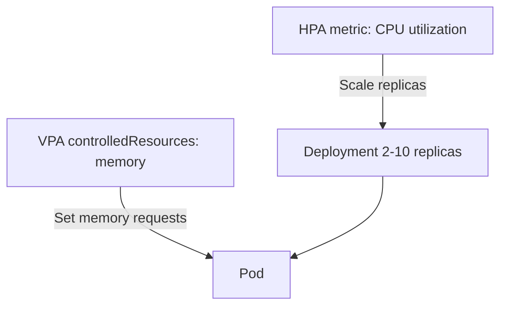

> 💡 **Quick Answer:** The Vertical Pod Autoscaler (VPA) sets container CPU/memory **requests** from observed usage. Install it (`./hack/vpa-up.sh` from `kubernetes/autoscaler`, or a Helm chart), create a `VerticalPodAutoscaler` targeting your Deployment with `updateMode: "Off"` to get recommendations only, then move to `Initial` or `Recreate` once you trust them. Always set `minAllowed`/`maxAllowed`.
>
> **Gotcha:** Don't let VPA and an HPA both act on the same resource (e.g. both on CPU). Common safe split: VPA controls memory, HPA scales replicas on CPU or custom metrics.

## The Problem

- Requests are guessed at deploy time: too low → OOMKilled/throttled, too high → wasted capacity and fewer pods per node
- Usage drifts with traffic and code changes; manual right-sizing doesn't scale to hundreds of workloads

## Components and Install

| Component | Role |
|-----------|------|
| Recommender | Reads metrics (metrics-server / Prometheus history), computes recommendations into `.status` |
| Updater | Evicts (or resizes in place) pods whose requests are far from the recommendation |
| Admission controller | Mutating webhook that rewrites requests on pod creation |

```bash
git clone https://github.com/kubernetes/autoscaler.git
cd autoscaler/vertical-pod-autoscaler
./hack/vpa-up.sh

kubectl get pods -n kube-system | grep vpa
# vpa-admission-controller-xxx   1/1   Running
# vpa-recommender-xxx            1/1   Running
# vpa-updater-xxx                1/1   Running
```

Requires metrics-server. See [installing VPA with hack/vpa-up.sh](/recipes/autoscaling/vpa-hack-vpa-up-sh-install-kubernetes/) for prerequisites and troubleshooting, or install via Helm (e.g. `fairwinds-stable/vpa`). On OpenShift, use the Vertical Pod Autoscaler Operator from OperatorHub instead.

## Recommendation Mode (Safe Start)

```yaml
apiVersion: autoscaling.k8s.io/v1
kind: VerticalPodAutoscaler
metadata:
  name: my-app-vpa
  namespace: production
spec:
  targetRef:
    apiVersion: apps/v1
    kind: Deployment
    name: my-app
  updatePolicy:
    updateMode: "Off"    # Recommend only
  resourcePolicy:
    containerPolicies:
      - containerName: "*"
        minAllowed:
          cpu: 50m
          memory: 64Mi
        maxAllowed:
          cpu: "4"
          memory: 8Gi
        controlledResources: ["cpu", "memory"]
```

```bash
kubectl describe vpa my-app-vpa -n production
# Container Recommendations:
#   Container Name:  my-app
#   Lower Bound:     cpu: 100m, memory: 128Mi
#   Target:          cpu: 250m, memory: 384Mi   <- what VPA would apply
#   Uncapped Target: cpu: 250m, memory: 384Mi   <- before min/maxAllowed
#   Upper Bound:     cpu: 1,    memory: 1Gi

# All VPAs at a glance
kubectl get vpa -A -o custom-columns=\
'NAME:.metadata.name,MODE:.spec.updatePolicy.updateMode,CPU:.status.recommendation.containerRecommendations[0].target.cpu,MEM:.status.recommendation.containerRecommendations[0].target.memory'
```

The updater only acts when current requests fall outside the lower/upper bounds, so small drifts don't cause restarts. Recommendations appear within minutes but need roughly a day (a week for weekly patterns) of history to stabilize.

## Update Modes

| Mode | Behavior | Use case |
|------|----------|----------|
| `Off` | Recommendations only | Assessment, feeding Goldilocks/dashboards |
| `Initial` | Applied at pod creation only, never evicts | StatefulSets, Jobs, apply on next rollout |
| `Recreate` | Evicts pods and the webhook sets new requests on recreation | Stateless services with PDBs |
| `Auto` | Currently behaves like `Recreate` | Legacy default |
| `InPlaceOrRecreate` | Resizes running pods in place, falls back to eviction | VPA 1.4+ on Kubernetes with in-place pod resize (beta 1.33, GA 1.35) |

## Production Pattern

```yaml
apiVersion: autoscaling.k8s.io/v1
kind: VerticalPodAutoscaler
metadata:
  name: api-server-vpa
spec:
  targetRef:
    apiVersion: apps/v1
    kind: Deployment
    name: api-server
  updatePolicy:
    updateMode: "Recreate"
    minReplicas: 2            # Never evict when fewer than 2 replicas are alive
  resourcePolicy:
    containerPolicies:
      - containerName: api-server
        minAllowed:
          cpu: 100m
          memory: 128Mi
        maxAllowed:
          cpu: "4"
          memory: 8Gi
        controlledResources: ["cpu", "memory"]
        controlledValues: RequestsOnly   # Or RequestsAndLimits (keeps request:limit ratio)
      - containerName: istio-proxy
        mode: "Off"                       # Leave sidecars alone
```

`controlledValues: RequestsAndLimits` scales limits proportionally to preserve the original request/limit ratio; `RequestsOnly` leaves limits untouched (make sure the new request can't exceed the limit).

## VPA + HPA Together

```yaml
apiVersion: autoscaling.k8s.io/v1
kind: VerticalPodAutoscaler
metadata:
  name: my-app-vpa
spec:
  targetRef:
    apiVersion: apps/v1
    kind: Deployment
    name: my-app
  updatePolicy:
    updateMode: "Recreate"
  resourcePolicy:
    containerPolicies:
      - containerName: app
        controlledResources: ["memory"]   # VPA owns memory only
        minAllowed:
          memory: 128Mi
        maxAllowed:
          memory: 8Gi
---
apiVersion: autoscaling/v2
kind: HorizontalPodAutoscaler
metadata:
  name: my-app-hpa
spec:
  scaleTargetRef:
    apiVersion: apps/v1
    kind: Deployment
    name: my-app
  minReplicas: 2
  maxReplicas: 10
  metrics:
    - type: Resource
      resource:
        name: cpu
        target:
          type: Utilization
          averageUtilization: 70
```

HPA utilization is usage / **request**. If VPA also changed CPU requests, every VPA update would shift the HPA's denominator and the two would chase each other.



## Goldilocks: Dashboard for Recommendations

```bash
helm repo add fairwinds-stable https://charts.fairwinds.com/stable
helm install goldilocks fairwinds-stable/goldilocks -n goldilocks --create-namespace
kubectl label namespace production goldilocks.fairwinds.com/enabled=true
```

Goldilocks creates an `Off`-mode VPA for each workload in labeled namespaces and shows all recommendations in one UI.

## Common Issues

| Issue | Cause | Fix |
|-------|-------|-----|
| Pods restarted too often | `Recreate`/`Auto` evicting | `minReplicas`, PDBs, widen bounds, or use `Initial` |
| HPA and VPA fighting | Both on CPU | VPA `controlledResources: ["memory"]`, or HPA on custom metrics |
| No recommendation | metrics-server missing, or too little history | Check `kubectl top pods`, wait |
| Recommendation too low after quiet period | Low-traffic history | Raise `minAllowed` |
| Requests not changed on new pods | Admission webhook not running / blocked by network policy | Check `vpa-admission-controller` and its webhook config |

Audit VPA activity with `kubectl get events -A --field-selector reason=EvictedByVPA`.

## Best Practices

1. **Start in `Off`** for a week, then enable `Initial` or `Recreate`
2. **Always set `minAllowed`/`maxAllowed`**
3. **Exclude sidecars** with `mode: "Off"`
4. **Protect availability** with PDBs and `minReplicas: 2`
5. **Split resources with HPA** — VPA memory, HPA CPU/custom metrics
6. **Erratic recommendations** mean spiky load — prefer horizontal scaling there

## Frequently Asked Questions

### What is VPA in Kubernetes?

The Vertical Pod Autoscaler is an add-on (not built into kube-controller-manager) from the `kubernetes/autoscaler` project that recommends and optionally applies CPU/memory requests per container based on historical usage.

### How does VPA calculate recommendations?

The recommender keeps decaying histograms of usage. The CPU target is roughly the 90th percentile of usage and the memory target is based on peak usage, each with a safety margin (15% by default), then clamped to `minAllowed`/`maxAllowed`.

### Can VPA and HPA be used together?

Yes, as long as they don't control the same resource. VPA on memory plus HPA on CPU, or VPA on CPU/memory plus HPA on custom/external metrics, both work. For combined control, see the [multidimensional pod autoscaler](/recipes/autoscaling/kubernetes-multidimensional-pod-autoscaler/).

### Does VPA restart pods?

In `Recreate`/`Auto` mode, yes — the updater evicts pods and the admission controller applies new requests to replacements. `Initial` never evicts. `InPlaceOrRecreate` resizes running pods without a restart when the node and runtime support in-place resize.
