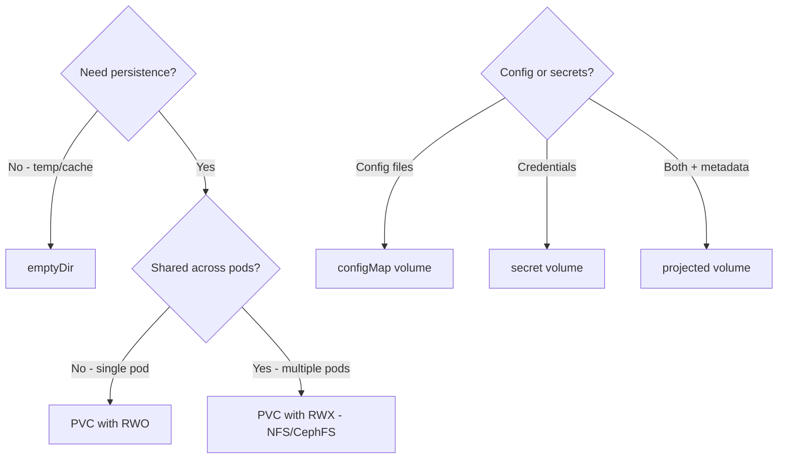

> 💡 **Quick Answer:** Compare all Kubernetes volume types: emptyDir, hostPath, PVC, ConfigMap, Secret, NFS, CSI, and projected volumes. When to use each type with examples.

## The Problem

This is one of the most searched Kubernetes topics. A comprehensive, well-structured guide helps engineers of all levels quickly find actionable solutions.

## The Solution

Detailed implementation with production-ready examples below.


### Volume Types Comparison

| Type | Persistence | Access | Use Case |
|------|------------|--------|----------|
| `emptyDir` | Pod lifetime | Single pod | Cache, temp files |
| `hostPath` | Node lifetime | Single node | Node-level data (dev only!) |
| `persistentVolumeClaim` | Independent | Configurable | Databases, stateful apps |
| `configMap` | ConfigMap lifetime | Read-only | Config files |
| `secret` | Secret lifetime | Read-only | Credentials, TLS certs |
| `nfs` | NFS server | ReadWriteMany | Shared file storage |
| `csi` | Driver-dependent | Driver-dependent | Cloud/enterprise storage |
| `projected` | Source lifetime | Read-only | Combine multiple sources |
| `downwardAPI` | Pod lifetime | Read-only | Pod metadata as files |

### Examples

```yaml
volumes:
  # emptyDir — temp storage
  - name: cache
    emptyDir:
      sizeLimit: 1Gi

  # hostPath — node filesystem (DANGEROUS in production)
  - name: docker-sock
    hostPath:
      path: /var/run/docker.sock
      type: Socket

  # PVC — persistent storage
  - name: data
    persistentVolumeClaim:
      claimName: my-data

  # ConfigMap as files
  - name: config
    configMap:
      name: app-config
      items:
        - key: nginx.conf
          path: nginx.conf

  # Secret as files
  - name: certs
    secret:
      secretName: tls-certs

  # Projected — combine multiple sources
  - name: combined
    projected:
      sources:
        - configMap:
            name: app-config
        - secret:
            name: app-secrets
        - downwardAPI:
            items:
              - path: labels
                fieldRef:
                  fieldPath: metadata.labels
```



## Common Issues

Check `kubectl describe` and `kubectl get events` first — most issues have clear error messages pointing to the root cause.

## Best Practices

- **Follow least privilege** — only grant the access that's needed
- **Test in staging** before applying to production
- **Monitor and alert** on key metrics
- **Document your runbooks** for the team

## Key Takeaways

- Essential knowledge for Kubernetes operations
- Start simple and evolve your approach
- Automation reduces human error
- Share knowledge with your team
