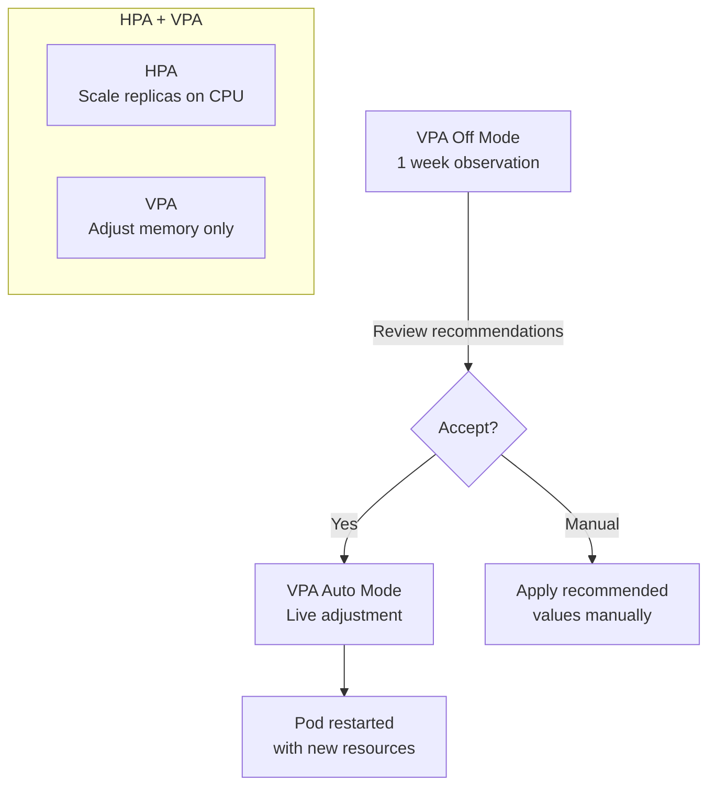

> 💡 **Quick Answer:** Deploy VPA in `Off` mode first to collect recommendations for 1 week without making changes. Review suggested CPU/memory values, then switch to `Auto` for non-critical workloads. For HPA-managed Deployments, use VPA for memory only (`controlledResources: [memory]`) to avoid conflicts.

## The Problem

Teams guess at resource requests — usually 2-5x higher than needed, wasting 40-60% of cluster resources. Or they set them too low, causing OOMKills and throttling. VPA analyzes actual usage and recommends (or auto-applies) right-sized resource values.

## The Solution

### VPA in Recommendation-Only Mode

```yaml
apiVersion: autoscaling.k8s.io/v1
kind: VerticalPodAutoscaler
metadata:
  name: api-server-vpa
  namespace: production
spec:
  targetRef:
    apiVersion: apps/v1
    kind: Deployment
    name: api-server
  updatePolicy:
    updateMode: "Off"
```

After 1 week, check recommendations:

```bash
kubectl get vpa api-server-vpa -o jsonpath='{.status.recommendation}' | jq
# {
#   "containerRecommendations": [{
#     "containerName": "api",
#     "lowerBound": {"cpu": "50m", "memory": "128Mi"},
#     "target": {"cpu": "250m", "memory": "384Mi"},
#     "upperBound": {"cpu": "1", "memory": "1Gi"}
#   }]
# }
```

### VPA Auto Mode

```yaml
apiVersion: autoscaling.k8s.io/v1
kind: VerticalPodAutoscaler
metadata:
  name: worker-vpa
spec:
  targetRef:
    apiVersion: apps/v1
    kind: Deployment
    name: background-worker
  updatePolicy:
    updateMode: "Auto"
  resourcePolicy:
    containerPolicies:
      - containerName: worker
        minAllowed:
          cpu: 100m
          memory: 128Mi
        maxAllowed:
          cpu: "4"
          memory: 4Gi
```

### VPA + HPA Coexistence

```yaml
# VPA: memory only (avoid CPU conflict with HPA)
apiVersion: autoscaling.k8s.io/v1
kind: VerticalPodAutoscaler
metadata:
  name: web-vpa
spec:
  targetRef:
    apiVersion: apps/v1
    kind: Deployment
    name: web-server
  updatePolicy:
    updateMode: "Auto"
  resourcePolicy:
    containerPolicies:
      - containerName: web
        controlledResources: ["memory"]
---
# HPA: scale on CPU
apiVersion: autoscaling/v2
kind: HorizontalPodAutoscaler
metadata:
  name: web-hpa
spec:
  scaleTargetRef:
    apiVersion: apps/v1
    kind: Deployment
    name: web-server
  minReplicas: 2
  maxReplicas: 10
  metrics:
    - type: Resource
      resource:
        name: cpu
        target:
          type: Utilization
          averageUtilization: 70
```



## Common Issues

**VPA keeps restarting pods**

Auto mode evicts pods to apply new resource values. Use `updateMode: Initial` to only set resources on pod creation (no restarts). Or use `Off` mode and apply manually.

**VPA and HPA fighting over CPU**

Never let VPA and HPA both control CPU. Use VPA for memory only: `controlledResources: [memory]`.

## Best Practices

- **Start with Off mode** — observe for 1 week before applying changes
- **Set minAllowed and maxAllowed** — prevent VPA from setting extreme values
- **VPA + HPA coexistence** — VPA for memory, HPA for CPU (never both on same resource)
- **Auto mode for non-critical workloads** — restarts pods to apply changes
- **Initial mode for production** — only applies on pod creation, no disruption

## Key Takeaways

- VPA analyzes actual resource usage and recommends right-sized values
- Off mode collects recommendations safely; Auto mode applies them (with pod restarts)
- Most teams over-provision by 2-5x — VPA recovers 40-60% of wasted resources
- VPA + HPA coexistence: VPA controls memory, HPA controls horizontal scaling on CPU
- Always set minAllowed/maxAllowed bounds to prevent extreme recommendations
