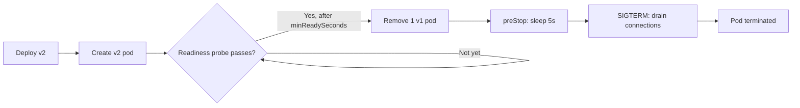

> 💡 **Quick Answer:** deployments

## The Problem

This is a fundamental Kubernetes topic that engineers search for frequently. A comprehensive reference with production-ready examples saves hours of trial and error.

## The Solution

### The Zero-Downtime Checklist

```yaml
apiVersion: apps/v1
kind: Deployment
metadata:
  name: web-app
spec:
  replicas: 3
  strategy:
    type: RollingUpdate
    rollingUpdate:
      maxSurge: 1
      maxUnavailable: 0       # ← Never remove a pod until new one is Ready
  template:
    spec:
      terminationGracePeriodSeconds: 60
      containers:
        - name: app
          image: my-app:v2
          ports:
            - containerPort: 8080

          # 1. Readiness probe — don't send traffic until ready
          readinessProbe:
            httpGet:
              path: /ready
              port: 8080
            initialDelaySeconds: 5
            periodSeconds: 5

          # 2. preStop hook — wait for LB to remove endpoint
          lifecycle:
            preStop:
              exec:
                command: ["sh", "-c", "sleep 5"]

          # 3. Resource requests — scheduler places pods correctly
          resources:
            requests:
              cpu: 100m
              memory: 128Mi

      # 4. Pod anti-affinity — spread across nodes
      affinity:
        podAntiAffinity:
          preferredDuringSchedulingIgnoredDuringExecution:
            - weight: 100
              podAffinityTerm:
                labelSelector:
                  matchLabels:
                    app: web-app
                topologyKey: kubernetes.io/hostname

  minReadySeconds: 5          # Wait 5s after Ready before continuing rollout
---
# 5. PDB — protect during node drains
apiVersion: policy/v1
kind: PodDisruptionBudget
metadata:
  name: web-pdb
spec:
  minAvailable: 2
  selector:
    matchLabels:
      app: web-app
```

### The Five Requirements

| # | Requirement | What It Does |
|---|------------|--------------|
| 1 | Readiness probe | Prevents traffic to unready pods |
| 2 | `maxUnavailable: 0` | Never removes old pod before new is Ready |
| 3 | preStop sleep 5 | Allows LB endpoint removal before shutdown |
| 4 | Handle SIGTERM | App drains in-flight requests gracefully |
| 5 | PDB | Prevents draining too many pods at once |



## Frequently Asked Questions

### Why do I still get 502s during deployment?

Usually missing one of: readiness probe, preStop hook, or `maxUnavailable: 0`. All three are required for true zero-downtime. Also ensure your app handles SIGTERM gracefully.

## Best Practices

- Start with the simplest configuration that meets your needs
- Test changes in staging before production
- Use `kubectl describe` and events for troubleshooting
- Document your decisions for the team

## Key Takeaways

- This is essential Kubernetes knowledge for production operations
- Follow the principle of least privilege and minimal configuration
- Monitor and iterate based on real-world behavior
- Automation reduces human error and improves consistency
