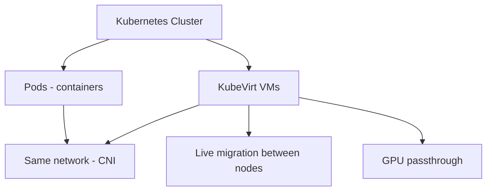

> 💡 **Quick Answer:** deployments

## The Problem

Engineers need production-ready guides for these essential Kubernetes ecosystem tools. Incomplete documentation leads to misconfiguration and security gaps.

## The Solution

### Install KubeVirt

```bash
export VERSION=$(curl -s https://api.github.com/repos/kubevirt/kubevirt/releases/latest | grep tag_name | cut -d'"' -f4)
kubectl apply -f https://github.com/kubevirt/kubevirt/releases/download/$VERSION/kubevirt-operator.yaml
kubectl apply -f https://github.com/kubevirt/kubevirt/releases/download/$VERSION/kubevirt-cr.yaml

# Install virtctl CLI
kubectl krew install virt
```

### Create a VM

```yaml
apiVersion: kubevirt.io/v1
kind: VirtualMachine
metadata:
  name: ubuntu-vm
spec:
  running: true
  template:
    metadata:
      labels:
        app: ubuntu-vm
    spec:
      domain:
        cpu:
          cores: 2
        memory:
          guest: 4Gi
        devices:
          disks:
            - name: rootdisk
              disk:
                bus: virtio
            - name: cloudinitdisk
              disk:
                bus: virtio
        resources:
          requests:
            memory: 4Gi
      volumes:
        - name: rootdisk
          containerDisk:
            image: quay.io/containerdisks/ubuntu:22.04
        - name: cloudinitdisk
          cloudInitNoCloud:
            userData: |
              #cloud-config
              password: changeme
              chpasswd: { expire: false }
              ssh_authorized_keys:
                - ssh-rsa AAAA...
```

```bash
# Manage VMs
kubectl virt start ubuntu-vm
kubectl virt stop ubuntu-vm
kubectl virt restart ubuntu-vm
kubectl virt console ubuntu-vm      # Serial console
kubectl virt ssh ubuntu-vm           # SSH access

# Live migration
kubectl virt migrate ubuntu-vm
```

### Expose VM as Service

```yaml
apiVersion: v1
kind: Service
metadata:
  name: ubuntu-vm-ssh
spec:
  type: NodePort
  selector:
    app: ubuntu-vm
  ports:
    - port: 22
      targetPort: 22
```



## Frequently Asked Questions

### When would I use KubeVirt?

When you need VMs (legacy apps, Windows, custom kernels) alongside containers on the same cluster. Consolidates infrastructure — one platform for VMs + containers.

### Performance vs bare-metal VMs?

KubeVirt uses KVM — same hypervisor as libvirt. Performance is nearly identical to traditional VMs. Overhead is in Kubernetes scheduling, not virtualization.

## Best Practices

- Start with default configurations and customize as needed
- Test in a non-production cluster first
- Monitor resource usage after deployment
- Keep components updated for security patches

## Key Takeaways

- This tool fills a critical gap in the Kubernetes ecosystem
- Follow the principle of least privilege for all configurations
- Automate where possible to reduce manual errors
- Monitor and alert on operational metrics
