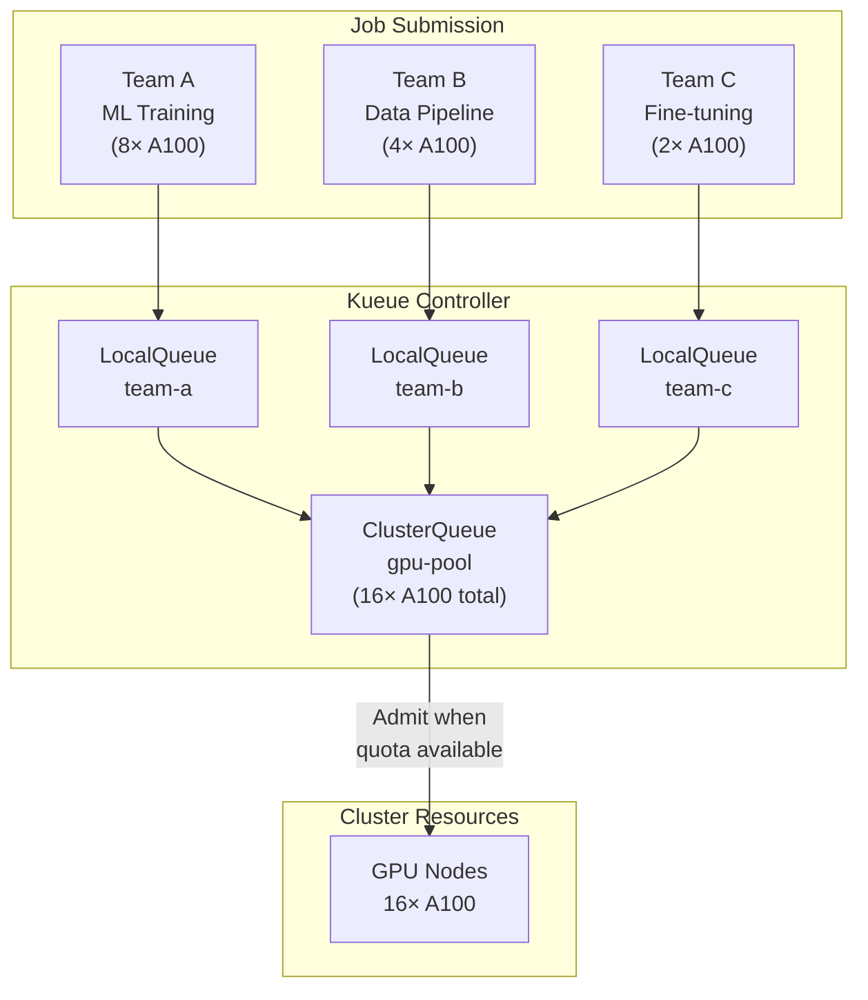

> 💡 **Quick Answer:** Kueue is a Kubernetes-native job queueing system that manages when and where batch Jobs run based on available quotas. Install Kueue, define `ResourceFlavors` (CPU/GPU types), `ClusterQueues` (resource pools), and `LocalQueues` (per-namespace). Jobs wait in queue until quota is available — no more overcommitting GPUs or starving lower-priority teams.

## The Problem

Kubernetes Jobs run immediately if resources exist — there's no native concept of "wait in line." When multiple teams submit GPU training jobs simultaneously, you get either resource contention (OOMKilled, scheduling failures) or massive overprovisioning. Kueue adds enterprise batch scheduling: fair sharing between teams, GPU quota management, priority-based preemption, and multi-cluster job distribution.



## The Solution

### Install Kueue

```bash
kubectl apply --server-side -f \
  https://github.com/kubernetes-sigs/kueue/releases/download/v0.10.0/manifests.yaml

# Verify
kubectl get pods -n kueue-system
```

### Define Resource Flavors

```yaml
# ResourceFlavors describe types of resources (GPU models, CPU tiers)
apiVersion: kueue.x-k8s.io/v1beta1
kind: ResourceFlavor
metadata:
  name: nvidia-a100-80gb
spec:
  nodeLabels:
    nvidia.com/gpu.product: "NVIDIA-A100-SXM4-80GB"
---
apiVersion: kueue.x-k8s.io/v1beta1
kind: ResourceFlavor
metadata:
  name: nvidia-h100
spec:
  nodeLabels:
    nvidia.com/gpu.product: "NVIDIA-H100-80GB-HBM3"
---
apiVersion: kueue.x-k8s.io/v1beta1
kind: ResourceFlavor
metadata:
  name: default-cpu
spec: {}  # No special labels — any CPU node
```

### Create Cluster Queue

```yaml
apiVersion: kueue.x-k8s.io/v1beta1
kind: ClusterQueue
metadata:
  name: gpu-pool
spec:
  namespaceSelector: {}             # All namespaces can use this
  preemption:
    reclaimWithinCohort: Any
    withinClusterQueue: LowerPriority
  resourceGroups:
    - coveredResources: ["cpu", "memory", "nvidia.com/gpu"]
      flavors:
        - name: nvidia-a100-80gb
          resources:
            - name: "cpu"
              nominalQuota: 128
            - name: "memory"
              nominalQuota: 1Ti
            - name: "nvidia.com/gpu"
              nominalQuota: 16          # 16 A100 GPUs total
              borrowingLimit: 0         # No borrowing from other queues
        - name: nvidia-h100
          resources:
            - name: "cpu"
              nominalQuota: 64
            - name: "memory"
              nominalQuota: 512Gi
            - name: "nvidia.com/gpu"
              nominalQuota: 8           # 8 H100 GPUs
  fairSharing:
    weight: 1                           # Equal weight with other ClusterQueues
```

### Per-Team Local Queues

```yaml
# Team A: ML training (gets up to 8 GPUs)
apiVersion: kueue.x-k8s.io/v1beta1
kind: LocalQueue
metadata:
  name: ml-training
  namespace: team-a
spec:
  clusterQueue: gpu-pool
---
# Team B: Data pipeline (gets up to 4 GPUs)
apiVersion: kueue.x-k8s.io/v1beta1
kind: LocalQueue
metadata:
  name: data-pipeline
  namespace: team-b
spec:
  clusterQueue: gpu-pool
---
# Team C: Fine-tuning (gets up to 4 GPUs)
apiVersion: kueue.x-k8s.io/v1beta1
kind: LocalQueue
metadata:
  name: fine-tuning
  namespace: team-c
spec:
  clusterQueue: gpu-pool
```

### Submit a Queued Job

```yaml
apiVersion: batch/v1
kind: Job
metadata:
  name: llm-training-run-42
  namespace: team-a
  labels:
    kueue.x-k8s.io/queue-name: ml-training    # Assign to LocalQueue
spec:
  parallelism: 4
  completions: 4
  template:
    spec:
      containers:
        - name: trainer
          image: myorg/llm-trainer:v3.0
          command: ["torchrun", "--nproc_per_node=2"]
          args: ["train.py", "--model=llama-7b", "--epochs=3"]
          resources:
            requests:
              cpu: "16"
              memory: "64Gi"
              nvidia.com/gpu: 2          # 2 GPUs per pod × 4 pods = 8 GPUs
            limits:
              nvidia.com/gpu: 2
      restartPolicy: Never
```

### Priority Classes for Preemption

```yaml
apiVersion: kueue.x-k8s.io/v1beta1
kind: WorkloadPriorityClass
metadata:
  name: production
value: 1000
description: "Production training jobs — preempt research"
---
apiVersion: kueue.x-k8s.io/v1beta1
kind: WorkloadPriorityClass
metadata:
  name: research
value: 100
description: "Research experiments — can be preempted"
---
# Job with priority
apiVersion: batch/v1
kind: Job
metadata:
  name: production-training
  namespace: team-a
  labels:
    kueue.x-k8s.io/queue-name: ml-training
    kueue.x-k8s.io/priority-class: production
spec:
  template:
    spec:
      containers:
        - name: trainer
          image: myorg/llm-trainer:v3.0
          resources:
            limits:
              nvidia.com/gpu: 8
      restartPolicy: Never
```

### Monitor Queue Status

```bash
# Check queue status
kubectl get clusterqueues
kubectl get localqueues -A
kubectl get workloads -A

# Detailed queue usage
kubectl describe clusterqueue gpu-pool

# Output shows:
# Flavors Usage:
#   nvidia-a100-80gb:
#     nvidia.com/gpu: 12/16 (used/nominal)
#   Pending Workloads: 3
#   Admitted Workloads: 5
```

### MultiKueue: Cross-Cluster Jobs

```yaml
# Distribute jobs across multiple clusters
apiVersion: kueue.x-k8s.io/v1beta1
kind: MultiKueue
metadata:
  name: global-gpu-pool
spec:
  clusters:
    - name: cluster-us-east
      kubeConfig:
        secretRef:
          name: cluster-us-east-kubeconfig
    - name: cluster-eu-west
      kubeConfig:
        secretRef:
          name: cluster-eu-west-kubeconfig
  admissionCheck:
    controllerName: kueue.x-k8s.io/multikueue
```

## Common Issues

| Issue | Cause | Fix |
|-------|-------|-----|
| Job stuck in "Inadmissible" | Not enough quota in ClusterQueue | Increase `nominalQuota` or wait for running jobs to complete |
| Job never gets admitted | Missing `kueue.x-k8s.io/queue-name` label | Add the label to Job metadata |
| Wrong GPU flavor selected | Node labels don't match ResourceFlavor | Verify `nvidia.com/gpu.product` labels on nodes |
| Preemption not working | WorkloadPriorityClass not set | Add priority label to Job |
| Fair sharing unbalanced | Queue weights misconfigured | Adjust `fairSharing.weight` in ClusterQueue |

## Best Practices

- **One ClusterQueue per GPU pool** — separate A100 and H100 pools if pricing/access differs
- **LocalQueue per team/project** — maps to namespaces for multi-tenancy
- **Use WorkloadPriorityClass** — production training > research experiments > nightly batch
- **Enable preemption** — `LowerPriority` preemption prevents low-priority jobs from blocking production
- **Monitor admission latency** — long queue times signal need for more GPUs or better scheduling
- **Combine with Cluster Autoscaler** — scale nodes when queue depth exceeds threshold

## Key Takeaways

- Kueue adds enterprise batch scheduling to Kubernetes: quotas, queuing, fair sharing
- ResourceFlavors describe GPU/CPU types; ClusterQueues define resource pools
- Jobs wait in queue until quota is available — no more overcommitting GPUs
- Priority-based preemption ensures production jobs get resources first
- MultiKueue distributes jobs across clusters for capacity management
- Essential for teams running ML training workloads on shared GPU infrastructure
