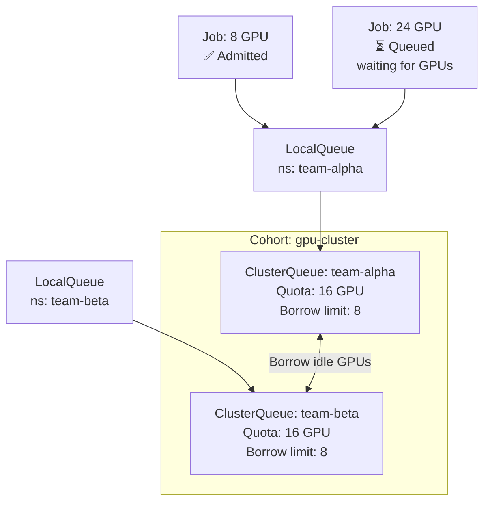

> 💡 **Quick Answer:** Install Kueue and create `ClusterQueues` with GPU quotas per team. Teams submit jobs to `LocalQueues` — Kueue admits jobs when resources are available and queues the rest. Cohort-based borrowing lets idle GPUs be used by other teams automatically.

## The Problem

Multiple teams compete for a shared GPU cluster. Without queuing, teams over-provision to guarantee GPU access, or jobs fail with "insufficient resources." ResourceQuotas alone don't queue — they reject. Kueue provides fair-share queuing that maximizes GPU utilization while respecting team quotas.

## The Solution

### Install Kueue

```bash
kubectl apply --server-side -f \
  https://github.com/kubernetes-sigs/kueue/releases/download/v0.9.0/manifests.yaml
```

### Define Resource Flavors

```yaml
apiVersion: kueue.x-k8s.io/v1beta1
kind: ResourceFlavor
metadata:
  name: a100-80gb
spec:
  nodeLabels:
    nvidia.com/gpu.product: A100-SXM4-80GB
---
apiVersion: kueue.x-k8s.io/v1beta1
kind: ResourceFlavor
metadata:
  name: h100-80gb
spec:
  nodeLabels:
    nvidia.com/gpu.product: H100-SXM5-80GB
```

### ClusterQueues with Fair Sharing

```yaml
apiVersion: kueue.x-k8s.io/v1beta1
kind: ClusterQueue
metadata:
  name: team-alpha
spec:
  cohort: gpu-cluster
  resourceGroups:
    - coveredResources: ["nvidia.com/gpu", "cpu", "memory"]
      flavors:
        - name: a100-80gb
          resources:
            - name: nvidia.com/gpu
              nominalQuota: 16
              borrowingLimit: 8
            - name: cpu
              nominalQuota: 64
            - name: memory
              nominalQuota: 256Gi
  preemption:
    reclaimWithinCohort: Any
    withinClusterQueue: LowerPriority
---
apiVersion: kueue.x-k8s.io/v1beta1
kind: ClusterQueue
metadata:
  name: team-beta
spec:
  cohort: gpu-cluster
  resourceGroups:
    - coveredResources: ["nvidia.com/gpu", "cpu", "memory"]
      flavors:
        - name: a100-80gb
          resources:
            - name: nvidia.com/gpu
              nominalQuota: 16
              borrowingLimit: 8
```

### LocalQueue (Per Namespace)

```yaml
apiVersion: kueue.x-k8s.io/v1beta1
kind: LocalQueue
metadata:
  name: training-queue
  namespace: team-alpha
spec:
  clusterQueue: team-alpha
```

### Submit a Training Job

```yaml
apiVersion: batch/v1
kind: Job
metadata:
  name: llm-finetune
  namespace: team-alpha
  labels:
    kueue.x-k8s.io/queue-name: training-queue
spec:
  template:
    spec:
      containers:
        - name: training
          image: registry.example.com/training:1.0
          resources:
            requests:
              nvidia.com/gpu: 8
      restartPolicy: Never
```

### How Borrowing Works

```
Team Alpha quota: 16 GPUs
Team Beta quota: 16 GPUs
Total cluster: 32 GPUs

Scenario: Team Alpha needs 24 GPUs, Team Beta using 8
  → Team Alpha uses 16 (own) + 8 (borrowed from Beta's idle)
  → Total: 24 GPUs active, 8 idle = 75% utilization

When Team Beta submits a job needing 12 GPUs:
  → Kueue reclaims 4 borrowed GPUs from Team Alpha
  → Team Alpha: 20 GPUs, Team Beta: 12 GPUs
```



## Common Issues

**Jobs not being admitted — stuck in queue**

Check ClusterQueue status: `kubectl get clusterqueue -o wide`. Ensure ResourceFlavor nodeLabels match actual node labels.

**Borrowed GPUs not being reclaimed**

`reclaimWithinCohort: Any` must be set. Without it, borrowed resources are only reclaimed when the borrowing job completes.

## Best Practices

- **Cohort-based sharing** maximizes utilization — idle GPUs automatically available to other teams
- **`borrowingLimit`** prevents one team from taking everything — cap at 50% of other queues
- **Preemption for fairness** — `reclaimWithinCohort: Any` reclaims borrowed resources
- **Priority classes** for job importance — inference > training > experiments
- **Monitor queue depth** — Kueue exposes Prometheus metrics for admission latency

## Key Takeaways

- Kueue provides fair-share GPU queuing that maximizes cluster utilization
- ClusterQueues define per-team GPU quotas; LocalQueues are the submission interface
- Cohort-based borrowing lets idle GPUs be used by other teams automatically
- Preemption reclaims borrowed resources when the owning team needs them
- Unlike ResourceQuotas, Kueue queues jobs instead of rejecting them
