> 💡 **Quick Answer:** Install Kyverno via Helm (`helm install kyverno kyverno/kyverno -n kyverno`), then create `ClusterPolicy` resources in YAML. Policies can **validate** (block non-compliant resources), **mutate** (add defaults like labels), or **generate** (create related resources automatically).
>
> **Key command:** `kubectl get policyreport -A` shows policy violations; `kubectl get clusterpolicy` lists active policies.
>
> **Gotcha:** Start with `validationFailureAction: Audit` to see violations without blocking, then switch to `Enforce` when ready.

## Problem

You need to enforce security policies, compliance requirements, and best practices across your Kubernetes cluster without writing complex admission webhooks. Manual policy enforcement is error-prone and doesn't scale.

## Solution

Use Kyverno, a Kubernetes-native policy engine that runs as a dynamic admission controller. Kyverno policies are written in YAML (no new language to learn) and can validate, mutate, generate, and verify images.

### Architecture

```mermaid
flowchart TB
    KUBECTL["💻 kubectl create/apply"]
    KUBECTL --> APISERVER

    APISERVER["☸️ Kubernetes API Server"]
    APISERVER --> KYVERNO

    subgraph KYVERNO["🛡️ Kyverno Admission Controller"]
        ACTIONS["1️⃣ Validate: Enforce rules<br/>2️⃣ Mutate: Modify resources<br/>3️⃣ Generate: Create new resources<br/>4️⃣ Verify Images: Check signatures"]
    end

    KYVERNO --> ALLOWED["✅ Allowed<br/>(compliant)"]
    KYVERNO --> REJECTED["❌ Rejected<br/>(non-compliant)"]
    KYVERNO --> MUTATED["🔧 Mutated<br/>(auto-fixed)"]

    style ALLOWED fill:#ccffcc,stroke:#00aa00
    style REJECTED fill:#ffcccc,stroke:#aa0000
    style MUTATED fill:#ccccff,stroke:#0000aa
```



### Step 1: Install Kyverno

Deploy Kyverno using Helm:

```bash
# Add Kyverno Helm repository
helm repo add kyverno https://kyverno.github.io/kyverno/
helm repo update

# Install Kyverno
helm install kyverno kyverno/kyverno \
  --namespace kyverno \
  --create-namespace \
  --set replicaCount=3 \
  --set resources.limits.memory=512Mi

# Verify installation
kubectl get pods -n kyverno
kubectl get validatingwebhookconfigurations,mutatingwebhookconfigurations | grep kyverno
```

### Step 2: Create Validation Policy - Require Labels

Enforce required labels on all resources:

```yaml
apiVersion: kyverno.io/v1
kind: ClusterPolicy
metadata:
  name: require-labels
  annotations:
    policies.kyverno.io/title: Require Labels
    policies.kyverno.io/category: Best Practices
    policies.kyverno.io/severity: medium
    policies.kyverno.io/description: >-
      Require all resources to have specific labels for tracking and organization.
spec:
  validationFailureAction: Enforce  # or Audit for reporting only
  background: true
  rules:
  - name: check-for-labels
    match:
      any:
      - resources:
          kinds:
          - Deployment
          - Service
          - ConfigMap
          namespaces:
          - production
          - staging
    validate:
      message: "Labels 'app', 'team', and 'environment' are required."
      pattern:
        metadata:
          labels:
            app: "?*"
            team: "?*"
            environment: "?*"
```

### Step 3: Create Validation Policy - Restrict Container Images

Only allow images from approved registries:

```yaml
apiVersion: kyverno.io/v1
kind: ClusterPolicy
metadata:
  name: restrict-image-registries
  annotations:
    policies.kyverno.io/title: Restrict Image Registries
    policies.kyverno.io/category: Security
    policies.kyverno.io/severity: high
spec:
  validationFailureAction: Enforce
  background: true
  rules:
  - name: validate-registries
    match:
      any:
      - resources:
          kinds:
          - Pod
    validate:
      message: "Images must come from approved registries: gcr.io, ghcr.io, or internal registry"
      pattern:
        spec:
          containers:
          - image: "gcr.io/* | ghcr.io/* | registry.company.com/*"
```

### Step 4: Create Mutation Policy - Add Default Labels

Automatically add labels to resources:

```yaml
apiVersion: kyverno.io/v1
kind: ClusterPolicy
metadata:
  name: add-default-labels
  annotations:
    policies.kyverno.io/title: Add Default Labels
    policies.kyverno.io/category: Other
spec:
  background: false
  rules:
  - name: add-labels
    match:
      any:
      - resources:
          kinds:
          - Deployment
          - StatefulSet
          - DaemonSet
    mutate:
      patchStrategicMerge:
        metadata:
          labels:
            managed-by: kyverno
            +(compliance): "required"  # Add only if not exists
        spec:
          template:
            metadata:
              labels:
                managed-by: kyverno
```

### Step 5: Create Mutation Policy - Add Security Context

Enforce security best practices:

```yaml
apiVersion: kyverno.io/v1
kind: ClusterPolicy
metadata:
  name: add-security-context
  annotations:
    policies.kyverno.io/title: Add Security Context
    policies.kyverno.io/category: Security
    policies.kyverno.io/severity: high
spec:
  background: false
  rules:
  - name: set-security-context
    match:
      any:
      - resources:
          kinds:
          - Deployment
          - StatefulSet
          - DaemonSet
    mutate:
      patchStrategicMerge:
        spec:
          template:
            spec:
              securityContext:
                runAsNonRoot: true
                seccompProfile:
                  type: RuntimeDefault
              containers:
              - (name): "*"
                securityContext:
                  allowPrivilegeEscalation: false
                  capabilities:
                    drop:
                    - ALL
                  runAsNonRoot: true
```

### Step 6: Create Generation Policy - Auto-Create NetworkPolicy

Generate NetworkPolicy for new namespaces:

```yaml
apiVersion: kyverno.io/v1
kind: ClusterPolicy
metadata:
  name: generate-networkpolicy
  annotations:
    policies.kyverno.io/title: Generate NetworkPolicy
    policies.kyverno.io/category: Security
spec:
  background: true
  rules:
  - name: default-deny-ingress
    match:
      any:
      - resources:
          kinds:
          - Namespace
    exclude:
      any:
      - resources:
          namespaces:
          - kube-system
          - kube-public
          - kyverno
    generate:
      apiVersion: networking.k8s.io/v1
      kind: NetworkPolicy
      name: default-deny-ingress
      namespace: "{{request.object.metadata.name}}"
      synchronize: true
      data:
        spec:
          podSelector: {}
          policyTypes:
          - Ingress
```

### Step 7: Create Generation Policy - Auto-Create LimitRange

Generate resource limits for new namespaces:

```yaml
apiVersion: kyverno.io/v1
kind: ClusterPolicy
metadata:
  name: generate-limitrange
  annotations:
    policies.kyverno.io/title: Generate LimitRange
    policies.kyverno.io/category: Resource Management
spec:
  background: true
  rules:
  - name: create-limitrange
    match:
      any:
      - resources:
          kinds:
          - Namespace
    exclude:
      any:
      - resources:
          namespaces:
          - kube-system
          - kube-public
          - kyverno
    generate:
      apiVersion: v1
      kind: LimitRange
      name: default-limitrange
      namespace: "{{request.object.metadata.name}}"
      synchronize: true
      data:
        spec:
          limits:
          - default:
              memory: 512Mi
              cpu: 500m
            defaultRequest:
              memory: 256Mi
              cpu: 100m
            type: Container
```

### Step 8: Verify Image Signatures with Cosign

Require signed container images:

```yaml
apiVersion: kyverno.io/v1
kind: ClusterPolicy
metadata:
  name: verify-image-signatures
  annotations:
    policies.kyverno.io/title: Verify Image Signatures
    policies.kyverno.io/category: Security
    policies.kyverno.io/severity: critical
spec:
  validationFailureAction: Enforce
  background: false
  webhookTimeoutSeconds: 30
  rules:
  - name: verify-signature
    match:
      any:
      - resources:
          kinds:
          - Pod
    verifyImages:
    - imageReferences:
      - "gcr.io/company/production/*"
      attestors:
      - count: 1
        entries:
        - keys:
            publicKeys: |-
              -----BEGIN PUBLIC KEY-----
              MFkwEwYHKoZIzj0CAQYIKoZIzj0DAQcDQgAE...
              -----END PUBLIC KEY-----
```

### Step 9: Create Policy Reports

Check policy compliance across cluster:

```bash
# View cluster policy reports
kubectl get clusterpolicyreports -A

# View policy reports for specific namespace
kubectl get policyreports -n production

# Describe policy report
kubectl describe clusterpolicyreport clusterpolicyreport

# Get policy violations
kubectl get clusterpolicyreport clusterpolicyreport -o json | \
  jq '.results[] | select(.result=="fail")'
```

### Step 10: Audit Mode for Testing

Test policies without blocking resources:

```yaml
apiVersion: kyverno.io/v1
kind: ClusterPolicy
metadata:
  name: test-policy
spec:
  validationFailureAction: Audit  # Don't block, just report
  background: true
  rules:
  - name: test-rule
    match:
      any:
      - resources:
          kinds:
          - Deployment
    validate:
      message: "Test policy violation"
      pattern:
        spec:
          replicas: ">1"
```

## Verification

Test validation policies:

```bash
# Try to create non-compliant deployment (should fail)
kubectl create deployment test --image=docker.io/nginx -n production

# Create compliant deployment
kubectl create deployment test --image=gcr.io/company/nginx -n production
kubectl label deployment test app=test team=platform environment=prod -n production
```

Test mutation policies:

```bash
# Create deployment without labels
cat <<EOF | kubectl apply -f -
apiVersion: apps/v1
kind: Deployment
metadata:
  name: test-mutation
  namespace: default
spec:
  replicas: 1
  selector:
    matchLabels:
      app: test
  template:
    metadata:
      labels:
        app: test
    spec:
      containers:
      - name: nginx
        image: nginx
EOF

# Check if labels were added
kubectl get deployment test-mutation -o yaml | grep managed-by
```

Check policy status:

```bash
# List all Kyverno policies
kubectl get clusterpolicies

# Describe policy
kubectl describe clusterpolicy require-labels

# Check policy status
kubectl get clusterpolicy require-labels -o jsonpath='{.status}'

# View policy violations
kubectl get policyreport -A
```

Monitor Kyverno metrics:

```bash
# Port-forward to Kyverno metrics
kubectl port-forward -n kyverno svc/kyverno-svc-metrics 8000:8000

# Query metrics
curl localhost:8000/metrics | grep kyverno

# Common metrics:
# kyverno_policy_rule_info_total
# kyverno_policy_results_total
# kyverno_admission_requests_total
```

## Best Practices

1. **Start with Audit mode** before enforcing policies
2. **Use background scanning** to check existing resources
3. **Exclude system namespaces** to avoid breaking cluster
4. **Set appropriate severity levels** in annotations
5. **Use generate policies** for automated compliance
6. **Verify image signatures** for supply chain security
7. **Monitor policy reports** regularly
8. **Test policies** in non-production first
9. **Document policy intent** in annotations
10. **Use namespace-scoped policies** for fine-grained control

## Common Issues

**Policy not taking effect:**
- Check validationFailureAction is set to Enforce
- Verify webhook is configured correctly
- Check for namespace exclusions

**Resources being blocked unexpectedly:**
- Review policy rules carefully
- Check policy reports for details
- Test with Audit mode first

**Generate policies not creating resources:**
- Verify synchronize is set to true
- Check RBAC permissions
- Review Kyverno logs for errors

## Related Resources

- [Kyverno Documentation](https://kyverno.io/)
- [Policy Library](https://kyverno.io/policies/)
- [Kyverno CLI](https://kyverno.io/docs/kyverno-cli/)
- [Best Practices](https://kyverno.io/docs/writing-policies/best-practices/)

---

## 📘 Go Further with Kubernetes Recipes

**Love this recipe? There's so much more!** This is just one of **100+ hands-on recipes** in our comprehensive **[Kubernetes Recipes book](https://amzn.to/3DzC8QA)**.

Inside the book, you'll master:
- ✅ Production-ready deployment strategies
- ✅ Advanced networking and security patterns  
- ✅ Observability, monitoring, and troubleshooting
- ✅ Real-world best practices from industry experts

> *"The practical, recipe-based approach made complex Kubernetes concepts finally click for me."*

**👉 [Get Your Copy Now](https://amzn.to/3DzC8QA)** — Start building production-grade Kubernetes skills today!
