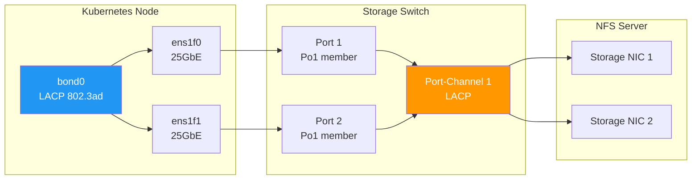

> 💡 **Quick Answer:** LACP (802.3ad) bonds aggregate multiple physical links into a single logical interface for storage traffic, providing bandwidth aggregation and link failover. Configure LACP bonds on Kubernetes nodes via NNCP/NMState, match with switch-side LACP port-channels, set `xmit_hash_policy: layer3+4` for storage traffic distribution, and use jumbo frames (MTU 9000) end-to-end.

## The Problem

Storage networks in Kubernetes clusters need more bandwidth and redundancy than a single link provides:

- **NFS throughput limited to one link** — 25GbE is not enough for GPU training data loading
- **Single link failure drops all storage I/O** — pods hang waiting for NFS timeouts
- **iSCSI multipath adds complexity** — separate paths vs aggregated bandwidth
- **Misconfigured LACP causes silent failures** — one side thinks it's bonded, the other doesn't
- **Wrong hash policy sends all NFS traffic through one link** — no bandwidth gain
- **MTU mismatch between bond members and switch** — jumbo frames fail silently

## The Solution

### LACP Architecture for Storage



### Node-Side: NNCP LACP Bond Configuration

```yaml
apiVersion: nmstate.io/v1
kind: NodeNetworkConfigurationPolicy
metadata:
  name: lacp-storage-bond
spec:
  nodeSelector:
    node-role.kubernetes.io/worker: ""
  maxUnavailable: 1
  desiredState:
    interfaces:
    # LACP bond
    - name: bond-storage
      type: bond
      state: up
      link-aggregation:
        mode: 802.3ad
        options:
          miimon: "100"
          lacp_rate: fast           # Fast LACPDU every 1s (vs slow=30s)
          xmit_hash_policy: layer3+4  # Hash by src/dst IP + port
          ad_select: bandwidth      # Select aggregator by bandwidth
          min_links: "1"            # Stay up with at least 1 link
        port:
        - ens1f0
        - ens1f1
      mtu: 9000
      ipv4:
        enabled: true
        dhcp: false
        address:
        - ip: 10.100.0.10
          prefix-length: 24

    # Ensure member interfaces are up with correct MTU
    - name: ens1f0
      type: ethernet
      state: up
      mtu: 9000

    - name: ens1f1
      type: ethernet
      state: up
      mtu: 9000

    # Storage VLAN on bond (optional — if storage is on a dedicated VLAN)
    - name: bond-storage.100
      type: vlan
      state: up
      vlan:
        base-iface: bond-storage
        id: 100
      mtu: 9000
      ipv4:
        enabled: true
        dhcp: false
        address:
        - ip: 10.100.0.10
          prefix-length: 24

    routes:
      config:
      - destination: 10.200.0.0/16    # Storage network
        next-hop-address: 10.100.0.1
        next-hop-interface: bond-storage
```

### Switch-Side: LACP Port-Channel Configuration

#### Cisco NX-OS / IOS-XE

```
! Create port-channel with LACP
interface port-channel 1
  description "K8s Worker Node 1 - Storage Bond"
  switchport mode trunk
  switchport trunk allowed vlan 100
  mtu 9216
  no shutdown

! Assign member ports
interface Ethernet1/1
  description "worker-1 ens1f0"
  switchport mode trunk
  switchport trunk allowed vlan 100
  mtu 9216
  channel-group 1 mode active
  no shutdown

interface Ethernet1/2
  description "worker-1 ens1f1"
  switchport mode trunk
  switchport trunk allowed vlan 100
  mtu 9216
  channel-group 1 mode active
  no shutdown

! LACP system priority (lower = higher priority)
lacp system-priority 32768

! Verify
show port-channel summary
show lacp counters interface port-channel 1
show lacp neighbor interface port-channel 1
```

#### Arista EOS

```
! Port-channel with LACP
interface Port-Channel1
  description "K8s Worker Node 1 - Storage Bond"
  switchport mode trunk
  switchport trunk allowed vlan 100
  mtu 9214
  lacp fallback timeout 10
  no shutdown

interface Ethernet1
  description "worker-1 ens1f0"
  channel-group 1 mode active
  no shutdown

interface Ethernet2
  description "worker-1 ens1f1"
  channel-group 1 mode active
  no shutdown

! Verify
show port-channel 1 detailed
show lacp 1 detailed
```

#### Mellanox / NVIDIA Spectrum (Cumulus)

```bash
# /etc/network/interfaces on Cumulus Linux
auto bond-worker1
iface bond-worker1
    bond-mode 802.3ad
    bond-lacp-rate fast
    bond-min-links 1
    bond-slaves swp1 swp2
    mtu 9000
    bridge-vids 100

# Or with NVUE (Cumulus 5.x+)
nv set interface bond-worker1 bond mode lacp
nv set interface bond-worker1 bond lacp-rate fast
nv set interface bond-worker1 bond member swp1
nv set interface bond-worker1 bond member swp2
nv set interface bond-worker1 link mtu 9000
nv set interface bond-worker1 bridge domain br_default vlan 100
nv config apply
```

### Hash Policy Selection

The hash policy determines how traffic is distributed across bond members:

| Policy | Hashes On | Best For | NFS Impact |
|--------|-----------|----------|------------|
| `layer2` | MAC addresses | Single peer | ❌ All NFS to one link |
| `layer3+4` | IP + TCP/UDP port | Multiple connections | ✅ Spreads NFS sessions |
| `layer2+3` | MAC + IP | Mixed workloads | ⚠️ Partial spread |
| `encap3+4` | Tunnel inner headers | Overlay networks | N/A for storage |

**For storage traffic, always use `layer3+4`:**

```bash
# Verify hash policy
cat /sys/class/net/bond-storage/bonding/xmit_hash_policy
# layer3+4 1

# Check traffic distribution across members
cat /proc/net/bonding/bond-storage
# Slave Interface: ens1f0
# MII Status: up
# Speed: 25000 Mbps
# Link Failure Count: 0
#
# Slave Interface: ens1f1
# MII Status: up
# Speed: 25000 Mbps
# Link Failure Count: 0
```

### NFS Mount Options for LACP Bonds

```yaml
# StorageClass with optimal NFS mount options for bonded links
apiVersion: storage.k8s.io/v1
kind: StorageClass
metadata:
  name: nfs-bonded-storage
provisioner: nfs.csi.k8s.io
parameters:
  server: nfs-server.example.com
  share: /srv/nfs/data
mountOptions:
  - nfsvers=4.1
  - hard
  - nconnect=8    # Multiple TCP connections — spreads across bond members
  - rsize=1048576  # 1MB read buffer — maximize throughput
  - wsize=1048576  # 1MB write buffer
  - timeo=600
  - retrans=5
```

**`nconnect=8` is critical** — NFSv4.1 uses a single TCP connection by default. With `nconnect=8`, the client opens 8 TCP connections, each hashing to potentially different bond members:

```bash
# Verify nconnect is working
mount | grep nfs
# nfs-server:/data on /mnt/data type nfs4 (rw,nconnect=8,nfsvers=4.1)

# Check connections are distributed
ss -tn | grep 2049 | awk '{print $4}' | sort | uniq -c
# 4 10.100.0.10:xxxxx   ← 4 connections via ens1f0
# 4 10.100.0.10:yyyyy   ← 4 connections via ens1f1
```

### Validation and Troubleshooting

```bash
#!/bin/bash
# lacp-storage-verify.sh — validate LACP bond health

BOND="bond-storage"

echo "=== LACP Storage Bond Verification ==="
echo ""

# 1. Bond status
echo "--- Bond Status ---"
cat /proc/net/bonding/$BOND | head -20

# 2. LACP partner info
echo ""
echo "--- LACP Partner ---"
cat /proc/net/bonding/$BOND | grep -A5 "Partner"

# 3. Traffic distribution
echo ""
echo "--- Member Traffic (bytes) ---"
for slave in $(cat /sys/class/net/$BOND/bonding/slaves); do
    RX=$(cat /sys/class/net/$slave/statistics/rx_bytes)
    TX=$(cat /sys/class/net/$slave/statistics/tx_bytes)
    echo "  $slave: RX=$(numfmt --to=iec $RX) TX=$(numfmt --to=iec $TX)"
done

# 4. MTU consistency
echo ""
echo "--- MTU Check ---"
BOND_MTU=$(cat /sys/class/net/$BOND/mtu)
echo "  $BOND: $BOND_MTU"
for slave in $(cat /sys/class/net/$BOND/bonding/slaves); do
    SLAVE_MTU=$(cat /sys/class/net/$slave/mtu)
    if [ "$SLAVE_MTU" != "$BOND_MTU" ]; then
        echo "  ❌ $slave: $SLAVE_MTU (MISMATCH!)"
    else
        echo "  ✅ $slave: $SLAVE_MTU"
    fi
done

# 5. LACP rate
echo ""
echo "--- LACP Rate ---"
cat /sys/class/net/$BOND/bonding/lacp_rate

# 6. Hash policy
echo ""
echo "--- Hash Policy ---"
cat /sys/class/net/$BOND/bonding/xmit_hash_policy

# 7. NFS connection distribution
echo ""
echo "--- NFS Connections ---"
ss -tn state established '( dport = :2049 )' | wc -l
echo "connections to NFS server"
```

### Prometheus Monitoring

```yaml
apiVersion: monitoring.coreos.com/v1
kind: PrometheusRule
metadata:
  name: lacp-storage-alerts
  namespace: monitoring
spec:
  groups:
  - name: lacp-storage
    rules:
    - alert: BondMemberDown
      expr: |
        node_bonding_slaves{master="bond-storage"} 
        - node_bonding_active{master="bond-storage"} > 0
      for: 1m
      labels:
        severity: critical
      annotations:
        summary: "LACP bond member down on {{ $labels.instance }}"
        description: "Storage bond has degraded link — running on single member."
    
    - alert: BondTrafficImbalance
      expr: |
        abs(
          rate(node_network_transmit_bytes_total{device="ens1f0"}[5m]) 
          - rate(node_network_transmit_bytes_total{device="ens1f1"}[5m])
        ) / (
          rate(node_network_transmit_bytes_total{device="ens1f0"}[5m]) 
          + rate(node_network_transmit_bytes_total{device="ens1f1"}[5m])
        ) > 0.8
      for: 10m
      labels:
        severity: warning
      annotations:
        summary: "LACP bond traffic heavily skewed on {{ $labels.instance }}"
        description: ">80% traffic on one member. Check hash policy and nconnect."
```

## Common Issues

**All NFS traffic goes through one link**

With `layer3+4` hash and a single NFS TCP connection, the hash is deterministic — same source/dest IP + port always picks the same link. Solution: use `nconnect=8` in NFS mount options to create multiple TCP connections with different source ports.

**LACP negotiation fails — bond stays in standby**

Switch and host must both use `mode active` (or one active, one passive). Never set both sides to `passive`. Also verify LACP system MAC is unique per node — VMs sometimes share MACs.

**MTU mismatch causes silent packet drops**

MTU must be set on: physical NICs, bond interface, VLAN (if used), switch port, switch port-channel, AND the NFS server NIC. A single mismatch anywhere causes fragmentation or drops. Test with `ping -M do -s 8972 <nfs-server-ip>`.

**Bond reports 50Gbps but NFS gets 25Gbps**

Single TCP stream can't exceed one link's bandwidth. Bond aggregation works across multiple flows, not within one flow. Use `nconnect` for NFS or multiple mount points to create parallel flows.

## Best Practices

- **Always use `lacp_rate: fast`** — detect link failure in 3s instead of 90s
- **Set `xmit_hash_policy: layer3+4`** — essential for storage traffic distribution
- **Use `nconnect=8`** for NFS mounts — creates multiple flows across bond members
- **Match MTU end-to-end** — 9000 on NICs, bond, VLAN, switch ports, and NFS server
- **Set `min_links: 1`** — keep the bond up with degraded performance rather than total failure
- **Monitor traffic balance** — alert when >80% of traffic is on one member
- **Use `fast` LACP on both sides** — faster failover and convergence
- **Test failover before production** — pull one cable and verify NFS I/O continues

## Key Takeaways

- LACP 802.3ad bonds provide bandwidth aggregation and link redundancy for storage traffic
- `xmit_hash_policy: layer3+4` + `nconnect=8` are mandatory for effective NFS load balancing
- Switch-side port-channel must match node-side LACP config (mode, MTU, VLANs)
- Single TCP connection can't exceed one link — always use nconnect for NFS
- MTU 9000 end-to-end (NIC → bond → VLAN → switch → NFS server) with no exceptions
- Monitor bond member status and traffic balance — degraded bonds cause silent performance loss
