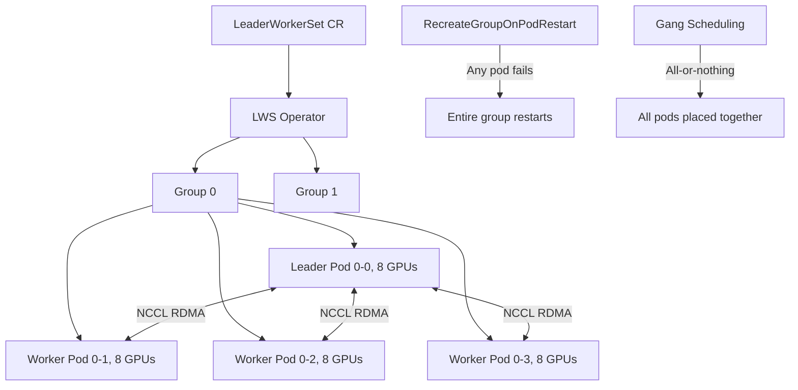

> 💡 **Quick Answer:** Install the LeaderWorkerSet (LWS) Operator and create a `LeaderWorkerSet` CR to deploy groups of pods with leader-worker topology — the leader coordinates training, workers run in lockstep, and gang scheduling ensures all-or-nothing placement.

## The Problem

Distributed AI training requires tightly coupled pod groups: one leader coordinates work while multiple workers execute in parallel. Standard Deployments and StatefulSets treat pods independently — they don't support group-aware scheduling, co-failure semantics, or leader election. When one worker fails, the whole group should restart together, not individually.

## The Solution

The LeaderWorkerSet (LWS) Operator creates pod groups where a leader pod and its workers are scheduled, scaled, and failed together as a unit. It's the Kubernetes-native replacement for tightly coupled distributed workloads.

### Install LWS Operator on Kubernetes

```bash
# Install from upstream
kubectl apply --server-side -f \
  https://github.com/kubernetes-sigs/lws/releases/download/v0.5.0/manifests.yaml

# Verify
kubectl get pods -n lws-system
kubectl get crds | grep leaderworkersets
```

### Install on OpenShift (OLM)

```bash
# Install via OperatorHub
cat <<EOF | oc apply -f -
apiVersion: operators.coreos.com/v1alpha1
kind: Subscription
metadata:
  name: lws-operator
  namespace: openshift-operators
spec:
  channel: stable
  name: lws-operator
  source: redhat-operators
  sourceNamespace: openshift-marketplace
  installPlanApproval: Automatic
EOF

# Verify operator is running
oc get csv -n openshift-operators | grep lws
oc get pods -n openshift-operators -l app.kubernetes.io/name=lws-operator
```

### Basic LeaderWorkerSet

```yaml
apiVersion: leaderworkerset.x-k8s.io/v1
kind: LeaderWorkerSet
metadata:
  name: distributed-training
  namespace: ai-workloads
spec:
  replicas: 2                    # 2 groups (2 leaders, each with workers)
  leaderWorkerTemplate:
    size: 5                      # 1 leader + 4 workers per group
    restartPolicy: RecreateGroupOnPodRestart
    leaderTemplate:
      metadata:
        labels:
          role: leader
      spec:
        containers:
          - name: leader
            image: nvcr.io/nvidia/pytorch:24.03-py3
            command:
              - torchrun
              - --nnodes=5
              - --node_rank=0
              - --nproc_per_node=8
              - --rdzv_backend=c10d
              - --rdzv_endpoint=$(LWS_LEADER_ADDRESS):29500
              - /workspace/train.py
            env:
              - name: NCCL_DEBUG
                value: "INFO"
            resources:
              limits:
                nvidia.com/gpu: 8
            ports:
              - containerPort: 29500
                name: rdzv
    workerTemplate:
      metadata:
        labels:
          role: worker
      spec:
        containers:
          - name: worker
            image: nvcr.io/nvidia/pytorch:24.03-py3
            command:
              - torchrun
              - --nnodes=5
              - --nproc_per_node=8
              - --rdzv_backend=c10d
              - --rdzv_endpoint=$(LWS_LEADER_ADDRESS):29500
              - /workspace/train.py
            env:
              - name: NCCL_DEBUG
                value: "INFO"
            resources:
              limits:
                nvidia.com/gpu: 8
```

### LWS with Shared Storage and RDMA

```yaml
apiVersion: leaderworkerset.x-k8s.io/v1
kind: LeaderWorkerSet
metadata:
  name: llm-training
  namespace: ai-workloads
spec:
  replicas: 1
  leaderWorkerTemplate:
    size: 4                      # 1 leader + 3 workers
    restartPolicy: RecreateGroupOnPodRestart
    leaderTemplate:
      spec:
        nodeSelector:
          nvidia.com/gpu.product: "NVIDIA-A100-SXM4-80GB"
        containers:
          - name: leader
            image: nvcr.io/nvidia/pytorch:24.03-py3
            command:
              - torchrun
              - --nnodes=4
              - --node_rank=0
              - --nproc_per_node=8
              - --rdzv_backend=c10d
              - --rdzv_endpoint=$(LWS_LEADER_ADDRESS):29500
              - /workspace/train.py
              - --deepspeed
              - --deepspeed_config=/workspace/ds_config.json
            env:
              - name: NCCL_IB_DISABLE
                value: "0"
              - name: NCCL_IB_HCA
                value: "mlx5"
              - name: NCCL_NET_GDR_LEVEL
                value: "5"
            resources:
              limits:
                nvidia.com/gpu: 8
                rdma/rdma_shared_device_a: 1
            volumeMounts:
              - name: datasets
                mountPath: /data
                readOnly: true
              - name: checkpoints
                mountPath: /checkpoints
              - name: dshm
                mountPath: /dev/shm
        volumes:
          - name: datasets
            persistentVolumeClaim:
              claimName: nfsordma-datasets
          - name: checkpoints
            persistentVolumeClaim:
              claimName: nfsordma-checkpoints
          - name: dshm
            emptyDir:
              medium: Memory
              sizeLimit: 64Gi
    workerTemplate:
      spec:
        nodeSelector:
          nvidia.com/gpu.product: "NVIDIA-A100-SXM4-80GB"
        containers:
          - name: worker
            image: nvcr.io/nvidia/pytorch:24.03-py3
            command:
              - torchrun
              - --nnodes=4
              - --nproc_per_node=8
              - --rdzv_backend=c10d
              - --rdzv_endpoint=$(LWS_LEADER_ADDRESS):29500
              - /workspace/train.py
              - --deepspeed
              - --deepspeed_config=/workspace/ds_config.json
            env:
              - name: NCCL_IB_DISABLE
                value: "0"
              - name: NCCL_IB_HCA
                value: "mlx5"
              - name: NCCL_NET_GDR_LEVEL
                value: "5"
            resources:
              limits:
                nvidia.com/gpu: 8
                rdma/rdma_shared_device_a: 1
            volumeMounts:
              - name: datasets
                mountPath: /data
                readOnly: true
              - name: checkpoints
                mountPath: /checkpoints
              - name: dshm
                mountPath: /dev/shm
        volumes:
          - name: datasets
            persistentVolumeClaim:
              claimName: nfsordma-datasets
          - name: checkpoints
            persistentVolumeClaim:
              claimName: nfsordma-checkpoints
          - name: dshm
            emptyDir:
              medium: Memory
              sizeLimit: 64Gi
```

### Auto-Injected Environment Variables

```bash
# LWS automatically injects:
# LWS_LEADER_ADDRESS   — DNS name of the leader pod
# LWS_GROUP_INDEX      — group number (0, 1, ...)
# LWS_WORKER_INDEX     — worker index within group (0=leader, 1-N=workers)
# LWS_GROUP_SIZE       — total pods in the group (leader + workers)

# Use LWS_LEADER_ADDRESS as the rendezvous endpoint for torch.distributed
```

### Monitor LWS

```bash
# List LeaderWorkerSets
kubectl get lws -n ai-workloads

# Check status
kubectl describe lws distributed-training -n ai-workloads

# View pod groups
kubectl get pods -n ai-workloads -l leaderworkerset.sigs.k8s.io/name=distributed-training

# Leader pods
kubectl get pods -n ai-workloads -l leaderworkerset.sigs.k8s.io/name=distributed-training,role=leader

# Worker pods
kubectl get pods -n ai-workloads -l leaderworkerset.sigs.k8s.io/name=distributed-training,role=worker

# Logs
kubectl logs distributed-training-0 -n ai-workloads        # Leader
kubectl logs distributed-training-0-1 -n ai-workloads      # Worker 1
```



## Common Issues

- **Group stuck Pending** — gang scheduling requires enough GPUs for the entire group; reduce `size` or add GPU nodes
- **Leader can't reach workers** — verify DNS resolution; `LWS_LEADER_ADDRESS` uses headless service
- **Group keeps restarting** — `RecreateGroupOnPodRestart` restarts the whole group on any pod failure; check training script exit codes
- **OpenShift SCC issues** — LWS pods may need `anyuid` or `privileged` SCC for GPU/RDMA access
- **NCCL timeout** — workers must be network-reachable from leader; check NetworkPolicy and RDMA interface configuration

## Best Practices

- Use `RecreateGroupOnPodRestart` for tightly coupled training — ensures consistent state across all workers
- Set `size` to match your per-node GPU topology (e.g., 4 nodes × 8 GPUs = size 4)
- Use `LWS_LEADER_ADDRESS` as the `--rdzv_endpoint` for torchrun — auto-injected by LWS
- Mount `/dev/shm` as memory-backed emptyDir for NCCL shared memory
- Combine with NFSoRDMA PVs for shared dataset and checkpoint storage
- Use node selectors to target specific GPU types for consistent performance
- LWS replaces the need for StatefulSet + custom leader election in training workloads

## Key Takeaways

- LeaderWorkerSet creates pod groups with leader-worker topology and gang scheduling
- `RecreateGroupOnPodRestart` ensures all pods restart together on failure
- Auto-injects `LWS_LEADER_ADDRESS`, `LWS_GROUP_INDEX`, `LWS_WORKER_INDEX`
- Available on OpenShift via OLM (OperatorHub) and upstream Kubernetes
- Ideal for distributed training, inference serving groups, and multi-node simulations
- Complements Kubeflow Training Operator — LWS focuses on topology, Training Operator on ML framework integration
