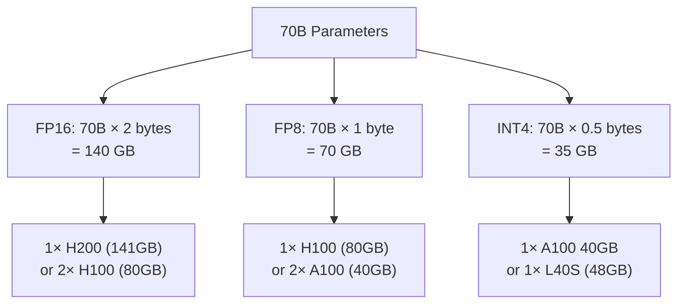

> 💡 **Quick Answer:** Llama 2 70B in FP16 precision requires ~140GB of VRAM (70 billion parameters × 2 bytes). A single H200 (141GB) can fit it. For H100 (80GB), use 2× GPUs with tensor parallelism. FP8 halves to ~70GB (1× H100), and INT4/GPTQ reduces to ~35GB (1× A100 40GB).

## The Problem

Before deploying Llama 2 70B (or any large model) on Kubernetes, you need to calculate VRAM requirements to choose the right GPU type, count, and parallelism strategy. Getting this wrong means either OOM crashes or wasted GPU spend.



## The Solution

### Model Size Formula

```
VRAM = Parameters × Bytes per Parameter + Overhead

Bytes per precision:
  FP32:  4 bytes
  FP16:  2 bytes (BF16 same)
  FP8:   1 byte
  INT4:  0.5 bytes (GPTQ/AWQ)

Overhead: ~10-20% for KV cache, activations, CUDA kernels
```

### Llama Model Family Sizes

| Model | Parameters | FP16 (GB) | FP8 (GB) | INT4 (GB) | +20% Overhead (FP16) |
|-------|:----------:|:---------:|:--------:|:---------:|:-------------------:|
| Llama 2 7B | 7B | 14 | 7 | 3.5 | 17 |
| Llama 2 13B | 13B | 26 | 13 | 6.5 | 31 |
| **Llama 2 70B** | 70B | **140** | **70** | **35** | **168** |
| Llama 3.1 8B | 8B | 16 | 8 | 4 | 19 |
| Llama 3.1 70B | 70B | 140 | 70 | 35 | 168 |
| Llama 3.1 405B | 405B | 810 | 405 | 203 | 972 |

### GPU Memory Reference

| GPU | VRAM | Fits Llama 70B | Precision |
|-----|:----:|:--------------:|:---------:|
| **A100 40GB** | 40 GB | INT4 only (1×) or FP8 (2×) | INT4 ✅, FP8 2×, FP16 4× |
| **A100 80GB** | 80 GB | FP8 (1×) or FP16 (2×) | FP8 ✅, FP16 2× |
| **L40S** | 48 GB | INT4 only (1×) or FP8 (2×) | INT4 ✅, FP8 2× |
| **H100 80GB** | 80 GB | FP8 (1×) or FP16 (2×) | FP8 ✅, FP16 2× |
| **H200** | 141 GB | FP16 (1×) | FP16 ✅ |
| **GH200 480GB** | 480 GB | FP16 (1×) with room | FP16 ✅ |
| **B200** | 192 GB | FP16 (1×) with room | FP16 ✅ |

### Kubernetes Deployment by GPU

#### 1× H200 — FP16 (Best Quality)

```yaml
apiVersion: apps/v1
kind: Deployment
metadata:
  name: llama-70b-fp16
spec:
  replicas: 1
  template:
    spec:
      containers:
        - name: vllm
          image: vllm/vllm-openai:latest
          args:
            - --model=meta-llama/Llama-2-70b-chat-hf
            - --dtype=float16
            - --tensor-parallel-size=1
            - --max-model-len=4096
            - --gpu-memory-utilization=0.90
          resources:
            limits:
              nvidia.com/gpu: 1
          env:
            - name: HF_TOKEN
              valueFrom:
                secretKeyRef:
                  name: hf-token
                  key: token
      nodeSelector:
        nvidia.com/gpu.product: NVIDIA-H200
```

#### 2× H100 — FP16 with Tensor Parallelism

```yaml
apiVersion: apps/v1
kind: Deployment
metadata:
  name: llama-70b-fp16-tp2
spec:
  replicas: 1
  template:
    spec:
      containers:
        - name: vllm
          image: vllm/vllm-openai:latest
          args:
            - --model=meta-llama/Llama-2-70b-chat-hf
            - --dtype=float16
            - --tensor-parallel-size=2
            - --max-model-len=4096
            - --gpu-memory-utilization=0.90
          resources:
            limits:
              nvidia.com/gpu: 2
          env:
            - name: HF_TOKEN
              valueFrom:
                secretKeyRef:
                  name: hf-token
                  key: token
      nodeSelector:
        nvidia.com/gpu.product: NVIDIA-H100-80GB-HBM3
```

#### 1× H100 — FP8 (Best Balance)

```yaml
args:
  - --model=meta-llama/Llama-2-70b-chat-hf
  - --dtype=float16
  - --quantization=fp8
  - --tensor-parallel-size=1
  - --max-model-len=4096
resources:
  limits:
    nvidia.com/gpu: 1
nodeSelector:
  nvidia.com/gpu.product: NVIDIA-H100-80GB-HBM3
```

#### 1× A100 40GB — INT4 GPTQ (Most Affordable)

```yaml
args:
  - --model=TheBloke/Llama-2-70B-Chat-GPTQ
  - --quantization=gptq
  - --tensor-parallel-size=1
  - --max-model-len=2048    # Reduced for 40GB
  - --gpu-memory-utilization=0.95
resources:
  limits:
    nvidia.com/gpu: 1
nodeSelector:
  nvidia.com/gpu.product: NVIDIA-A100-SXM4-40GB
```

### KV Cache Memory Impact

Model weights are just part of the story. KV cache grows with context length and batch size:

```
KV Cache per token = 2 × num_layers × num_kv_heads × head_dim × bytes_per_param

Llama 2 70B (FP16):
  KV per token = 2 × 80 × 8 × 128 × 2 bytes = 327,680 bytes ≈ 0.31 MB

Context 4096 tokens × batch 16:
  KV cache = 4096 × 16 × 0.31 MB ≈ 20 GB

Total VRAM = Model (140 GB) + KV Cache (20 GB) + Overhead ≈ 168 GB
```

This is why a single H200 (141GB) can load the model but may need reduced batch size for long contexts.

### Quick Sizing Decision Matrix

| Your GPU | Budget | Recommendation |
|----------|--------|---------------|
| H200 / B200 / GH200 | High | FP16, TP=1 — best quality, simplest setup |
| 2× H100 80GB | Medium | FP16, TP=2 — full quality, needs NVLink |
| 1× H100 80GB | Medium | FP8, TP=1 — minimal quality loss |
| 2× A100 80GB | Medium | FP8, TP=2 — good balance |
| 4× A100 40GB | Lower | FP8, TP=4 — more GPUs but works |
| 1× A100 40GB / L40S | Low | INT4 GPTQ — noticeable quality loss |

## Common Issues

| Issue | Cause | Fix |
|-------|-------|-----|
| OOM on 1× H100 with FP16 | 140GB > 80GB VRAM | Use FP8 or add second GPU with TP=2 |
| Slow inference on 4× GPU | Communication bottleneck | Ensure NVLink (not PCIe) between GPUs |
| Quality degradation | INT4 quantization | Move to FP8 — much better quality/VRAM tradeoff |
| KV cache OOM at high batch | Model fits but KV cache doesn't | Reduce \`--max-model-len\` or batch size |
| Model download timeout | 140GB+ download over slow network | Pre-cache model on PV or use \`modelcache\` init container |

## Best Practices

- **Start with FP8 on H100/H200** — best quality-per-VRAM ratio
- **Use tensor parallelism, not pipeline parallelism** for inference — lower latency
- **Set \`--gpu-memory-utilization=0.90\`** — leaves headroom for KV cache spikes
- **Pre-download models to PersistentVolumes** — avoid cold-start download delays
- **Use NVLink for multi-GPU** — PCIe bottlenecks tensor parallelism significantly
- **Monitor with \`nvidia-smi\`** — watch memory usage under load, not just at startup

## Key Takeaways

- Llama 2 70B FP16 = 140GB VRAM (70B params × 2 bytes)
- Add 20% overhead for KV cache, activations, and CUDA context
- H200 (141GB) fits FP16 on 1 GPU; H100 (80GB) needs FP8 or 2× GPUs
- FP8 is the sweet spot — 50% less VRAM with minimal quality loss
- INT4/GPTQ cuts to 35GB but quality degrades noticeably
- KV cache scales with context length × batch size — factor this into VRAM planning
