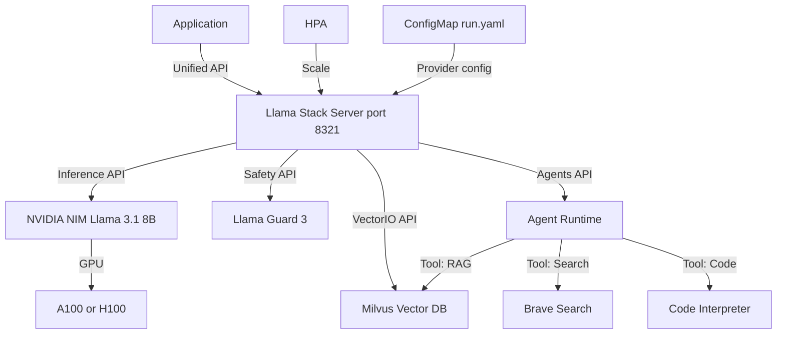

> 💡 **Quick Answer:** Deploy the Llama Stack starter distribution as a Kubernetes Deployment, configure NVIDIA NIM as the inference provider, and use the unified Llama Stack APIs for inference, RAG, agents, safety, and evals — all through a single endpoint.

## The Problem

Building LLM applications requires stitching together separate services for inference, vector search, safety guardrails, and agent orchestration. Each has its own API, SDK, and deployment model. Switching inference backends (NIM → vLLM → cloud) means rewriting application code.

## The Solution

Llama Stack provides a unified API layer across inference, RAG, agents, tools, safety, and evals. Deploy it on Kubernetes with NVIDIA NIM as the high-performance inference backend, and your application code stays the same regardless of which provider you use.

### Architecture Overview

```yaml
# Llama Stack components:
# - Inference API → NVIDIA NIM (TensorRT-LLM optimized)
# - VectorIO API → Milvus/ChromaDB/Qdrant for RAG
# - Safety API → Llama Guard for content filtering
# - Agents API → Built-in agentic workflows with tool calling
# - Eval API → Benchmarking and evaluation pipelines
```

### Deploy NVIDIA NIM (Inference Backend)

```yaml
apiVersion: apps/v1
kind: Deployment
metadata:
  name: nim-llama
  namespace: llama-stack
spec:
  replicas: 1
  selector:
    matchLabels:
      app: nim-llama
  template:
    metadata:
      labels:
        app: nim-llama
    spec:
      containers:
        - name: nim
          image: nvcr.io/nim/meta/llama-3.1-8b-instruct:latest
          env:
            - name: NGC_API_KEY
              valueFrom:
                secretKeyRef:
                  name: ngc-secret
                  key: api-key
            - name: NIM_CACHE_PATH
              value: /opt/nim/.cache
          ports:
            - containerPort: 8000
              name: http
          resources:
            limits:
              nvidia.com/gpu: 1
          volumeMounts:
            - name: nim-cache
              mountPath: /opt/nim/.cache
      volumes:
        - name: nim-cache
          persistentVolumeClaim:
            claimName: nim-cache-pvc
---
apiVersion: v1
kind: Service
metadata:
  name: nim-llama
  namespace: llama-stack
spec:
  selector:
    app: nim-llama
  ports:
    - port: 8000
      targetPort: 8000
      name: http
```

### Llama Stack Configuration

```yaml
# llama-stack-config.yaml (ConfigMap)
apiVersion: v1
kind: ConfigMap
metadata:
  name: llama-stack-config
  namespace: llama-stack
data:
  run.yaml: |
    version: 2
    apis:
      - inference
      - safety
      - agents
      - vector_io
      - eval

    providers:
      inference:
        - provider_id: nvidia-nim
          provider_type: remote::nvidia
          config:
            url: http://nim-llama.llama-stack.svc:8000/v1

      safety:
        - provider_id: llama-guard
          provider_type: inline::llama-guard
          config:
            excluded_categories: []

      vector_io:
        - provider_id: milvus
          provider_type: remote::milvus
          config:
            host: milvus.llama-stack.svc
            port: 19530

      agents:
        - provider_id: meta-reference
          provider_type: inline::meta-reference
          config:
            persistence_store:
              type: postgres
              host: postgres.llama-stack.svc
              port: 5432
              db: llama_stack
              user: llama
              password: ${POSTGRES_PASSWORD}

    models:
      - metadata: {}
        model_id: meta-llama/Llama-3.1-8B-Instruct
        provider_id: nvidia-nim
        provider_model_id: meta/llama-3.1-8b-instruct

    shields:
      - shield_id: llama-guard
        provider_id: llama-guard
        provider_shield_id: meta-llama/Llama-Guard-3-8B
```

### Deploy Llama Stack Server

```yaml
apiVersion: apps/v1
kind: Deployment
metadata:
  name: llama-stack
  namespace: llama-stack
spec:
  replicas: 2
  selector:
    matchLabels:
      app: llama-stack
  template:
    metadata:
      labels:
        app: llama-stack
    spec:
      containers:
        - name: llama-stack
          image: llamastack/distribution-starter:latest
          command:
            - llama
            - stack
            - run
            - /config/run.yaml
            - --port
            - "8321"
          ports:
            - containerPort: 8321
              name: http
          env:
            - name: POSTGRES_PASSWORD
              valueFrom:
                secretKeyRef:
                  name: postgres-secret
                  key: password
            - name: NVIDIA_API_KEY
              valueFrom:
                secretKeyRef:
                  name: ngc-secret
                  key: api-key
          volumeMounts:
            - name: config
              mountPath: /config
          resources:
            requests:
              cpu: 500m
              memory: 1Gi
            limits:
              cpu: "2"
              memory: 4Gi
          readinessProbe:
            httpGet:
              path: /v1/health
              port: 8321
            initialDelaySeconds: 30
            periodSeconds: 10
          livenessProbe:
            httpGet:
              path: /v1/health
              port: 8321
            initialDelaySeconds: 60
            periodSeconds: 30
      volumes:
        - name: config
          configMap:
            name: llama-stack-config
---
apiVersion: v1
kind: Service
metadata:
  name: llama-stack
  namespace: llama-stack
spec:
  selector:
    app: llama-stack
  ports:
    - port: 8321
      targetPort: 8321
      name: http
---
apiVersion: networking.k8s.io/v1
kind: Ingress
metadata:
  name: llama-stack
  namespace: llama-stack
  annotations:
    nginx.ingress.kubernetes.io/proxy-read-timeout: "300"
    nginx.ingress.kubernetes.io/proxy-send-timeout: "300"
spec:
  rules:
    - host: llama-stack.example.com
      http:
        paths:
          - path: /
            pathType: Prefix
            backend:
              service:
                name: llama-stack
                port:
                  number: 8321
```

### Using the Llama Stack APIs

```bash
# Install client SDK
pip install llama-stack-client

# Chat inference
curl -X POST http://llama-stack.llama-stack.svc:8321/v1/inference/chat-completion \
  -H "Content-Type: application/json" \
  -d '{
    "model_id": "meta-llama/Llama-3.1-8B-Instruct",
    "messages": [
      {"role": "system", "content": "You are a Kubernetes expert."},
      {"role": "user", "content": "How do I debug CrashLoopBackOff?"}
    ],
    "sampling_params": {
      "temperature": 0.7,
      "max_tokens": 1024
    }
  }'

# Safety check
curl -X POST http://llama-stack.llama-stack.svc:8321/v1/safety/run-shield \
  -H "Content-Type: application/json" \
  -d '{
    "shield_id": "llama-guard",
    "messages": [
      {"role": "user", "content": "How do I fix my deployment?"}
    ]
  }'
```

### Python Client with RAG

```python
from llama_stack_client import LlamaStackClient

client = LlamaStackClient(base_url="http://llama-stack:8321")

# Register a vector database for RAG
client.vector_dbs.register(
    vector_db_id="k8s-docs",
    embedding_model="all-MiniLM-L6-v2",
    embedding_dimension=384,
    provider_id="milvus",
)

# Insert documents
client.vector_io.insert(
    vector_db_id="k8s-docs",
    chunks=[
        {"content": "Use kubectl rollout restart to restart a deployment...",
         "metadata": {"source": "k8s-docs", "topic": "deployments"}},
        {"content": "CrashLoopBackOff means the container keeps crashing...",
         "metadata": {"source": "k8s-docs", "topic": "troubleshooting"}},
    ],
)

# RAG query
response = client.vector_io.query(
    vector_db_id="k8s-docs",
    query="How to restart a deployment?",
    params={"max_chunks": 5},
)

# Use retrieved context in inference
context = "\n".join([c.content for c in response.chunks])
completion = client.inference.chat_completion(
    model_id="meta-llama/Llama-3.1-8B-Instruct",
    messages=[
        {"role": "system", "content": f"Answer using this context:\n{context}"},
        {"role": "user", "content": "How do I restart a deployment?"},
    ],
)
print(completion.completion_message.content)
```

### Agent with Tool Calling

```python
from llama_stack_client import LlamaStackClient

client = LlamaStackClient(base_url="http://llama-stack:8321")

# Create an agent with tools
agent = client.agents.create(
    agent_config={
        "model": "meta-llama/Llama-3.1-8B-Instruct",
        "instructions": "You are a K8s operations assistant.",
        "tools": [
            {
                "type": "brave_search",
                "engine": "brave",
                "api_key": "BRAVE_KEY",
            },
            {
                "type": "memory",
                "memory_bank_configs": [{
                    "bank_id": "k8s-docs",
                    "type": "vector",
                }],
            },
        ],
        "enable_session_persistence": True,
        "sampling_params": {
            "temperature": 0.0,
            "max_tokens": 2048,
        },
    },
)

# Create a session and chat
session = client.agents.session.create(
    agent_id=agent.agent_id,
)

response = client.agents.turn.create(
    agent_id=agent.agent_id,
    session_id=session.session_id,
    messages=[
        {"role": "user",
         "content": "Find the latest GPU Operator version and explain how to upgrade"}
    ],
)

for event in response:
    if event.event.payload.event_type == "turn_complete":
        print(event.event.payload.turn.output_message.content)
```

### HPA for Llama Stack

```yaml
apiVersion: autoscaling/v2
kind: HorizontalPodAutoscaler
metadata:
  name: llama-stack-hpa
  namespace: llama-stack
spec:
  scaleTargetRef:
    apiVersion: apps/v1
    kind: Deployment
    name: llama-stack
  minReplicas: 2
  maxReplicas: 8
  metrics:
    - type: Resource
      resource:
        name: cpu
        target:
          type: Utilization
          averageUtilization: 70
```



## Common Issues

- **Llama Stack can't reach NIM** — verify NIM service is running and accessible at `http://nim-llama:8000/v1`; check NIM logs for model loading status
- **NIM OOM during model loading** — ensure GPU has enough VRAM (8B needs ~16GB, 70B needs ~140GB); use quantized models for smaller GPUs
- **Vector search returns empty** — verify Milvus is running and documents are inserted; check embedding model compatibility
- **Agent tool calling fails** — ensure tools are properly configured in agent config; check API keys for external tools
- **Slow first response** — NIM needs time to load model on first request; use readiness probes to avoid routing traffic before ready

## Best Practices

- Use NVIDIA NIM for inference — TensorRT-LLM provides 2-4x throughput vs vanilla vLLM
- Deploy Llama Stack server separately from NIM — scale API layer independently of GPU inference
- Use PVCs for NIM model cache — avoid re-downloading models on pod restart
- Enable Llama Guard safety shields for production deployments
- Store agent sessions in PostgreSQL for persistence across restarts
- Use Milvus or Qdrant for production RAG — not SQLite-vec
- Configure readiness probes on both NIM and Llama Stack deployments
- Provider swapping: change `run.yaml` to switch from NIM to vLLM or cloud without code changes

## Key Takeaways

- Llama Stack provides unified APIs for inference, RAG, agents, safety, and evals
- NVIDIA NIM serves as the high-performance inference backend
- Provider architecture allows swapping backends without code changes
- Agents API supports tool calling, RAG, and session persistence
- Safety API with Llama Guard filters harmful content
- Deploy as ConfigMap-driven Deployment — scale API and inference layers independently
- Python and TypeScript SDKs available for application integration
