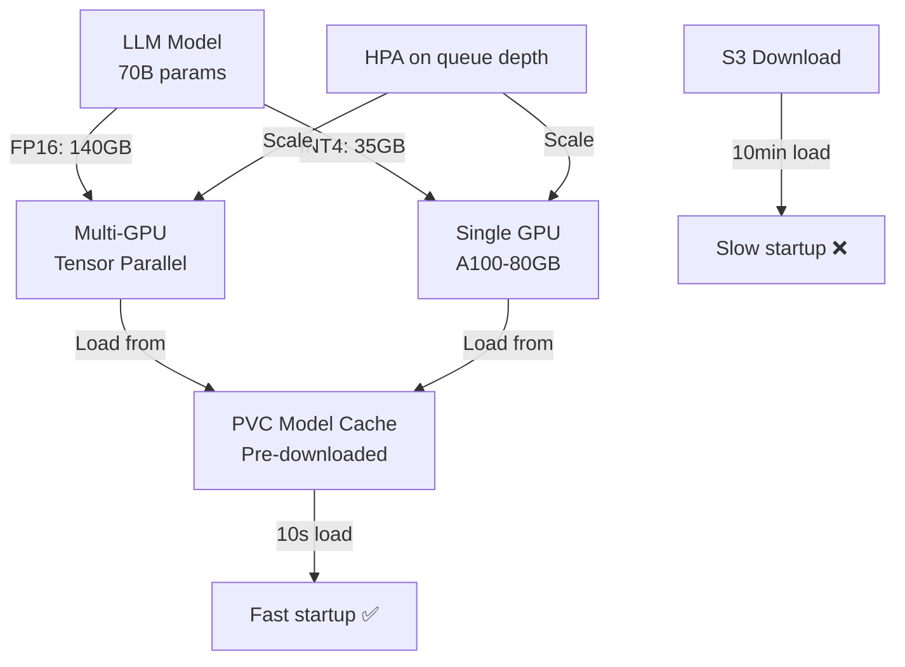

> 💡 **Quick Answer:** Tackle the 5 biggest LLM deployment challenges: (1) GPU memory — use quantization (AWQ/GPTQ) to fit larger models, (2) model loading — pre-cache models on PVCs instead of pulling each time, (3) latency — tune `max_batch_size` and `max_tokens`, (4) scaling — autoscale on request queue depth not CPU, (5) multi-node — use tensor parallelism across nodes for models that don't fit on one GPU.

## The Problem

Deploying LLMs on Kubernetes is fundamentally different from deploying web services. Models are 10-200GB, require specialized GPU hardware, have complex memory requirements, and exhibit non-linear latency under load. Standard Kubernetes patterns (HPA on CPU, small container images, horizontal scaling) don't apply.

## The Solution

### Challenge 1: GPU Memory Management

```yaml
# Model size vs GPU memory
# Llama-3 70B in FP16: ~140GB VRAM → needs 2× H100 (80GB each)
# Llama-3 70B in INT4 (AWQ): ~35GB VRAM → fits on 1× A100 (80GB)

apiVersion: apps/v1
kind: Deployment
metadata:
  name: llm-server
spec:
  template:
    spec:
      containers:
        - name: vllm
          image: registry.example.com/vllm:0.6.0
          args:
            - --model=/models/llama-3-70b-awq
            - --quantization=awq
            - --tensor-parallel-size=2
            - --max-model-len=4096
            - --gpu-memory-utilization=0.90
          resources:
            limits:
              nvidia.com/gpu: 2
              memory: 64Gi
          volumeMounts:
            - name: model-cache
              mountPath: /models
      volumes:
        - name: model-cache
          persistentVolumeClaim:
            claimName: model-storage
```

### Challenge 2: Model Loading Speed

```yaml
# Problem: Downloading 70GB model from S3 takes 10+ minutes
# Solution: Pre-cache on PVC with ReadWriteMany

apiVersion: batch/v1
kind: Job
metadata:
  name: model-downloader
spec:
  template:
    spec:
      containers:
        - name: download
          image: registry.example.com/model-downloader:1.0
          command:
            - huggingface-cli
            - download
            - meta-llama/Llama-3-70B-AWQ
            - --local-dir=/models/llama-3-70b-awq
          volumeMounts:
            - name: models
              mountPath: /models
      volumes:
        - name: models
          persistentVolumeClaim:
            claimName: model-storage
```

### Challenge 3: Inference Latency

```yaml
# vLLM serving config for optimal latency
args:
  - --max-num-batched-tokens=4096
  - --max-num-seqs=32
  - --enable-chunked-prefill
  - --disable-log-requests
  # KV cache optimization
  - --kv-cache-dtype=fp8_e5m2
  - --enable-prefix-caching
```

### Challenge 4: Autoscaling on Queue Depth

```yaml
apiVersion: autoscaling/v2
kind: HorizontalPodAutoscaler
metadata:
  name: llm-hpa
spec:
  scaleTargetRef:
    apiVersion: apps/v1
    kind: Deployment
    name: llm-server
  minReplicas: 1
  maxReplicas: 8
  metrics:
    - type: Pods
      pods:
        metric:
          name: vllm_num_requests_waiting
        target:
          type: AverageValue
          averageValue: "5"
  behavior:
    scaleUp:
      stabilizationWindowSeconds: 120
    scaleDown:
      stabilizationWindowSeconds: 600
```

### Challenge 5: Model Size Reference

| Model | FP16 VRAM | INT4 VRAM | Min GPUs (FP16) |
|-------|-----------|-----------|-----------------|
| 7B | 14GB | 4GB | 1× T4/A10 |
| 13B | 26GB | 7GB | 1× A100-40 |
| 34B | 68GB | 17GB | 1× A100-80 |
| 70B | 140GB | 35GB | 2× A100-80 |
| 405B | 810GB | 203GB | 8× H100 |



## Common Issues

**OOMKilled during model loading**

Model loading temporarily uses more memory than inference. Set memory limit 50% higher than model size. Use `--gpu-memory-utilization=0.85` to leave headroom.

**Inference latency spikes under load**

Reduce `max-num-seqs` to limit concurrent requests per instance. Scale horizontally instead of overloading one replica.

## Best Practices

- **Pre-cache models on PVCs** — never download at pod startup
- **Quantize aggressively** — AWQ INT4 loses <1% accuracy with 75% memory reduction
- **Autoscale on queue depth**, not CPU — LLM workloads are GPU-bound
- **Slow scale-down (600s)** — model loading is expensive, avoid thrashing
- **FP8 KV cache** — reduces memory by 50% with minimal quality impact

## Key Takeaways

- LLMs require fundamentally different deployment patterns than web services
- GPU memory is the primary constraint — use quantization to fit larger models
- Pre-cache models on PVC — S3 downloads at pod startup cause 10+ minute cold starts
- Autoscale on inference queue depth — CPU/memory metrics are meaningless for LLMs
- Multi-node tensor parallelism for models that don't fit on one node's GPUs
