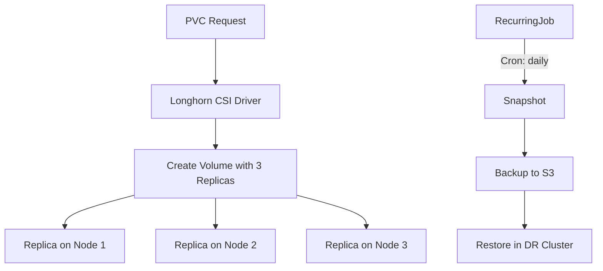

> 💡 **Quick Answer:** Install Longhorn for distributed block storage on Kubernetes. Replicated volumes, snapshots, backups to S3, and disaster recovery across nodes.

## The Problem

Kubernetes needs persistent storage that survives node failures. Cloud-managed disks are single-node. Longhorn provides replicated block storage across nodes with built-in backup to S3.

## The Solution

### Step 1: Install Longhorn

```bash
# Prerequisites: open-iscsi on all nodes
# Ubuntu/Debian
sudo apt-get install -y open-iscsi
sudo systemctl enable iscsid --now

# RHEL/Rocky
sudo yum install -y iscsi-initiator-utils
sudo systemctl enable iscsid --now

# Install Longhorn via Helm
helm repo add longhorn https://charts.longhorn.io
helm repo update

helm install longhorn longhorn/longhorn \
  --namespace longhorn-system --create-namespace \
  --set defaultSettings.defaultReplicaCount=3 \
  --set defaultSettings.backupTarget="s3://my-bucket@us-east-1/" \
  --set defaultSettings.backupTargetCredentialSecret=longhorn-s3-secret \
  --set persistence.defaultClassReplicaCount=3

# Verify
kubectl get pods -n longhorn-system
kubectl get storageclass | grep longhorn
```

### Step 2: Create Volumes

```yaml
apiVersion: v1
kind: PersistentVolumeClaim
metadata:
  name: my-data
spec:
  accessModes:
    - ReadWriteOnce
  storageClassName: longhorn
  resources:
    requests:
      storage: 10Gi
```

### Step 3: Snapshots and Backups

```bash
# Create a snapshot via Longhorn UI or API
kubectl -n longhorn-system exec deploy/longhorn-driver-deployer -- \
  longhornctl snapshot create --volume my-data

# Schedule recurring backups
cat << 'EOF' | kubectl apply -f -
apiVersion: longhorn.io/v1beta2
kind: RecurringJob
metadata:
  name: daily-backup
  namespace: longhorn-system
spec:
  cron: "0 2 * * *"
  task: backup
  retain: 7
  concurrency: 1
  groups:
    - default
EOF
```

### Step 4: Disaster Recovery

```yaml
# Restore a volume from backup in another cluster
apiVersion: v1
kind: PersistentVolumeClaim
metadata:
  name: restored-data
  annotations:
    longhorn.io/backup-url: "s3://my-bucket@us-east-1/?backup=backup-abc123&volume=my-data"
spec:
  accessModes:
    - ReadWriteOnce
  storageClassName: longhorn
  resources:
    requests:
      storage: 10Gi
```



## Best Practices

- **Start small and iterate** — don't over-engineer on day one
- **Monitor and measure** — you can't improve what you don't measure
- **Automate repetitive tasks** — reduce human error and toil
- **Document your decisions** — future you will thank present you

## Key Takeaways

- This is essential knowledge for production Kubernetes operations
- Start with the simplest approach that solves your problem
- Monitor the impact of every change you make
- Share knowledge across your team with internal runbooks
